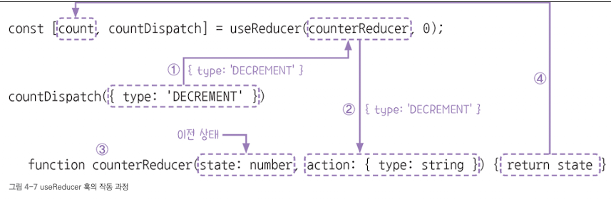

# useReducer 훅: 복잡한 상태 관리

useReducer 훅은 리액트에서 상태를 관리하는 또 다른 방법으로, 이전 상태와 액션에 따라 새로운 상태를 반환하는 방식이다.\
특히 상태 변경 로직이 복잡하거나 업데이트해야 하는 경우가 많으면 useState 훅보다 더 적합할 수 있다.

## useReducer 훅 기본 문법

useReducer 훅을 호출하면 2개의 값을 담은 배열을 반환한다. 이 값을 구조 분해 할당해 아래와 같이 사용할 수 있다.

> 형식\
> const [state, dispatch] = useReducer<Type>(reducer, initialState);

- \<Type> : useReducer 훅이 반환하는 상태 값의 타입을 제네릭으로 지정한다. 대부분의 경우 타입스크립트가 초깃값을 기준으로 타입을 추론하므로 생략할 수 있다. 그러나 초깃값과 이후에 처리할 데잍터의 타입이 다를 경우, 타입을 명시해주는 것이 안전하다.

- reducer : useReducer 훅의 첫 번째 매개변수는 리듀서 함수다. **리듀서 함수** 는 상태를 변경하는 함수로, 이전 상태와 액션을 받아서 새로운 상태를 반환한다.

- initialState : 상태의 초깃값이다. 이 값을 기준으로 상태가 시작되고, 생략할 경우 undefined 가 된다.

- state : 상태를 나타내는 상태 변수로 useReducer 훅이 반환하는 첫 번째 값을 저장한다. 보통 관리하려는 상태의 의미에 맞는 이름으로 지정한다.

- dispatch : useReducer 훅이 반환하는 두 번째 값으로, 리듀서 함수에 액션을 전달하는 함수다. 이 함수를 호출하면 리듀서 함수가 실행되고, 새로운 상태가 계산된다. 흔히 **액션 발생 함수** 라고 하며, 보통 식별자는 상태 변수 이름에 Dispatch를 붙여 사용한다. 예를 들어, 상태 변수가 count라면 countDispatch 처럼 이름을 짓는다.

---

### 액션과 액션 발생 함수

**액션** 은 리듀서 함수에서 어떤 상태 변경을 수행할지 결정하기 위해 참조하는 값이다. 리듀서 함수 내부에는 여러 상태 변경 로직이 존재할 수 있으며, 액션의 내용을 기반으로 어떤 로직을 실행할지 선택한다.

액션은 보통 객체 형태로 표현하며, 아래와 같은 구조를 가진다.

> 형식\
> { type : 'ACTION_TYPE', payload: 데이터 };

- type : 액션의 종류를 나타내는 속성이다. 문자열로 작성하고, 보통 대문자 스네이크로 작성한다.

- payload : 선택 속성으로, 상태 변경에 필요한 데이터를 담는다.

`대문자 스네이크 케이스(UPPER_SNAKE_CASE)란 여러 단어로 구성된 이름을 모두 대문자로 표기하고 단어 사이를 밑줄로 구분하는 표기법이며 아래와 같은 액션은 'INCREMENT' 라는 유형의 액션이 5만큼 증가하는 동작을 수행하라는 의미이다.`

> { type : 'INCREMENT' , payload : 5 };

정의한 액션은 액션 발생 함수를 통해 리듀서 함수로 전달된다. 형식은 아래와 같다.

> 형식\
> dispatch({ type: 'ACTION_TYPE' })

예를 들어, dispatch({ type: 'INCREMENT', payload: 5 }) 라고 호출하면 리듀서 함수는 이 액션을 받아 해당 로직에 따라 상태를 업데이트 한다.

일반적으로 액션은 객체로 정의하는 것이 가독성과 유지보수 면에서 좋다. 그러나 리듀서 함수의 설계에 따라 숫자, 문자열, 배열, 함수 등 다양한 형태의 액션을 사용할 수도 있다.

---

### 리듀서 함수

**리듀서 함수** 는 이전 상태(state)와 액션(action)을 매개변수로 받아 새로운 상태를 반환하는 함수다. 이때 반환하는 값이 컴포넌트의 새로운 상태 값이 된다. 리듀서 함수 내부에서는 주로 switch 문을 사용해 action.type 에 따라 실행할 로직을 결정한다.

리듀서 함수의 기본 형식은 아래와 같다.

```javascript
function reducer(state: StateType, action: ActionType){
    switch (action.type){
        case 'ACTION_TYPE_1':
            return { ...state, 변경_값 }; // 새로운 상태 반환
        case 'ACTION_TYPE_2':
            return { ...state, 변경_값 }; // 새로운 상태 반환
        default:
            return state; // 변경이 없을 경우 이전 상태 유지
    }
}
```

리듀서 함수를 작성할 때 알아야 할 기본 형식이 있다.

1. 함수 이름 : 이름은 자유롭게 정할 수 있지만, 보통 reducer 라는 이름을 사용한다.

2. 상태를 직접 변경하지 말 것 : 리듀서 함수는 상태를 변경하는 함수가 아니라, 새로운 상태를 반환하는 함수다. 기존 상태를 직접 수정하면 리액트가 변경을 감지하지 못해 오류가 발생할 수 있다.

3. 반드시 하나의 상태를 반환해야 함 : 상태를 반환하지 않으면 리액트가 상태 변경을 인식하지 못한다. 변경이 없으면 기존 상태를 그대로 반환해야 한다.

4. 모든 경우에 대해 상태를 반환하도록 작성할 것 : 정의하지 않은 action.type 에서 예외가 발생하지 않도록 default 분기에서 반드시 이전 상태를 반환해야 한다.

5. 객체나 배열 상태는 전개 연산자로 복사 후 수정 : 객체나 배열은 참조형 데이터이므로 직접 변경하면 기존 상태도 함께 바뀐다. 리액트는 **상태의 불변성** 을 원칙으로 하기때문에 { ...state } 처럼 이전 상태를 복사한 뒤 변경하는 방식으로 작성해야 한다.

아래는 숫자 상태를 증가, 감소, 초기화하는 리듀서 함수 예제다.

```javascript
function reducer(state: number, action: { type: string }){ --- (1)
    switch (action.type) { --- (2)
        case 'INCREMENT':
            return state + 1;
        case 'DECREMENT':
            return state - 1;
        case 'RESET':
            return 0;
        default: --- (3)
            return state;
    }
}
```

1. 리듀서 함수의 매개변수로 전달되는 상태와 액션의 타입을 명시한다. 상태는 숫자 타입이고, 액션은 { type: string } 형태의 객체다.

2. switch 문을 사용해 action.type 값에 따라 분기 처리(다음 로직을 결정) 한다.

3. 정의하지 않은 action.type이면 기존 상태 값을 그대로 반환해 오류를 방지 한다.

---

## useReducer 훅 사용하기

이번에는 useReducer 훅을 어떻게 사용하는지 알아보자. 아래는 버튼을 클릭할 때 숫자를 증가, 감소, 초기화를 할 수 있는 간단한 카운터 예제다.

```javascript
import { useReducer } from "react";

function counterReducer(state: number, action: { type: string }){
    switch (action.type) {
        case 'INCREMENT':
            return state + 1;
        case 'DECREMENT':
            return state - 1;
        case 'RESET':
            return 0;
        default:
            throw new Error(`Unhandled action type: ${action.type}`);
    }
}
export default function App(){
    const [count, countDispatch] = useReducer(counterReducer, 0);
    return (
        <div>
            <h1>Count: {count}</h1>

            <button onClick={() => countDispatch({ type: 'DECREMENT' })}>감소</button>
            <button onClick={() => countDispatch({ type: 'RESET' })}>초기화</button>
            <button onClick={() => countDispatch({ type: 'INCREMENT' })}>증가</button>
        </div>
    );
}
```

1. useReducer 는 리액트에서 제공하는 내장 훅이므로, react 패키지에서 import 한다.

2. 리듀서 함수를 정의한다. 이 함수는 아래 2개의 매개변수를 받는다.

- state : 이전 상태 값, number 타입
- action : 상태를 변경할 때 참조할 정보가 담긴 객체, type 속성을 포함\
  switch 문을 사용해 action.type의 값에 따라 상태 변경 로직을 실행한다.
- 'INCREMENT' : 이전 상태에 1을 더함
- 'DECREMENT' : 이전 상태에서 1을 뺌
- 'RESET' : 상태를 0으로 초기화함
- default : 정의하지 않은 액션이 전달되면 오류를 발생시켜 예외 처리함

3. useReducer(counterReducer, 0) 을 호출하면 초깃값이 0인 상태 변수(count)와 액션 발생 함수(countDispatch)가 생성된다. useReducer 훅은 이 둘을 배열 형태로 반환하므로 구조 분해 할당을 통해 각각 변수로 나누어 받을 수 있다. 초깃값으로 0을 지정했기 때문에 상태 값의 타입은 number로 자동 추론된다.

4. 버튼의 onClick 이벤트 핸들러에서 countDispatch()를 호출해 액션을 리듀서 함수에 전달한다. 이 코드가 실행되면 액션이 counterReducer() 함수로 전달되고, 이에 따라 상태가 변경된다. 이때 액션 객체의 타입 구조는 counterReducer() 함수에서 정의한 action 매개변수의 타입 ({ type: string }) 과 반드시 일치해야 한다.

위의 과정을 정리하면 아래 그림과 같다.



사용자가 버튼을 클릭하면 해당 버튼에 연결된 이벤트 핸들러가 실행된다. 이벤트 핸들러 내부에서 countDispatch() 함수가 호출되며 댁션 객체 ({ type: 'DECREMENT' }) 가 전달된다.

1. countDispatch() 함수는 액션 객체를 받아 useReducer 훅의 첫 번째 인자인 counterReducer() 함수를 호출한다.

2. 1에서 전달된 액션은 action 매개변수로 전달된다.

3. counterReducer() 함수는 두 개의 매개변수를 받는다. 첫 번째 매개변수는 이전 상태 값(state)으로, 컴포넌트가 처음 랜더링될 때는 초깃값이 전달된다. 이후에는 이전 랜더링에서 리듀서가 반환한 상태 값이 전달된다. 두 번째 매개변수는 액션 객체(action)로, 이벤트 핸들러에서 전달한 값이다. counterReducer() 함수는 action.type에 따라 상태 변경 로직을 실행한 뒤, 변경된 새로운 상태값을 반환한다.

4. 반환한 값은 useReducer 훅의 상태 값이 되어 컴포넌트에 반영된다.

---

### 리듀서 함수 분리하기

useReducer 훅에서 사용하는 리듀서 함수는 별도의 파일로 분리해서 관리할 수 있다. 리듀서 함수를 분리하면 코드의 재사용성과 가독성이 높아지고, 상태 로직을 더 체계적으로 관리할 수 있다.

src 폴더 아래에 reducer 폴더를 만든 뒤, 그 안에 counterReducer.ts 파일을 생성한다. 기존 App.tsx에 있던 리듀서 함수를 counterReducer.ts 파일로 옮긴다.

```javascript
export function counterReducer(state: number, action: { type: string }){
    switch (action.type) {
        case 'INCREMENT':
            return state + 1;
        case 'DECREMENT':
            return state - 1;
        case 'RESET':
            return 0;
        default:
            throw new Error(`Unhandled action type: ${action.type}`);
    }
}
```

위처럼 분리한 counterReducer() 함수는 App.tsx에서 import 하여 아래처럼 사용할 수 있다.

```javascript
import { useReducer } from "react";
import { counterReducer } from "./reducer/counterReducer";

export default function App() {
  const [count, countDispatch] = useReducer(counterReducer, 0);
  return (
    <div>
      <h1>count : {count}</h1>

      <button onClick={() => countDispatch({ type: "INCREMENT" })}>증가</button>
      <button onClick={() => countDispatch({ type: "DECREMENT" })}>감소</button>
      <button onClick={() => countDispatch({ type: "RESET" })}>초기화</button>
    </div>
  );
}
```

리듀서 함수를 분리하면 코드가 더 깔끔하고 모듈화되며, 여러 컴포넌트에서 같은 리듀서를 재사용할 수 있어 중복 코드가 줄어든다. 또한, 상태변경 로직을 한곳에 모아두면 유지보수와 테스트가 쉬워진다. useReducer 훅을 여러 개 사용하는 경우에도 상태별로 로직을 분리해 체계적으로 관리할 수 있다.

리듀서 함수는 분리하더라도 useReducer 훅과 함께 정상적으로 작동한다. 훅과 리듀서를 분리하는 것은 매우 일번적인 패턴이다.

> Note : 파일 확장자 \
> counterReducer.ts 는 리액트 컴포넌트가 아니고 jsx를 전혀 사용하지 않아서 jsx를 해석할 필요가 없다. 따라서 .tsx확장자를 쓸 이유가 없고, 더 명확하게 목적에맞는 .ts확장자를 사용하는 것이 좋다.\
>
> - .tsx : jsx를 포함하는 파일(컴포넌트)
> - .ts : 유틸 함수, 리듀서, 타입 선언, api 모듈 등 jsx가 없는 파일\
>   이렇게 구분하면 프로젝트 구조가 더 명확해지고 유지보수도 쉬워진다.
