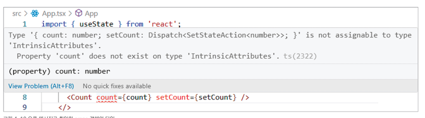
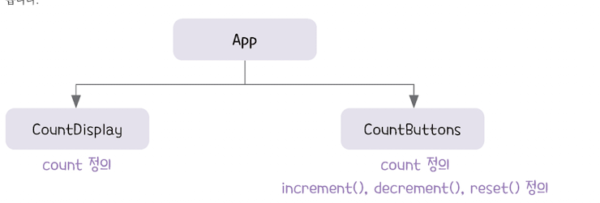
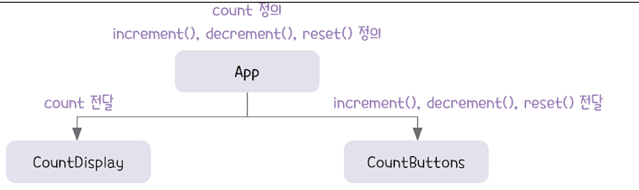

# 상태 관리 패턴

이전까지 리액트에서 상태를 정의하는 두 가지 훅, useState와 useReducer에 대해 살펴보았다.\
본 절에서는 이렇게 정의한 상태를 실제로 어떻게 활용하는지, 실무에서 자주 쓰는 몇 가지 활용방법과 패턴을 소개하겠다.

> tip\
> 가장 많이 사용하는 useState 훅을 기준으로 설명하지만, useReducer 훅도 동일한 방식으로 적용할 수 있다.\
> 개념과 패턴은 거의 같으니 상황에 맞게 훅을 선택해 활용해보자.

---

## 상태 전달하기

리액트 훅으로 정의한 상태, 상태 변경 함수, 액션 발생 함수는 하나의 데이터처럼 취급한다. 그래서 이를 다른 컴포넌트에 props로 전달해 재사용할 수 있다.

예를 들어, useState 훅으로 정의한 count 상태와 setCount() 함수를 하위 컴포넌트인 Count에 전달하려 할 때는 아래와 같이 작성한다.

```javascript
import { useState } from 'react';
import Count from './components/Count';

export default function App(){
    const [count, setCount] = useState(0); --- 1
    return (
        <>
            <Count count={count} setCount={setCount} /> --- 2
        </>
    );
}
```

1. count 상태를 선언하고, 초깃값으로 0을 설정한다. 상태 변경 함수인 setCount()도 함께 반환된다.

2. count와 setCount()를 props로 Count 컴포넌트에 전달한다. 그러면 하위 컴포넌트에서도 상태 값을 표시하거나 변경할 수 있다.

App 컴포넌트에서 전달한 count 와 setCount()를 Count 컴포넌트에서 사용하려면 props 객체의 타입을 명확하게 정의해야 한다. 타입스크립트를 사용할 때 props의 타입을 명확히 지정하지 않으면 타입 추론이 제대로 되지 않아 컴파일 오류 또는 경고가 발생할 수 있다.

props 타입은 직접 정의할 수도 있지만 앞전에 학습했던 **props 객체 타입 알아내기** 에서 설명한 VSCode의 오류 메시지를 활용하면 더욱 쉽게 확인할 수 있다.

앞에서 작성한 App.tsx 파일의 count에 마우스를 올리면 아래와 같은 오류 메시지가 표시된다.


이때 오류 메시지를 보려면 Count 컴포넌트에 아래처럼 빈 형태라도 코드가 작성되어 있어야 한다.

```javascript
export default function Count() {
  return <div>count</div>;
}
```

위 그림의 오류 메시지에 보이는 { count: number, setCount: Dispatch<SetStateAction<number>>; } 부분을 그대로 props 타입으로 사용하면된다.

```javascript
import type { Dispatch, SetStateAction } from "react"; --- 1

export default function Count({
    count, setCount --- 2
} : { count: number, setCount: Dispatch<SetStateAction<number>>; }) { --- 3
    return (
        <div>
            <h1>Count: {count}</h1>
            <button onClick={() => setCount((count) => count + 1)}>증가</button>
        </div>
    );
}
```

1. setCount()의 타입을 명시하려면 Dispatch와 SetStateAction을 react 패키지에서 불러온다.

2. props 객체를 구조 분해 할당해 count 와 setCount를 바로 사용한다.

3. props 객체의 타입을 명확하게 지정한다. 타입을 명확하게 지정하면 부모 컴포넌트에서 정의한 상태(count)와 상태 변경 함수 setCount() 를 자식 컴포넌트에서 props로 안전하게 전달받아 사용할 수 있다.

---

상태 변경 함수를 자식 컴포넌트에 직접 전달하는 대신, 부모 컴포넌트에서 별도로 함수를 정의해 전달할 수도 있다.

```javascript
import { useState } from "react";
import Count from "./components/Count";

export default function App() {
  const [count, setCount] = useState(0);
  const increment = () => setCount((count) => count + 1);
  return (
    <>
      <Count count={count} increment={increment} />
    </>
  );
}
```

Count 컴포넌트에서는 전달받은 increment() 함수의 타입을 지정해야 한다. 타입은 밑줄이 표시된 increment에 마우스를 올려 오류 메시지로 알아낸다. 타입스크립트에 익숙해지면 increment() 함수가 매개변수도 없고 반환 값도 없는 함수라는 것을 바로 알 수 있다.

```javascript
export default function Count({
    count, increment
} : { count: number, increment: () => void }) {
    return (
        <div>
            <h1>Count: {count}</h1>
            <button onClick={increment}>증가</button>
        </div>
    );
}
```

두 방법은 상태를 변경하는 방식에 차이가 있을 뿐 실행결과는 동일하다.

첫 번째 방법은 setCount() 함수를 props로 전달해 자식 컴포넌트에서 직접 setCount(count) -> count + 1 을 실행해 상태를 변경한다.

두 번째 방법은 increment() 함수를 부모 컴포넌트에서 정의하고, 이 함수를 자식 컴포넌트로 전달해 setCount()를 실행하게 한다.

위 예제에서는 useState 훅으로 정의한 상태와 상태 변경 함수를 전달했지만, useReducer 훅으로 정의한 상태와 액션 발생 함수를 전달해도 같은 원리로 동작한다.\
즉, 어떤 리액트 훅을 사용하든 상태와 상태를 변경하는 함수를 props로 전달해 자식 컴포넌트에서 활용할 수 있다는 점은 동일하다.

> Tip\
> 자식 컴포넌트에 상태 변경 함수를 직접 전달하는 것과 상태 변경 로직을 담은 함수를 전달하는 것 중 어떤 방법이 더 좋을까?\
> 두 번째 방법을 더 권장한다. 이유는 아래와 같다.\
>
> #### 1. 캡슐화
>
> 첫 번째 방법은 상태 변경의 구체적인 방식까지 자식 컴포넌트에 노출된다. 이는 자식이 상태를 어떻게든 바꿀 수 있도록 허용하는 것이므로 캡슐화가 깨진 상태다. 반면, 두 번째 방법은 상태 변경 로직을 부모 컴포넌트 내부에 숨기고 자식은 단순히 제공된 함수를 호출하기만 하므로 캡슐화가 잘 유지된다.
>
> #### 2. 함수의 올바른 사용
>
> 첫 번째 방법에서는 자식 컴포넌트가 setCount()를 임의로 호출하거나 비정상적인 값으로 변경할 수 있다. 두 번째 방법은 미리 정의한 로직대로만 동작하기 때문에 의도하지 않은 방식으로 상태가 변경되는 위험을 줄일 수 있다.
>
> #### 3. 유지보수성
>
> 첫 번째 방법은 추후 요구사항이 바뀔 경우, setCount()를 사용하는 자식 컴포넌트를 일일이 찾아서 코드를 수정해야 할 수도 있다. 반면, 두 번째 방법은 부모에서 정의한 함수의 로직만 수정하면 되므로 기능 변경이나 유지보수가 훨씬 수월하다.
>
> #### 4. 의도 전달
>
> setCount()와 같은 일반적인 함수 이름만으로는 해당 함수가 어떤 동작을 하는지 파악하기 어렵다. 반면, increment() 처럼 의미 있는 이름을 가진 함수를 전달하면 코드를 읽는 사람도 이 함수가 어떤 목적을 가지고 있는지 쉽게 이해할 수 있다.
>
> 이는 절대적인 기준은 아니며 상황에 따라 적절한 방식을 선택하면 된다. 간단한 ui 컴포넌트에는 첫 번째 방법이 더 간단할 수 있고, 복잡한 상태 관리나 재사용이 필요한 경우에는 두 번째 방법이 더 유리할 수 있다.

---

## 상태 끌어올리기

**상태 끌어올리기** 란 여러 컴포넌트에서 공유해야 하는 상태를 가장 가까운 공통 부모 컴포넌트로 이동시키는 과정을 말한다. 이렇게 상태를 끌어올리면 부모 컴포넌트가 상태를 중앙에서 관리하고, 자식 컴포넌트들은 props를 통해 상태 값을 전달받기 때문에 상태를 일관되게 관리할 수 있다.

아래는 상태를 표시하는 ui 와 버튼 ui를 각각 다른 컴포넌트로 나눠 구현한 예제다.

```javascript
// src/App.tsx
import CountDisplay from './components/CountDisplay';
import CountButtons from './components/CountButtons';

export default function App(){
    return (
        <>
            <CountDisplay />
            <CountButtons />
        </>
    );
}

// src/components/CountDisplay.tsx
import { useState } from 'react';

export default function CountDisplay(){
    const [count] = useState(0);
    return <h1>Count : {count}</h1>
}

// src/components/CountButtons.tsx
import { useState } from 'react';

export default function CountButtons(){
    const [count, setCount] = useState(0);
    const increment = () => setCount(count + 1);
    const decrement = () => setCount(count - 1);
    const reset = () => setCount(0);
    return (
        <>
            <button onClick={decrement}>감소</button>
            <button onClick={reset}>초기화</button>
            <button onClick={increment}>증가</button>
        </>
    );
}
```

위처럼 코드를 작성하고 버튼을 클릭해보면 화면에 표시된 Count 값이 전혀 바뀌지 않는다. 왜 그러냐??

그 이유는 CountDisplay와 CountButtons 컴포넌트가 서로 다른 count 상태를 독립적으로 가지고 있기 때문이다. 즉, 버튼을 클릭하면 CountButtons 안에 있는 count 값만 바뀌고 CountDisplay는 여전히 자신만의 useState(0) 에서 선언한 초깃값을 보여줘서 화면에는 아무런 변화가 없다.



이처럼 여러 컴포넌트에서 동일한 상태를 공유해야 할 경우에는 공통 부모 컴포넌트(여기서는 App) 로 상태를 끌어올려야 한다. 리액트에서는 데이터가 항상 부모 -> 자식 방향으로만 전달되므로 자식 컴포넌트끼리 상태를 공유하려면 공통 부모에 상태를 정의하고 그 상태를 props를 통해 자식에게 전달해야 한다.

따라서 App 컴포넌트에서 count 상태를 관리하고 CountDisplay와 CountButtons 컴포넌트는 각각 props를 통해 상태 값을 전달받아 사용하도록 구성한다.



상태 끌어올리기를 적용한 코드는 아래와 같다.

```javascript
// src/App.tsx
import { useState } from 'react';
import CountDisplay from './components/CountDisplay';
import CountButtons from './components/CountButtons';

export default function App(){
  const [count, setCount] = useState(0);
  const increment = () => setCount(count + 1); // 클로저에 의해 정의된 시점의 값을 기억하고 잇다가 그 값에 1 을 더한다.
  // const increment = () => setCount((count) => count + 1); // 함수형 업데이트 더 안전한 방식
  const decrement = () => setCount(count - 1);
  //const decrement = () => setCount((count) => count - 1);
  const reset = () => setCount(0);
  return(
    <>
      <CountDisplay count={count} />
      <CountButtons increment={increment} decrement={decrement} reset={reset} />
    </>
  );
}

// src/components/CountDisplay.tsx
export default function CountDisplay({ count } : { count: number}){
    return <h1>Count : {count}</h1>;
}

// src/components/CountButtons.tsx
export default function CountButtons({
    increment, decrement, reset
} : {
    increment : () => void, decrement : () => void, reset : () => void,
}){
    return (
        <>
            <button onClick={decrement}>감소</button>
            <button onClick={reset}>초기화</button>
            <button onClick={increment}>증가</button>
        </>
    );
}
```
