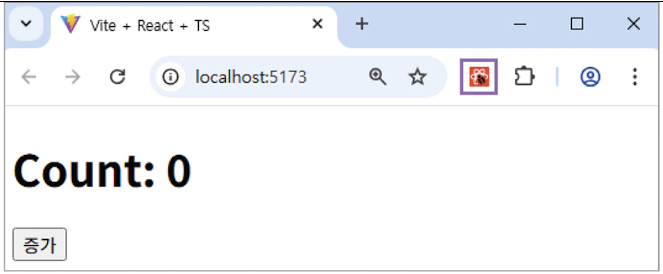
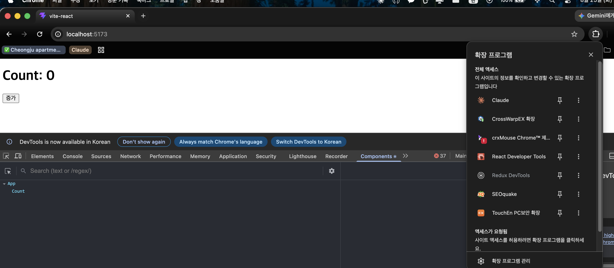
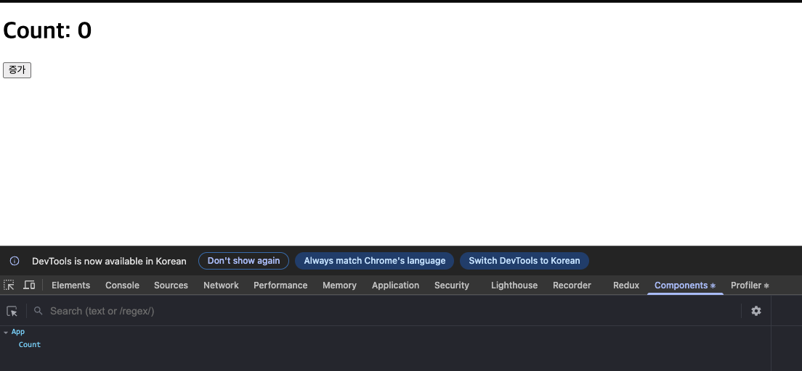
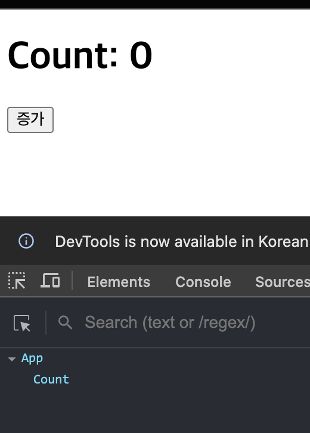
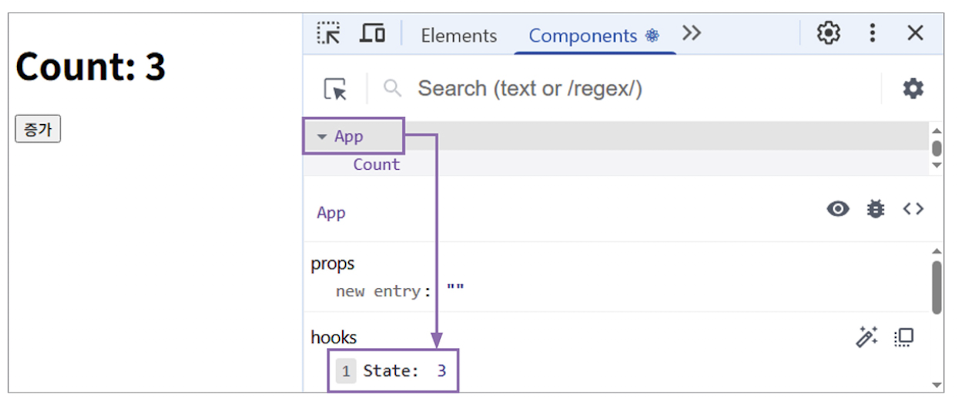
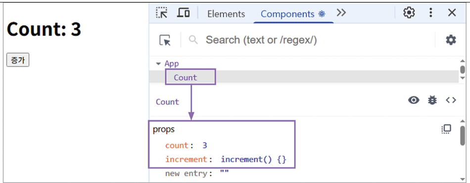
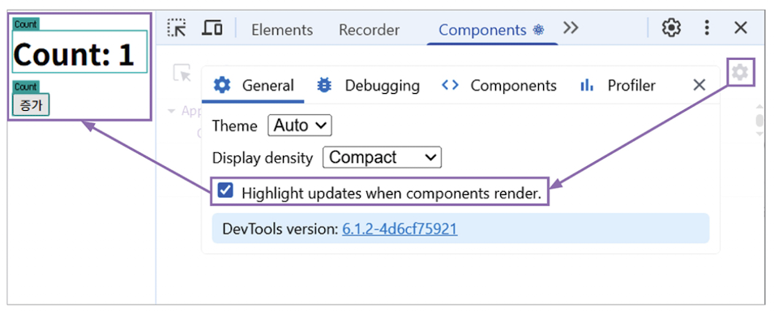

# 개발자 도구로 상태 값 확인하기

리액트에서 상태를 정의하고 상태 값이 제대로 변경되는지 확인하려면 화면에 상태 값을 직접 출력해보면 된다. 그런데 리액트 개발자 도구를 활용하면 상태 값을 화면에 출력하지 않고도 상태 변화를 확인할 수 있다.

아래 간단한 예제 코드를 작성해보자

```javascript
// src/App.tsx
import { useState } from 'react';
import Count from './components/Count';

export default function App(){
    const [count, setCount] = useState(0);
    const increment = () => setCount((count) => count + 1);
    return <Count count={count} increment={increment} />
}

// src/components/Count.tsx
export default function Count({
    count, increment
} : { count: number, increment: () => void }){
    return (
        <div>
            <h1>Count: {count}</h1>
            <button onClick={increment}>증가</button>
        </div>
    );
}
```

코드를 실행하고 웹 브라우저에서 애플리케이션을 확인한다. 이때 리액트 개발자 도구가 설치되어 있다면 개발자 도구 아이콘이 빨간색으로 활성화된다. 리액트 개발자 도구는 아이콘 색상을 개발 모드에서 빨간색, 배포 모드에서 검은색 + 파란색으로 표시한다.





이 상태에서 F12 를 누르면 크롬 개발자 도구가 열린다. 개발자 도구의 상단 탭에 기존 항목 외에 Components와 Profiler 라는 탭이 추가되어 보일것이다.



이 중에서 Profiler 탭은 리액트 애플리케이션 렌더링 성능을 분석할 때 사용하는 도구다. 본 과정에서는 성능 분석보다 상태와 렌더링 흐름 파악에 집중하므로 Profiler 탭은 다루지 않고, 실무에서 가장 많이 사용하는 Components 탭만 다루겠다.

Components 탭을 클릭하면 현재 실행 중인 리액트 애플리케이션의 컴포넌트 구조가 트리 형태로 표시된다.



예제에서는 App 과 Count 2개 컴포넌트가 나타난다. App 컴포넌트에서 count 상태를 정의했기 때문에 App 을 클릭하면 현재 count 상태 값을 확인할 수 있다. 버튼을 클릭해서 상태 값을 증가시키면 리액트 개발자 도구에서도 실시간으로 상태가 변한다.



또한 Count 컴포넌트를 클릭하면 App 컴포넌트에서 전달한 props 값도 확인할 수 있다.



Components 탭의 검색창 옆에 위치한 톱니바퀴 아이콘을 클릭하면 설정 창이 열린다. 여기서 **Highlight updates when components render** 옵션을 체크하면 컴포넌트가 랜더링될 때마다 화면에서 해당 영역이 하이라이트 됩니다. 이 기능은 불필요한 렌더링이 발생하는 컴포넌트를 찾는 데 매우 유용하다.



리액트 개발자 도구는 리액트 애플리케이션을 개발할 때 상태 변화. props 전달, 컴포넌트 구조 확인, 렌더링 흐름 추적 등에 매우 효과적인 도구다. 이를 적극적으로 활용하면 디버깅은 물론 성능 최적화에도 큰 도움이 된다.
