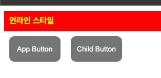
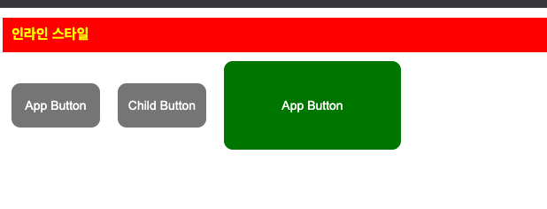
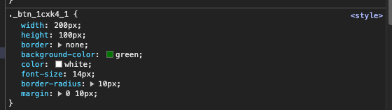
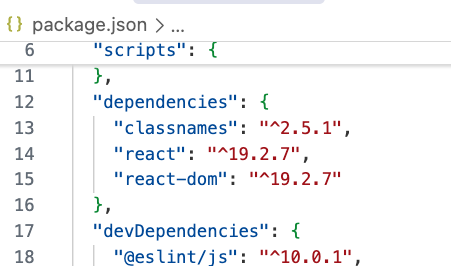
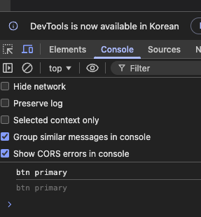
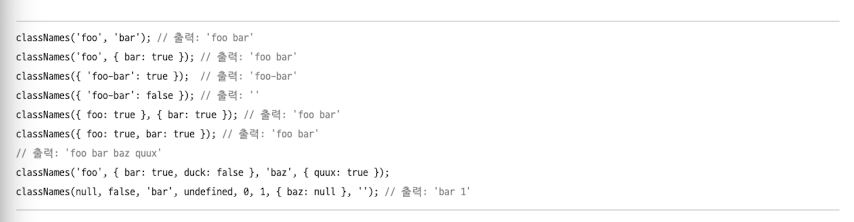

# 전통적인 방법으로 스타일링하기

리액트는 컴포넌트 기반 아키텍처를 바탕으로, 재사용성과 유지보수성이 뛰어난 ui 를 만들 수 있도록 설계되어있다. 하지만 기능적인 구성만큼이나 스타일을 효율적이고 일관성 있게 적용하는 것도 매우 중요하다.

리액트에서는 스타일을 적용하는 방식이 매우 다양하다. 전통적인 css 파일을 활용하는 방식부터 자바스크립트 코드 안에서 스타일을 정의하는 css-in-js 방식, 최근 많이 사용하는 Tailwind css 같은 유틸리티 기반 프레임워크까지 폭넓은 폭넓은 선택지가 존재한다.

각 방식은 장단점이 뚜렷하므로 프로젝트 규모나 팀의 스타일 가이드에 따라 적절한 방법을 선택하는 것이 중요하다.

---

## 인라인 스타일

리액트 컴포넌트에 스타일을 적용하는 가장 전통적인 방법은 인라인 스타일이다. **인라인 스타일** 은 jsx 요소의 style 속성에 직접 스타일 객체를 지정하는 방식이다.

html 에서는 style 속성에 문자열로 css 속성을 작성한다.

> HTML \
> \<h1 style='color: red; font-size: 28px;'>h1\</h1>

반면에 jsx에서는 스타일을 객체 형태로 작성한다. 이때 속성 이름은 카멜 케이스로 작성하고, 값은 문자열로 지정한다.

> JSX \
> \<h1 sytle={{ color: 'red', fontSize: '20px' }}>h1\</h1>;

아래 두 예제는 \<h1> 요소에 스타일을 적용하는 두 가지 방법을 뵤여준다. 첫 번째 예제는 스타일 객체를 변수로 분리해서 사용하는 방식이다.\
style 속성에 background-color, color, font-size, padding 속성을 포함한 객체를 할당한다.\
이처럼 객체를 변수로 따로 정의하면 코드가 더 깔끔하고 동일한 스타일을 여러 곳에서 재사용할 수 있다는 장점이 있다.

```javascript
export default function App() {
  const styles = {
    backgroundColor: "blue",
    color: "white",
    fontSize: "16px",
    padding: "10px",
  };
  return (
    <>
      <h1 style={styles}>인라인 스타일</h1>
    </>
  );
}
```

두 번째 예제는 jsx 안에서 style 속성에 직접 객체를 작성하는 방식이다. 간단한 스타일만 적용할 때는 jsx 내부에서 바로 작성하는 방식이 더 직관적일 수 있다.

```javascript
export default function App() {
  return (
    <>
      <h1
        style={{
          backgroundColor: "red",
          color: "yellow",
          fontSize: "16px",
          padding: "10px",
        }}
      >
        인라인 스타일
      </h1>
    </>
  );
}
```

---

## 글로벌 스타일

리액트에서 스타일을 적용하는 또 다른 전통적인 방법은 글로벌 스타일이다. **글로벌 스타일** 이란 css 확장자를 가진 파일에 CSS 코드를 작성하고,\
이를 컴포넌트에서 import하여 적용하는 방식이다. 일반적으로 **외부 스타일** 이라고 한다.

예를 들어, src 폴더 안에 App.css 파일을 만들고, 버튼에 적용할 스타일을 아래와 같이 작성한다.

```javascript
// src/App.css
.btn {
    width: 100px;
    height: 50px;
    border: none;
    background-color: gray;
    color: white;
    font-size: 14px;
    border-radius: 10px;
    margin: 0 10px;
}
```

App 컴포넌트에서 앞에서 작성한 CSS 파일을 불러온다.

```javascript
// src/App.tsx
import "./App.css";

// 버튼 추가
export default function App() {
  return (
    <>
      <h1
        style={{
          backgroundColor: "red",
          color: "yellow",
          fontSize: "16px",
          padding: "10px",
        }}
      >
        인라인 스타일
      </h1>
      <button className="btn">App Button</button>
    </>
  );
}
```

글로벌 스타일은 작성이 간편하고 전통적인 방식이라 친숙할 수 있지만, 한 가지 중요한 특징이 있다. CSS 파일을 한 번 임포트하면 해당 스타일은 전체 애플리케이션에 전역으로 적용된다는 점이다.

예를 들어, Child 컴포넌트를 아래와 같이 새로 만들어보자.

```javascript
// src/components/Child.tsx
export default function Child() {
    return <button className="btn">Child Button</button>
}

// src/App.tsx
import './App.css';
import Child from './components/Child';

// 스타일을 인라인에 직접 작성
export default function App(){
  return(
    <>
      <h1 style={{
        backgroundColor: 'red',
        color: 'yellow',
        fontSize: '16px',
        padding: '10px',
      }}>
        인라인 스타일
      </h1>
      <button className='btn'>App Button</button>
      <Child />
    </>
  );
}
```



이처럼 글로벌 스타일은 특정 컴포넌트에만 국한되지 않고, 애플리케이션 전체에 영향을 미친다. 따라서 의도치 않게 스타일이 적용되는 경우가 생길 수 있으니 사용할 때 주의해야 한다.

> Tip\
> 글로벌 스타일은 CSS 가 전체 애플리케이션에 적용되므로 일반적으로 main.tsx 파일에서 임포트하는 경우가 많다. 이렇게 하면 스타일 적용 범위를 명확히 할 수 있고, CSS 파일 관리도 더 쉬워진다.

---

## CSS 모듈

리액트에서 스타일을 적용하는 또 다른 전통적인 방법으로는 CSS 모듈이 있다. **CSS 모듈** 은 파일 확장자가 .module.css로 끝나는 파일에 스타일을 작성한 뒤 이를 컴포넌트에서 불러와 사용하는 방식이다.

CSS 모듈의 가장 큰 특징은 스타일이 **로컬 스코프** 를 가진다는 점이다. 그래서 해당 CSS는 특정 컴포넌트에만 적용된다. 즉, 컴포넌트마다 스타일을 독립적으로 관리할 수 있어 스타일 충돌을 방지할 수 있다. 또한 클래스 이름이 고유한 이름으로 자동 변환되기 때문에 다른 컴포넌트와 클래스 이름이 중복되는 문제도 예방할 수 있다.

앞서 App컴포넌트에서 CSS 파일을 임포트하면 Child 컴포넌트의 버튼에도 스타일이 함께 적용되는 문제가 있었다. 이 예제를 CSS 모듈 방식으로 변경해보자.

```javascript
// src/App.module.css
.btn {
    width: 200px;
    height: 100px;
    border: none;
    background-color: green;
    color: white;
    font-size: 14px;
    border-radius: 10px;
    margin: 0 10px;
}

// src/App.tsx
import './App.css';
import Child from './components/Child';
import styles from './App.module.css'; --- 1

// 스타일을 인라인에 직접 작성
export default function App(){
  return(
    <>
      <h1 style={{
        backgroundColor: 'red',
        color: 'yellow',
        fontSize: '16px',
        padding: '10px',
      }}>
        인라인 스타일
      </h1>
      <button className='btn'>App Button</button>
      <Child />
      <button className={styles.btn}>App Button</button> --- 2
    </>
  );
}
```

1. CSS 파일의 이름을 App.module.css 로 바꾸고 import styles from 구문을 사용해 불러온다.

2. 버튼 요소에는 className={styles.btn} 처럼 객체 속성 형태로 클래스 이름을 지정한다.



웹 브라우저에서 개발자도구를 열어 탭에서 App 컴포넌트의 버튼 요소를 확인한다. 그러면 .btn 클래스가 아래처럼 고유한 이름으로 자동 변환되어 있는 것을 확인할 수 있다.


이처럼 CSS 모듈은 클래스 이름을 컴포넌트 기준으로 자동 변환해주기 때문에 다른 컴포넌트나 외부 CSS와 충돌없이 안정적으로 스타일을 적용할수 있다.

> Tip\
> CSS 모듈의 파일명은 컴포넌트 이름과 맞추는 것이 관례다. 예를 들어 App.tsx 컴포넌트에는 App.module.css 로 Child.tsx 컴포넌트에는 Child.module.css 로 이름을 정한다. 이렇게 이름을 통일하면 구조도 명확하고 관리도 쉬워진다.

---

## classnames 라이브러리

글로벌 스타일이나 CSS 모듈을 사용할 때 상황에 따라 클래스 이름을 조건부로 적용해야 하는 경우가 많다. 이럴 때 유용한 도구가 classnames 라이브러리다.\
**classnames** 는 리액트를 포함한 자바스크립트 프레임워크에서 CSS 클래스 이름을 동적으로 포함하고 관리할 수 있게 도와주는 라이브러리다. 이 라이브러리를 사용하면 조건에 따라 클래스 이름을 동적으로 추가하거나 제거할 수 있어 스타일을 더욱 유연하고 깔끔하게 적용할 수 있다.

- 설치 및 기본 사용법
  터미널에서 아래 명령어를 입력하여 classnames 를 설치한다.

> npm i classnames

설치를 완료하면 package.json 파일의 dependencies 항목에 classnames 가 추가된것을 확인할 수 있다.



설치한 후에는 아래와 같이 classNames() 함수를 import 해서 사용할 수 있다.

```javascript
import './App.css';
import Child from './components/Child';
import styles from './App.module.css';
import classNames from 'classnames';

// 스타일을 인라인에 직접 작성
export default function App(){
  // classnames 라이브러리 설치 및 사용
  const btnClass = classNames('btn', 'primary');
  console.log(btnClass);

  .... 생략
```

콘솔출력


classNames() 함수는 전달된 클래스 이름(btn 과 primary) 을 공백으로 구분한 하나의 문자열(btn primary) 로 합쳐준다. 불필요한 공백을 줄이고, 조건에 따라 클래스를 조합할 수 있어 코드가 훨씬 간결해진다.

아래는 classNames() 함수의 다양한 사용 방법이다. 이 함수는 false, null, undefined, 0, '' 등 불필요한 값은 자동으로 무시한다.



> Tip\
> 더 많은 사용법은 공식 문서 https://www.npmjs.com/package/classnames 를 참고하자.

classnames 라이브러리는 글로벌 스타일 방식과 CSS 모듈 방식 모두에서 사용할 수 있지만, 사용법에 차이가 있다. 각 사용법을 살펴보자.

---

### 글로벌 스탈에서 사용하기

classnames 라이브러리는 글로벌 스타일 방식에서 매우 유용하게 활용할 수 있다.

간단한 예제를 보자. 기존 App.module.css 파일의 이름을 App.css로 바꾸고 코드를 다음과 같이 수정한다. \
버튼에 적용할 기본 스타일인 .btn 클래스와 조건부로 적용할 .is-active 클래스를 정의한다.

```javascript
// src/App.css
.btn {
    width: 100px;
    height: 50px;
    border: none;
    background-color: gray;
    color: white;
    font-size: 14px;
    border-radius: 10px;
    margin: 0 10px;
}

/* .is active 정의 */
.is-active {
    background-color: blue;
}

// src/App.tsx
import './App.css';
import Child from './components/Child';
import styles from './App.module.css';
import classNames from 'classnames'; --- 1

// 스타일을 인라인에 직접 작성
export default function App(){
  // classnames 라이브러리 설치 및 사용
  const btnClass = classNames('btn', 'primary');
  console.log(btnClass);

  // is-active 사용
  const isActive = true; --- 2

  return(
    <>
      <h1 style={{
        backgroundColor: 'red',
        color: 'yellow',
        fontSize: '16px',
        padding: '10px',
      }}>
        인라인 스타일
      </h1>
      <button className='btn'>App Button1</button>
      <Child />
      <button className={styles.btn}>App Button2</button>
      <button className={classNames('btn', {'is-active': isActive})}>App Button3</button> --- 3
    </>
  );
}

```

1. classnames 패키지에서 classNames 함수를 import 한다.

2. isActive 변수는 true 또는 false 값을 가지며, 값에 따라 \<button> 요소에 is-active 클래스를 추가하거나 삭제한다.

3.
