# CSS-in-JS 로 스타일링하기

기존의 웹 개발 방식은 html, css, 자바스크립트를 각각 분리해 개발하는 구조를 따른다. \
이 방식은 **관심사 분리** 라는 소프트웨어 설계 원칙에 기반을 두고 있다. 이 방식의 목적은 각 기술의 역할을 명확하게 구분함으로써 유지보수성과 확장성을 높이려는 것이다.

그러나 웹 애플리케이션이 점점 더 복잡해지고, 리액트나 뷰와 같은 프런트앤드 프레임워크의 도입으로 컴포넌트 기반 개발 방식이 보편화되면서 기존의 스타일링 방식은 아래와 같은 문제점을 드러내기 시작했다.

1. **전역 스코프 문제** : 기존 CSS 는 전역 스코프로 작동하기 때문에 클래스 이름 충돌이 자주 발생하고, 이를 방지하기 위한 명명 규칙 관리도 복잡하다.

2. **상태 기반 스타일링의 어려움** : ui의 상태는 자바스크립트로 제어하는 반면, 스타일은 css 파일에 따로 정의하므로 동적 상태 변화에 따른 스타일조작이 번거롭고 복잡하다.

3. **유지보수의 어려움** : 프로젝트 규모가 커질수록 어떤 스타일이 어떤 컴포넌트에 적용되는지 파악하기 힘들고, 사용하지 않는 css를 완전히 제거하는 것도 쉽지 않다.

이러한 문제를 해결하고자 등장한 스타일링 방식이 바로 CSS-in-JS 다. **CSS-in-JS** 는 자바스크립트 파일 안에 스타일을 정의하고 적용하는 방식으로 동적 스타일링을 매우 쉽게 처리할 수 있다. 이 방식은 컴포넌트 단위로 스타일을 작성하므로 클래스 충돌이 없고 재사용성도 높다.\
그리고 상태, props, 조건 등을 바탕으로 동적으로 스타일을 조절할 수 있는 유연성이 있다.

CSS-in-JS 방식은 다양한 라이브러리로 구현할 수 있다. \
리액트 생태계에서 널리 사용하는 대표적인 라이브러리는 styled-components, emotion, vanilla-extract 다.

---

## styled-components

styled-components는 CSS-in-JS 방식의 대표적인 라이브러리 중 하나로, 자바스크립트 코드 안에 스타일이 적용된 컴포넌트(스타일 컴포넌트)를 생성하는 방식이다. 자바스크립트를 사용해 CSS를 정의하고, 해당 스타일이 적용된 컴포넌트를 바로 만들어 사용할 수 있다.

- 설치
  styled-components는 터미널에서 아래 명령어로 설치한다.

> TERMINAL\
> npm install styled-components

설치를 완료하면 package.json 파일의 dependencies 항목에 styled-components가 다음과 같이 추가된다. 버전 정보는 설치 시점에 따라 다를 수 있다.

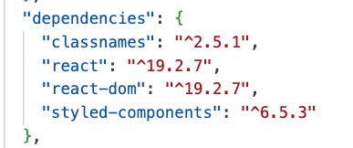

- 기본 사용법\
  styled-components를 사용하려면 먼저 라이브러리에서 styled 객체를 불러와야 한다.

  > import styled from 'styled-components';

styled 객체는 html 태그 이름에 해당하는 함수를 제공해 이 함수를 사용하면 사용하면 스타일 컴포넌트를 만들 수 있다. 예를 들어 \<button> 태그에 스타일을 적용한 컴포넌트를 만들고 적용한 컴포넌트를 만들고 싶다면 아래와 같이 작성한다.

```javascript
const Button = styled.button`
  background: transparent;
  border-radius: 3px;
  border: 2px solid #ffffff;
  color: #aaabbb;
  margin: 0 1em;
  padding: 0.25em 1em;
`;
```

코드에서 사용한 styled.button `` 형식이 조금 생소할 수 있는데, 이는 **태그드 템플릿 리터럴** 이라는 문법이다.\
함수와 템플릿 문자열을 결함한 형태로, 자세한 내용은 [Note] **태그드 템플릿 리터럴** 을 참고하도록 하고 \
CSS 를 문자열처럼 작성해 함수에 전달하는 방식 정도로 이해해도 충분하다.

styled-components 는 템플릿 리터럴 안에 작성한 CSS 코드를 읽어 해당 스타일이 허용된 컴포넌트를 생성해 반환한다.\
즉, styled.button `` 을 호출하면 스타일이 적용된 버튼 컴포넌트가 만들어진다.

styled-components 라이브러리를 App 컴포넌트에서 사용해 보자.

```javascript
import styled from "styled-components"; --- 1

const Button = styled.button`
  background: transparent;
  border-radius: 3px;
  border: 2px solid #ffccdd;
  color: #aabbcc;
  margin: 0 1em;
  padding: 0.25em 1em;
`;

export default function App() {
    return <Button>Click Me</Button> --- 2
}
```

1. styled 객체는 App() 함수바깥에서 정의한다. 이처럼 컴포넌트 바깥에서 스타일 컴포넌트를 정의하면 성능상 유리하기 때문에 일반적으로 이 방식을 사용한다.

2. 생성한 Button 컴포넌트를 App 컴포넌트에서 랜더링하면 스타일이 적용된 버튼이 화면에 표시된다.

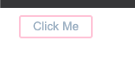

---

`Note 태그드 템플릿 리터럴`

**태그드 템플릿 리터럴** 은 템플릿 리터럴 앞에 함수를 붙여 문자열을 처리할 수 있는 자바스크립트 문법이다.\
함수는 템플릿 리터럴의 문자열 부분과 ${} 로 감싼 표현식을 분리된 배열 형태로 전달받아 이를 바탕으로 원하는 방식으로 문자열을 가공할 수 있다.

예제로 작동 방식을 확인해 보자.

```javascript
function tagFunction(strings, ...values) {
  console.log(strings); // 문자열 배열
  console.log(values); // 삽입된 표현식 값들
}
const name = "John";
const age = 25;

tagFunction`Hello, my name is ${name} and I am ${age} years old.`;
```

코드를 실행하면 다음과 같은 결과가 출력된다. 첫 번째 배열은 ${} 기준으로 나뉜 고정 문자열 부분이고, 두 번째 배열은 템플릿 리터럴 안에 삽입된 표현식 값들이다.

[출력결과]\
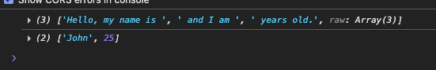

태그드 템플릿 리터럴은 리액트에만 특화된 기능은 아니다. 다만, styled-components 같은 CSS-in-JS 라이브러리에서 스타일 문자열을 함수에 전달하는 방식으로 널리 사용된다. 따라서 이 문법은 리터럴을 함수처럼 호출할 수 있다 는 정도만 이해해도 충분하다.

---

- 동적 스타일

styled-components를 사용할 때 컴포넌트의 속성을 사용해 동적으로 스타일을 지정할 수도 있다. 이 기능을 사용하면 상태에 따라 버튼 색을 다르게 표시하는 등 조건에 따른 스타일 변경이 매우 간편해진다.

아래 예제는 $primary 라는 속성을 기준으로 버튼의 배경색과 글자색을 변경한다.

```javascript
import styled, { css } from "styled-components"; --- 1

const Button = styled.button<{ $primary?: boolean }>` --- 2
  background: transparent;
  border-radius: 3px;
  border: 2px solid #ffccdd;
  color: #aabbcc;
  margin: 0 1em;
  padding: 0.25em 1em;
  ${ (props) =>  --- 3
    props.$primary &&
    css `
        background: #bf4f74;
        color: white;
    `
  }
`;

export default function App() {
    return <Button $primary>Click Me</Button> --- 4
}
```

1. css 함수를 불러온다. css 함수는 styled-components 에서 **조건부 스타일** 을 작성할 때 사용하는 함수다. **태그드 템플릿 리터럴** 을 지원하며, 동적 스타일을 정의할 때 자주 사용한다.

2. 타입스크립트에서는 스타일 컴포넌트에 전달할 props의 타입을 명시해야 한다. 여기서는 $primary 라는 불리언 타입의 선택적 속성을 정의하고 있다. $ 기호는 일반적으로 스타일 내부에서만 사용하는 props 임을 나타낼 때 관례적으로 사용한다.

3. ㅅ스타일 컴포넌트에 전달된 props는 ${ (props) => css `` } 형식으로 사용하고, 조건에 따라 새로운 스타일을 동적으로 추가할 수 있다. 위의 예제 코드에서는 props.$primary가 true 일 경우, 즉 $primary 속성이 전달되면 버튼의 배경색과 글자색을 변경한다.

4. Button 스타일 컴포넌트로 $primary 속성을 전달한다. \<Button $primary>처럼 속성 이름만 적으면 타입스크립트에서는 $primary={true} 와 동일하게 처리한다. 반면에 $primary={false} 를 명시하거나 아예 속성을 생략하면 스타일이 적용되지 않는다.

> Note 트래지언트 props \
> $primary처럼 변수 앞에 $ 기호를 붙여 전달하는 방식을 **트래지언트 props** 라고 한다.\
이 기능은 styled-components 6.1 버전부터 도입되었다.\
$ 기호로 시작하는 props는 컴포넌트와 스타일링에는 사용되지만, 최종 DOM에는 전달되지 않기 때문에 콘솔에 불필요한 경고가 뜨거나 예기치 않은 동작이 발생하는 것을 방지할 수 있다.

위 예제에서 변수 Button은 스타일이 적용된 리액트 컴포넌트다. 기본 컴포넌트와 마찬가지로 props를 전달훌 수 있으며, 전달된 props 값에 따라 컴포넌트의 스타일이 달라지는 구조다. 실행해보면 지정한 배경색과 글자색이 버튼에 적용된다.

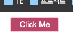

styled-componets 는 이처럼 자바스크립트와 스타일을 유기적으로 결합해 동적인 스타일링을 매우 간편하게 구현할 수 있게 도와준다.

> Tip\
> 2025년 3월 styled-components 공식 팀은 새로운 기능 개발을 중단하고 버그 수정 및 보안 패치와 같으 유지보수에만 집중하겠다고 발표했다. 이에 따라 장기적인 후원도 받지 않으며, 긴급한 상황이 발생할 경우 내부 비상 기금을 통해 간헐적으로 유지보수를 진행할 수 있도록 최소한의 예산만 확보해둔 상태라고 한다.\
> \
> 따라서 현재 시점에서는 새로운 프로젝트에 styled-components를 사용하는 것을 권장하지 않으며 기존 프로젝트를 유지보수를 위한 참고용으로만 다루었다.

---

## emotion

emotion 은 현대 웹 개발에서 널리 사용하는 강력하고 유연한 CSS-in-JS 라이브러리다. 이 라이브러리는 유연성과 성능을 극대화 할 수 있도록 설계되었으며, 간결한 API를 제공해 개발자가 컴포넌트 기반 애플리케이션에서 직관적으로 스타일을 정의하고 관리할 수 있게 한다.

- 설치
  emotion 라이브러리는 터미널에 다음 명령어를 입력해 설치한다.

> TERMINAL\
> npm i @emotion/css

설치를 완료하면 package.json 파일의 dependencies 항목에 emotion 이 아래와 같이 추가된다.

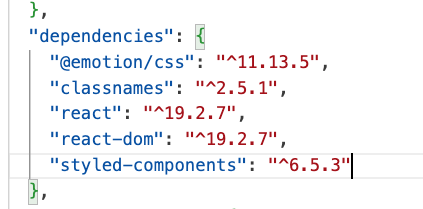

---

- 기본 사용법

emotion 라이브러리를 사용하려면 @emotion/css 패키지에서 css 함수를 불러와야 한다. \
이 함수는 태그드 템플릿 문자열을 지원하므로 일반적인 CSS 처럼 템플릿 리터럴 안에 스타일을 작성한다. \
CSS 함수는 전달받은 스타일을 정보를 바탕으로 고유한 클래스 이름을 설정하고, 해당 이름을 문자열로 반환한다. \
이 클래스 이름은 html 요소의 className 속성에 설정해 사용할 수 있다.

```javascript
import { css } from "@emotion/css";

export default function App() {
  return (
    <button
      className={css`
        background: transparent;
        border-radius: 3px;
        border: 2px solid #bf4f74;
        color: #bf4f74;
        margin: 0 1em;
        padding: 0.25em 1em;
      `}
    >
      클릭버튼이유~~
    </button>
  );
}
```

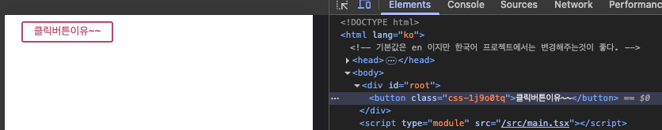

예제에서 \<button> 태그는 className 속성을 통해 css 함수를 호출한다. 템플릿 리터럴로 작성한 스타일은 emotion이 자동으로 클래스 이름을 생성해 적용한다. 클래스 이름은 애플리케이션을 실행하고 개발자 도구를 열어보면 확인할 수 있다.

---

- 동적 스타일

emotion 라이브러리는 템플릿 문자열 안에 자바스크립트 표현식을 사용할 수 있어서 삼항 연산자를 활용해 간단하게 동적 스타일을 구현할 수 있다.\
예를 들어, 아래 예제는 isActive 상태 값에 따라 버튼의 배경색과 글자색을 다르게 설정한다.

```javascript
import { css } from '@emotion/css';

export default function App() {
    const isActive = true; --- ?
    return (
        <button
            className={css`
                background: ${ isActive? 'blue' : 'transparent' }; --- ?
                border-radius: 3px;
                border: 2px solid #bf4f74;
                color: ${ isActive? 'white' : '#bf4f74' }; --- ?
                margin: 0 1em;
                padding: 0.25em 1em;
            `}
        >클릭버튼이유~~</button>
    );
}
```

위처럼 삼항 연산자를 활용해 상태 값에 따라 다른 스타일을 쉽게 적용할 수 있다.

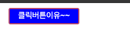

---

## vanilla-extract

vanilla-extract 는 타입스크릷트 기반의 CSS-in-JS 라이브러리로, 가장 큰 특징은 제로 런타임이다.\
**제로 런타임** 이란 애플리케이션이 실행될때 스타일을 생성하거나 적용하는데 추가 비용이 전혀 발생하지 않는다는 의미다.

**styled-components, emotion** 과 같은 일반적인 CSS-in-JS 라이브러리는 자바스크립트 코드 안에 스타일을 작성하고, 이를 실행 중에 동적으로 처리한다. 이 방식은 개발이 편리하지만, 자바스크립트가 실행될 때마다 스타일이 생성되어 초기 랜더링이 느려질 수 있고, 스타일이 많을수록 성능 저하 가능성이 증가한다.

반면, vanilla-extract 는 개발자가 작성한 스타일이 빌드 타임에 정적 CSS 파일로 변환된다. 웹 브라우저는 이 CSS 파일을 일반 CSS 처럼 정적으로 로딩한다. 따라서 실행 중에 스타일을 생성하지 않으므로 런타임 비용이 없다.

그래서 초기 랜더링 속도가 빠르고, CSS파일이 정적이므로 웹 브라우저 캐싱이 가능하다.
또한 타입스크립트 기반으로 정적 타입 검사 및 자동 완성을 지원한다.

이러한 이유로 성능과 타입 안전성을 모두 고려하는 프런트앤드 개발자 사이에서 vanilla-extract는 점점 더 큰 관심을 받고 있다.

---

- 설치

vanilla-extract는 패키즈를 2번에 나눠 설치해야 한다. @vanilla-extract/css 는 프로젝트에서 실제 사용할 스타일 관련 기능을 제공하므로 일반 의존성에 설치한다. @vanilla-extract/vite-plugin 은 Vite에서 빌드 시 스타일 파일을 처리하는 역할을 하므로 개발 의존성에 설치한다.

> TERMINAL\
> npm install @vanilla-extract/css\
> npm install --save-dev @vanilla-extract/vite-plugin

설치를 완료하면 package.json 파일의 dependencies와 devDependencies 항목에 vanilla-extract 가 다음과 같이 추가된다. 버전 정보는 설치 시점에 따라 책과 다를 수 있다.

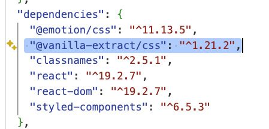

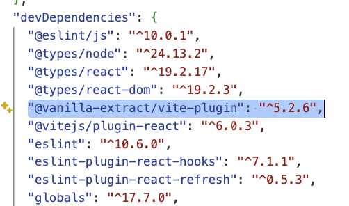

vanilla-extract 를 사용하려면 Vite 설정 파일인 vite.config.ts 에 아래와 같이 플러그인을 추가해야 한다.

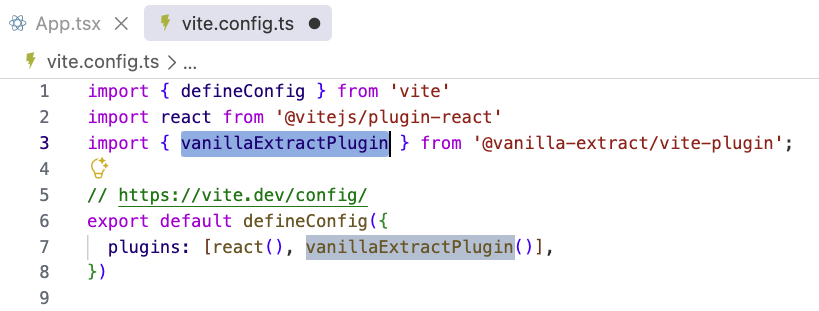

---

- 기본 사용법

vanilla-extract 라이브러리는 .css.ts 확장자를 가진 파일에 CSS 를 작성한다.
이 파일안에 @vanilla-extract/css 패키지에서 제공하는 style() 함수를 사용해 CSS 클래스를 정의한다.

src 폴더에 App.css.ts 파일을 만들고 다음과 같이 코드를 작성한다. 각 style() 함수는 CSS 속성을 객체 형태로 작성하며, 반환된 클래스 이름이 변수에 저장된다. 이 변수들을 className 에 할당하면 해당 스타일이 적용된다.

```javascript
// src/App.css.ts

import { style } from "@vanilla-extract/css";

export const container = style({
  padding: "1rem",
});

export const button = style({
  background: "transparent",
  borderRadius: "3px",
  border: "2px solid #bf4f74",
  color: "#bf4f74",
  margin: "0 1em",
  padding: "0.25em 1em",
});

export const active = style({
  backgroundColor: "blue",
  border: "2px solid blue",
  color: "white",
});
```

가상 선택자도 객체 속성 키로 지정할 수 있다.\
예를 들어 :hover 스타일을 아래와 같이 작성할 수 있다.

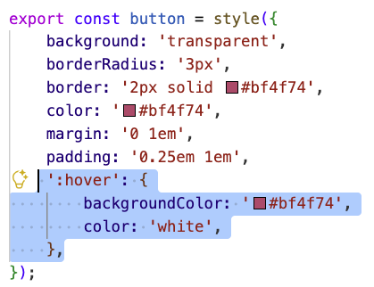

App.css.ts 파일에서 내보낸 변수를 아래와 같이 가져와 사용한다.

```javascript
// src/App.tsx

import { container, button } from "./App.css.ts";

export default function App() {
  return (
    <div className={container}>
      <button className={button}>클릭?</button>
    </div>
  );
}
```

container, button 변수는 각각 클래스 이름 문자열을 담고 있다. 이를 jsx의 className 속성에 할당하면 해당 스타일이 html 요소에 적용된다.

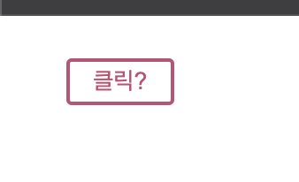

---

- 동적 스타일

vanilla-extract 라이브러리는 런타임에서 CSS 를 생성하지는 않지만, 조건에 따라 className 을 선택적으로 할당하는 방식으로 동적 스타일을 적용할 수 있다.\
자바스크립트의 삼항 연산자 (조건 ? 값1 : 값2) 또는 AND 연산자 (조건 && 값) 를 사용하면 특정 상태에 따라 클래스를 추가하거나 제외할 수 있다.

아래 예제에서 button 은 항상 적용되고 active 클래스는 AND 연산자를 사용해 조건이 true 일 때만 추가한다.

```javascript
import { container, button, active } from "./App.css.ts";

export default function App() {
  const isActive = true;
  return (
    <div className={container}>
      <button className={`${button} ${isActive && active}`}>클릭?</button>
    </div>
  );
}
```

[실행결과]

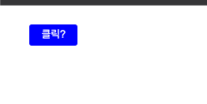
