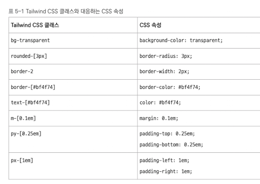
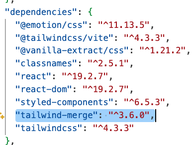
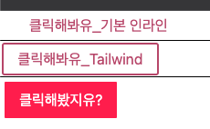

# Tailwind CSS 로 스타일링하기

최근에는 Tailwind CSS 라는 컴포넌트 스타일링 방식이 크게 주목받고 있다.\
**Tailwind CSS** 는 유틸리티 퍼스트 스타일링 철학을 따르는 프레임워크 중에서 가장 인기 있는 라이브러리다.\
**유틸리티 퍼스트** 란 작고 재사용 가능한 유틸리티 클래스를 조합해 스타일을 만드는 방식이다.\
각 유틸리티 클래스는 보통 하나의 CSS 속성과 일대일로 대응하며, 이 클래스들을 class 속성에 나열해 원하는 스타일을 만들 수 있다.\
이런 방식 덕분에 CSS 파일을 따로 작성하지 않고도 HTML이나 JSX 코드 안에서 클래스만으로 스타일을 적용할 수 있다.

## 설치 및 기본 사용법

Tailwind CSS 를 리액트 프로젝트에서 사용하려면 관련 라이브러리를 설치하고 초기 설정을 해야 한다.

---

- 설치

터미널에서 아래 명령어를 입력해 Tailwind CSS 와 Vite 플러그인을 설치한다. 이전에는 postcss, autoprefixer 도 수동으로 설치해야 했으나, Vite 환경에서는 @tailwindcss/vite 플러그인이 자동으로 처리하기 때문에 따로 설치하지 않아도 된다.

> TERMINAL\
> npm install tailwindcss @tailwindcss/vite

[설치완료 후 package.json 예]


설치가 끝나면 Vite 설정 파일인 vite.config.ts 에 아래와 같이 플러그인을 추가한다.

[코드추가]


src 폴더에 index.css 파일을 생성하고 아래와 같이 Tailwind 를 불러온다.


index.css 파일을 프로젝트에 반영하려면 main.tsx 파일에서 import 해야 한다.


여기까지 따라 했다면 Tailwind CSS 설치와 기본 설정은 끝난다. 이제 컴포넌트에서 자유롭게 유틸리티 클래스를 사용할 수 있다.

---

- 기본 사용법

Tailwind CSS 는 유틸리티 클래스를 HTML 요소에 직접 적용해 스타일을 설정하는 방식이다. 아래 예제는 기존 인라인 스타일로 코드를 작성했다.

```javascript
export default function App() {
  return (
    <>
      <button
        style={{
          background: "transparent",
          borderRadius: "3px",
          color: "#bf4f74",
          margin: "0 1em",
          padding: "0.25em 1em",
        }}
      >
        클릭해봐유_기본 인라인
      </button>
    </>
  );
}
```

위의 코드를 Tailwind CSS 로 변환하면 코드가 훨씬 간결해진다.

```javascript
export function App2() {
  return (
    <>
      <div>
        <hr />
        <button
          className="
                        bg-transparent
                        rounded-[3px]
                        border-2
                        border-[#bf4f74]
                        text-[#bf4f74]
                        m-[0.1em]
                        py-[0.25em]
                        px-[1em]
                "
        >
          클릭해봐유_Tailwind
        </button>
      </div>
    </>
  );
}
```

예제 코드에서 사용한 Tailwind CSS 클래스명과 대응되는 CSS 속성은 아래와 같다.



Tailwind CSS 를 처음 사용할 때 클래스명을 매칭하기 어려울 수 있다. \
이럴때는 Tailwind CSS 공식문서 https://tailwindcss.com/docs 를 활용하면 된다.\
원하는 CSS 속성을 검색하면 대응하는 클래스명을 쉽게 찾을 수 있다.\

---

## tailwind-merge 라이브러리

기존 CSS 에서는 classnames 라이브러리를 사용해 조건부 스타일이나 동적 클래스를 조합할 수 있었다. Tailwind CSS에서도 classnames 를 사용할 수 있지만, 최근에는 tailwind-merge 라이브러리를 더 많이 사용하는 추세다.

tailwind-merge 는 Tailwind CSS 클래스명을 충돌 없이 병합할 수 있게 도와주는 유틸리티 라이브러리다. 특히 동적으로 클래스명을 조합해야 할 때 매우 유용하며, 아래 두 가지 함수를 제공한다.

- twMerge() : 여러 Tailwind CSS 클래스를 결합할 때 중복되거나 충돌되는 클래스가 있으면 마지막 클래스를 우선시해 중복을 제거한다.

- twJoin() : 여러 클래스를 단순히 문자열로 연결하며, 중복되거나 충돌되는 클래스도 그대로 유지한다.

두 함수는 중복 클래스명을 제거하느냐 제거하지 않느냐의 차이만 있을 뿐 나머지 작동 방식은 동일하다. Tailwind CSS 를 사용하다 보면 같은 속성 그룹의 클래스가 중복되는 경우가 많기 때문에 일반적으로는 중복을 제거해주는 twMerge() 함수를 사용하는 것이 더 편리하다.

[설치]

> TERMINAL\
> npm i tailwind-merge

[설치 후 package.json]



twMerge() 함수는 다음과 같이 불러온다.

> import { twMerge } from 'tailwind-merge';

twMerge() 함수는 기본적으로 전달된 클래스명을 클래스명을 하나로 결합한다. 이때 중복 속성이 있는 경우 나중에 등장한 클래스를 우선 적용하며, 전달하는 인자의 개수에는 제한이 없다.

```javascript
twMerge("bg-transparent", "rounded-[3px]");

twMerge(
  "bg-transparent",
  "rounded-[3px]",
  "border-[#bf4f74]",
  "text-[#bf4f74]",
);
```

각 인자는 하나의 클래스 문자열일 수도 있고, 공백으로 구분한 여러 클래스 문자열일 수도 있다.

```javascript
twMerge("bg-transparent rounded-[3px]");

twMerge("bg-transparent", "rounded-[3px]", "border-[#bf4f74] text-[#bf4f74]");
```

txMerge() 함수는 같은 속성 그룹의 클래스가 중복되었을 때 가장 마지막에 등장한 클래스만 남기고 나머지를 제거한다.

```javascript
twMerge("bg-red-500 bg-blue-500");

twMerge("bg-red-500 bg-blue-500", "text-white bg-rose-500");
```

AND 연산자나 삼항 연산자를 사용하면 조건에 따라 클래스를 동적으로 조합할 수 있다.

```javascript
const isActive = true;

const className = twMerge("bg-gray-500", isActive && bg - blue - 500);
```

아래는 twWind() 함수를 사용해 버튼 요소에 스타일을 적용한 예제다.

```javascript
import { twMerge } from "tailwind-merge";

export function App3() {
  return (
    <>
      <hr />
      <div>
        <button
          className={twMerge(
            "bg-transparent text-[#bf4f74] rounded-[3px] border-2 border[#f4f88] m-[0.2em] py-[0.5em] px-[1em]",
            "bg-rose-500 text-white",
          )}
        >
          클릭해봤지유?
        </button>
      </div>
    </>
  );
}
```

[실행결과]



코드를 보면 bg-transparent 와 bg-rose-500, text-[#bf4f74] 와 text-white 가 각각 중복된다.\
twMerge() 는 이중 마지막 클래스만 남기고 앞에 있는 클래스는 제거하므로 실제 적용 클래스는 다음과 같다.

> class= 'bg-rose-500 text-white rounded-[3px] border-[#bf4f74] m-[0.1em] py-[0.25em] px-[1em]
