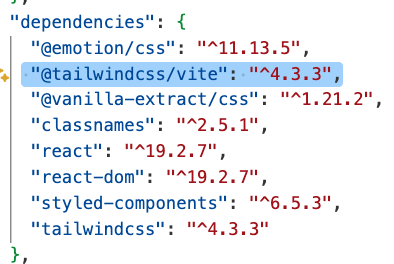
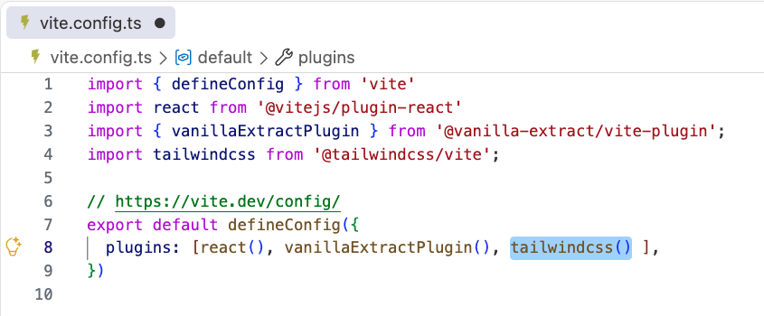
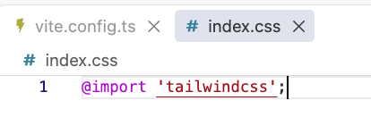
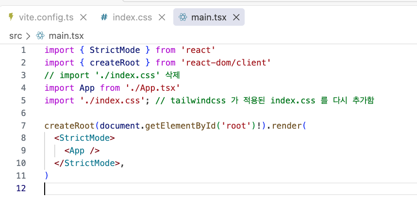

# Tailwind CSS 로 스타일링하기

최근에는 Tailwind CSS 라는 컴포넌트 스타일링 방식이 크게 주목받고 있다.\
**Tailwind CSS** 는 유틸리티 퍼스트 스타일링 철학을 따르는 프레임워크 중에서 가장 인기 있는 라이브러리다.\
**유틸리티 퍼스트** 란 작고 재사용 가능한 유틸리티 클래스를 조합해 스타일을 만드는 방식이다.\
각 유틸리티 클래스는 보통 하나의 CSS 속성과 일대일로 대응하며, 이 클래스들을 class 속성에 나열해 원하는 스타일을 만들 수 있다.\
이런 방식 덕분에 CSS 파일을 따로 작성하지 않고도 HTML이나 JSX 코드 안에서 클래스만으로 스타일을 적용할 수 있다.

## 설치 및 기본 사용법

Tailwind CSS 를 리액트 프로젝트에서 사용하려면 관련 라이브러리를 설치하고 초기 설정을 해야 한다.

---

- 설치

터미널에서 아래 명령어를 입력해 Tailwind CSS 와 Vite 플러그인을 설치한다. 이전에는 postcss, autoprefixer 도 수동으로 설치해야 했으나, Vite 환경에서는 @tailwindcss/vite 플러그인이 자동으로 처리하기 때문에 따로 설치하지 않아도 된다.

> TERMINAL\
> npm install tailwindcss @tailwindcss/vite

[설치완료 후 package.json 예]

설치가 끝나면 Vite 설정 파일인 vite.config.ts 에 아래와 같이 플러그인을 추가한다.

[코드추가]

src 폴더에 index.css 파일을 생성하고 아래와 같이 Tailwind 를 불러온다.

index.css 파일을 프로젝트에 반영하려면 main.tsx 파일에서 import 해야 한다.

여기까지 따라 했다면 Tailwind CSS 설치와 기본 설정은 끝난다. 이제 컴포넌트에서 자유롭게 유틸리티 클래스를 사용할 수 있다.

---

- 기본 사용법
