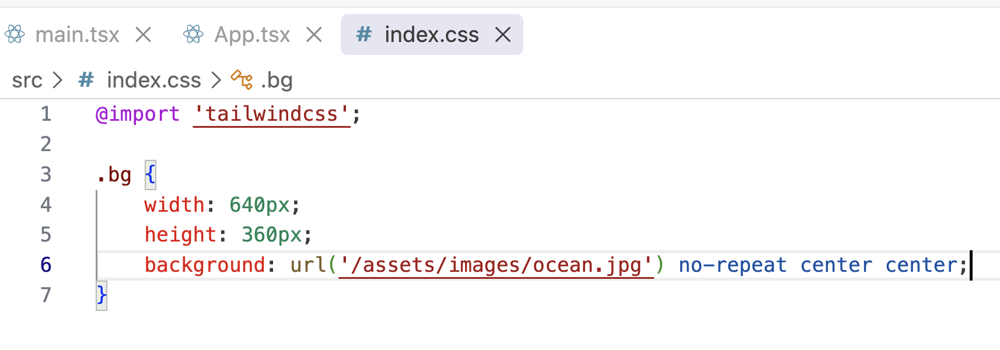
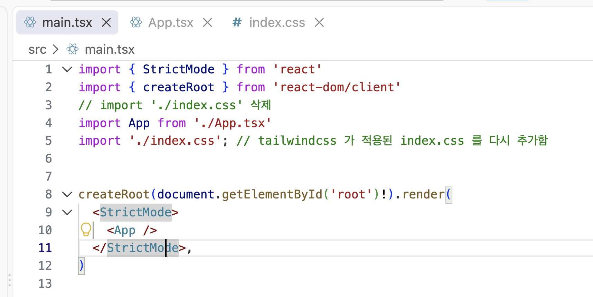
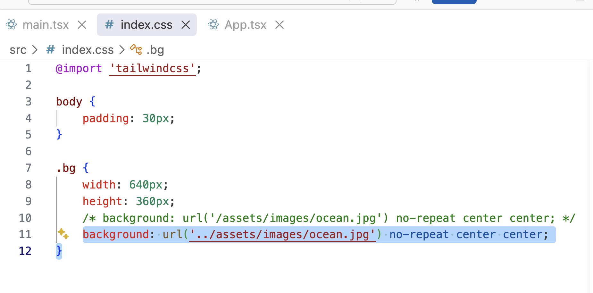
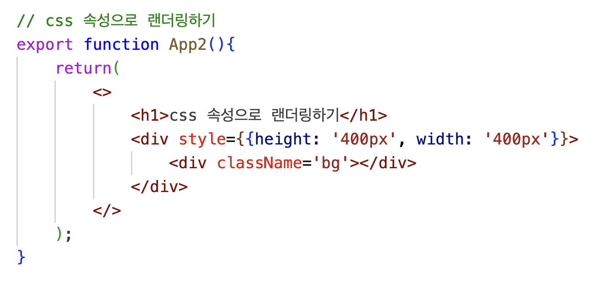

# 이미지 랜더링하기

리액트 애플리케이션을 스타일링할 때는 보통 CSS에 집중하는 경우가 많다.\
하지만 이미지나 폰트처럼 시각적 요소도 애플리케이션의 스타일을 구성하는 중요한 부분이다. 적절한 이미지를 활용하고 디자인된 폰트를 적용하면 애플리케이션의 전체 분위기와 완성도에 큰 영향을 줄 수 있다. 리액트 컴포넌트에서 이미지를 랜더링하는 방식은 HTML과 약관 다르다. 리액트에서는 HTML이 아니라 JSX 문법을 사용하기 때문이다.

## 이미지 리소스 준비하기

예제를 실습하기 위한 이미지 파일을 준비한다. 이미지 파일은 자유롭게 선택해도 되지만,\
**픽사베이 (Pixabay)** 사이트에서 무료 이미지를 다운로드하여 사용해보자.

리액트 애플리케이션에서 이미지 파일은 보통 Public과 src 폴더 중 하나에 추가할 수 있다. 렌더링 방식은 이미지를 추가한 위치에 따라 달라진다. ocean.jpg 파일을 다음 위치에 각각 저장한 후 비교해 보자.

- public/assets/images/ocean.jpg
- src/assets/images/ocean.jpg

`Tip - 이미지나 폰트 같은 리소스 파일은 일반적으로 assets 폴더에 저장한다.`

## public 폴더에서 이미지 렌더링하기

public 폴더 하위에 저장한 이미지는 정적 리소스로 취급한다. 이 리소스들은 웹팩이나 Vite 같은 빌드 도구의 처리 과정을 거치지 않고, 파일 그대로 애플리케이션에 포함된다.

---

- img 태그로 렌더링하기

public 폴더에 저장한 이미지를 리액트 컴포넌트에서 렌더링하려면 \ 태그의 src 속성에 이미지 경로를 지정한다. 이때 경로는 절대 경로 방식으로 작성해야 한다. 예를 들어, public/assets/images/ocean.jpg 파일을 사용하려면 아래와 같이 작성한다. 절대 경로의 / 는 public 폴더를 가리키므로 public 폴더 자체는 경로에 포함하지 않아도 된다.

```javascript
export default function App() {
  return (
    <>
      
    </>
  );
}
```

코드에서 보듯이 public 폴더의 정적 리소스는 html에서 사용하듯 import 없이 바로 참조할 수 있다.

---

- CSS 속성으로 렌더링하기

CSS 에서는 background 또는 background-image 속성을 사용해 요소에 배경 이미지를 설정할 수 있다. public 폴더에 저장한 이미지를 CSS 속성으로 지정할 때도 \ 태그를 사용할 때와 마찬가지로 절대 경로를 사용해야 한다.



main.tsx 파일에서 index.css 파일을 불러온다.(이미 추가되어있다면 패쓰!)



.css 파일에 클래스를 정의한 뒤 jsx에서 className으로 해당 클래스를 적용한다.

```javascript
export function App2() {
  return (
    <>
      <div style={{ height: "400px", width: "400px" }}>
        <div className="bg"></div>
      </div>
    </>
  );
}
```

JSX에서 배경 이미지를 직접 스타일로 지정할 수도 있다. 이 경우에도 절대 경로를 그대로 사용할 수 있다.

---

## src 폴더에서 이미지 랜더링하기

src 폴더는 소스코드가 있는 위치로, 이 폴더에 추가된 이미지는 JSX 코드에서 import 해서 사용한다. 그리고 빌드도구(웹팩, Vite 등) 에 의해 다음과 같은 과정을 거친다.

- 번들링 : 여러파일(이미지, CSS, JS 등) 을 하나의 최적화된 결과물 파일로 묶는 과정
- 트랜스파일 : 최신 문법의 코드를 웹 브라우저가 이해할 수 있는 형태로 변환하는 과정

이처럼 src 폴더에 추가한 이미지는 단순한 정리 리소스가 아니라 프로젝트에 통합되어 관리된다. 그래서 이미지 리소스가 public 폴더에 있을때와 렌더링 방식이 조금 다르다.

---

- img 태그로 렌더링하기

리액트 컴포넌트 내부에서 \ 태그를 사용해 src 폴더에 있는 이미지를 렌더링할 때는 이미지를 import 문으로 먼저 불러온 뒤, 해당 변수를 src 속성에 할당해야 한다. 이는 HTML에서는 사용하지 않는 JSX 만의 문법이므로 처음 접하면 생소할 수 있다.

```javascript
import ocean from './assets/images/ocean.jpg'; --- 1

export function App4(){
    return(
        <>
            <h1>src 폴더에서 이미지 렌더링하기 -&gt; img 태그로 렌더링하기</h1>
            <div style={{height: '400px', width: '400px'}}>
                 --- 2
            </div>
        </>
    );
}
```

1. 이미지 파일을 모듈처럼 불러와 ocean 변수에 할당한다.

2. ocean 변수를 중괄호 안에 넣어 src 속성 값으로 지정한다.

---

- CSS 속성으로 렌더링하기

src 폴더에 저장된 이미지 파일을 CSS의 background 속성으로 사용할 때는 스타일을 어디에서 적용하느냐(인라인 또는 외부 CSS) 에 따라 사용방식이 다르다.

JSX 코드 안에서 style 속성을 인라인 스타일을 적용할 경우 이미지 파일을 import 문으로 불러와야 한다. 그래야 빌드 도구가 파일을 인식하고 처리할 수 있다. 그리고 JSX의 style 속성은 자바스크립트 객체이므로 ${} 로 문자열을 삽입한다.

```javascript
import ocean2 from "./assets/images/ocean.jpg";

export function App5() {
  return (
    <>
      <h1>src 폴더에서 이미지 렌더링하기 -&gt; CSS 속성으로 렌더링하기</h1>
      <div style={{ height: "400px", width: "400px" }}>
        <div
          style={{
            width: "546px",
            height: "320px",
            background: `url(${ocean2})`,
          }}
        ></div>
      </div>
    </>
  );
}
```

외부 CSS 파일을 사용할 경우 (글로벌 스타일) 에는 이미지 경로를 상대 경로로 지정한다. CSS파일의 위치에서 이미지 파일까지의 상대 경로를 아래와 같이 정확히 지정해야 한다.



그런 다음 JSX에서 외부에 정의한 CSS 클래스를 className 속성으로 연결한다.


