# 폰트 적용하기

리액트 애플리케이션에서 CSS를 활용해 레이아웃과 색상 등을 설정하는 것도 중요하지만, 디자인된 폰트를 사용하는 것 또한 시각적인 완성도를 높이는 중요한 요소이다. 특히 리액트 환경에서는 웹 폰트가 매우 유용하다.

**웹 폰트** 는 웹 서버를 통해 다운로드되어 웹 브라우저에 표시되는 폰트를 의미한다. 사용자의 컴퓨터나 모바일 기기에 해당 폰트가 설치되어 있지 않더라도 인터넷에 연결되어 있으면 폰트를 불러와 적용할 수 있다.

---

## 구글 폰트 적용하기

구글 폰트를 적용하는 방법.

1. 구글 폰트 사이트 (https://fonts.google.com) 에 접속

2. 상단 검색창에서 적용하고 싶은 폰트 이름을 입력. (ex : Nanum Pen Script)

3. 검색 결과에서 Nanum Pen Script 를 선택하면 해당 폰트의 상세 페이지로 이동한다.

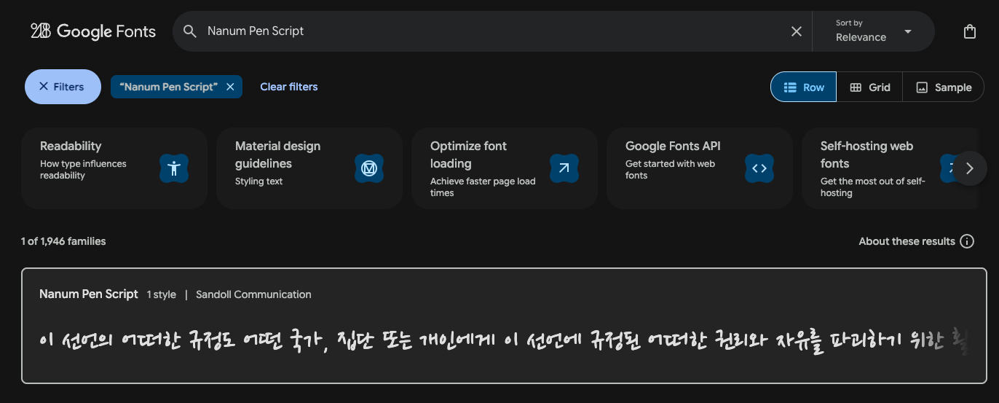

4. 상세 페이지에서 "Get font" 버튼을 클릭한다.

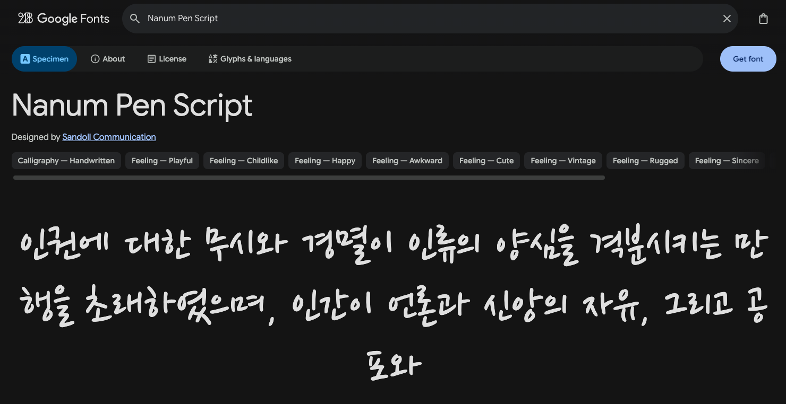

5. 화면에 보이는 Get embed code 버튼을 클릭한다.

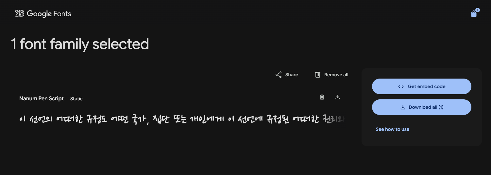

6. 여러 항목이 표시되는데, 이 중에서 Web 을 선택하면 \<link> 태그를 사용하는 방법과 @import 문법을 사용하는 방법을 함께 제공한다. 두 방식 모두 웹 폰트를 프로젝트에 로드하는 결과는 동일하므로 하나를 선택하면 된다.

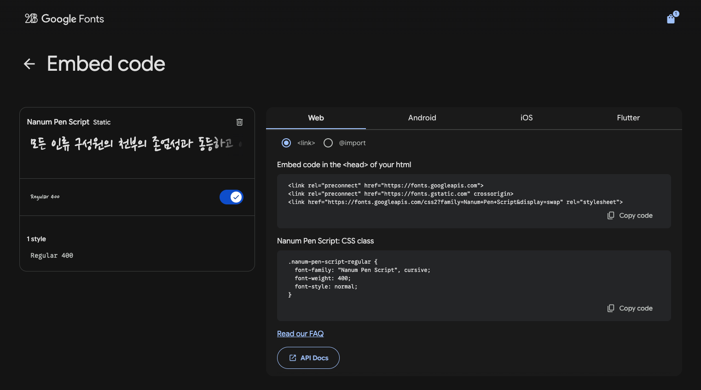

7.\<link> 태그를 사용하려면 \<link> 에 체크한 후 Embed code in the \<head> of your html 부분의 코드를 그대로 복사한다. 그리고 리액트 애플리케이션의 index.html 파일을 열고 \<head> 태그 안에 아래와 같이 추가한다.

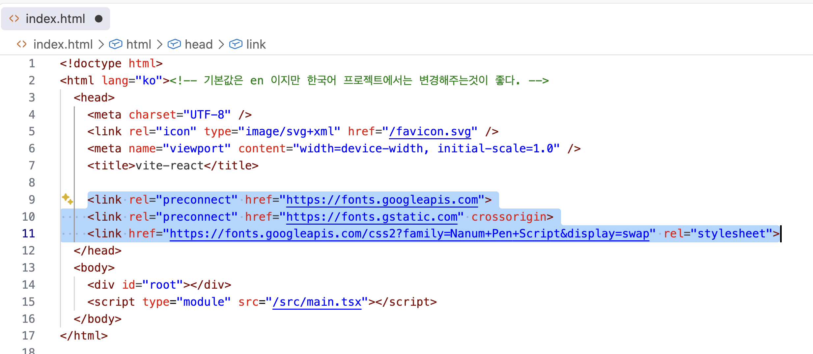

8. 적용한 웹 폰트를 사용하는 CSS 클래스를 하나 만든다.

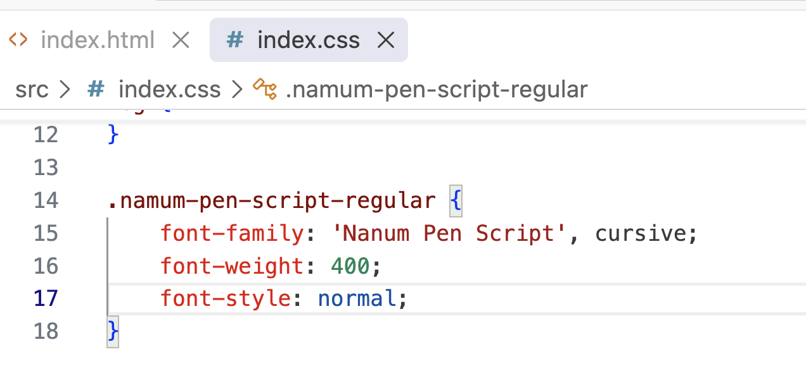

9. main.tsx 파일에서 index.css 파일을 불러온다.

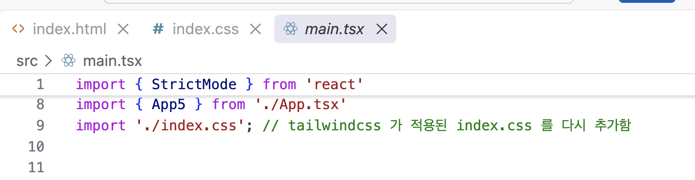

10. App 컴포넌트의 JSX 요소에서 className 속성에 namum-pen-script-regular 클래스를 지정한다.

```javascript
export default function App() {
  return (
    <h1 className="namum-pen-script-regular">
      나눔 펜 스크립트 이거 예쁜가???
    </h1>
  );
}
```

11. 애플리케이션을 실행하면 웹 폰트가 적용된 화면을 확인할 수 있다.


12. 이번에는 @import 방식으로 웹 폰트를 적용해 보자. 7번 과정에서 추가한 \<link> 태그를 모두 삭제한다. 그리고 아래 구글 폰트화면에서 import 를 체크한 후 \<style> 을 제외한 코드를 복사한다. 복사한 코드는 index.css 파일에 붙여넣는다.

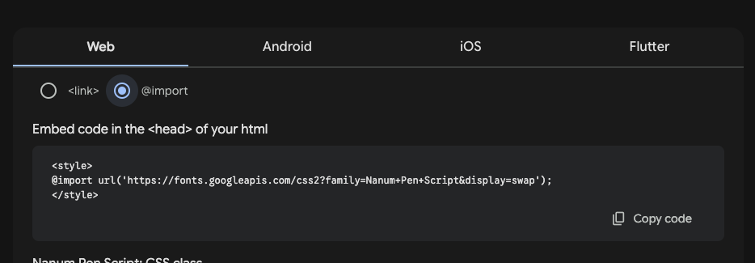

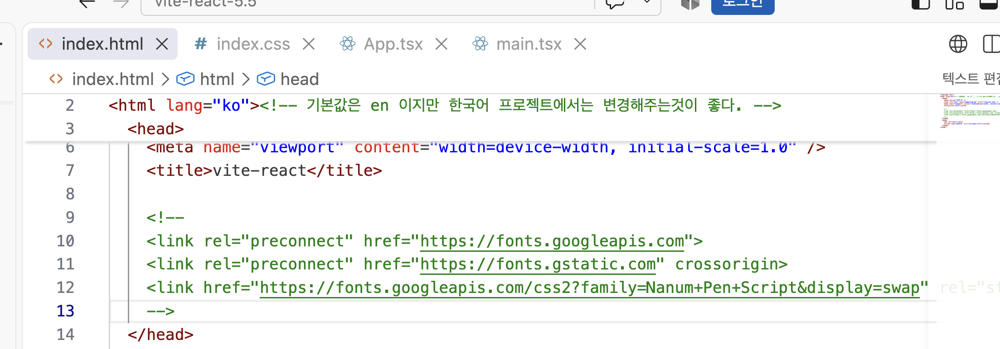

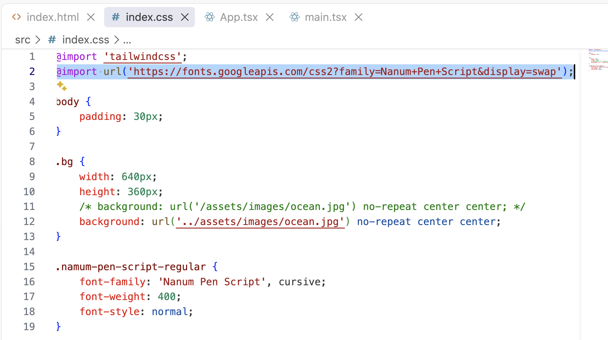

코드를 저장하고 실행하면 폰트가 적용된것을 확인할 수 있다.

---

## @font-face 로 웹 폰트 적용하기

구글 폰트 사이트는 \<link> 태그나 @import 코드를 제공해 웹 폰트를 매우 쉽게 적용할 수 있다. 그러나 구글 폰트에 없는 폰트를 사용해야 할 경우도 있다. 이럴 때는 @font-face를 직접 사용해 폰트 파일을 불러오는 형식을 사용한다.

**@font-face** 는 웹 페이지에서 서버에 있는 폰트 파일을 직접 불러와 사용하는 CSS 규칙이다. 사용자와 컴퓨터에 해당 폰트가 설치되어 있지 않더라도 웹 브라우저가 폰트 파일을 내려받아 적용할 수 있다.

구글 폰트 의 대부분 웹 폰트 사이트트 \<link> 또는 @import 방식 대신 @font-face 방식으로 폰트를 제공한다.\
그중 눈누 (https://noonnu.cc) 는 한글 웹 폰트를 무료로 제공하는 가장 유명한 사이트다.

눈누에서 제공하는 SF함박눈 폰트를 적용해보자.

1. 눈누 사이트에 접속해 상담 검색창에서 **SF함박눈** 을 입력한다. 검색 결과에서 해당 폰트를 클릭하면 상세 페이지로 이동한다.
   오른쪽에 보이는 **웹폰트로 사용** 부분 코드를 복사한다.

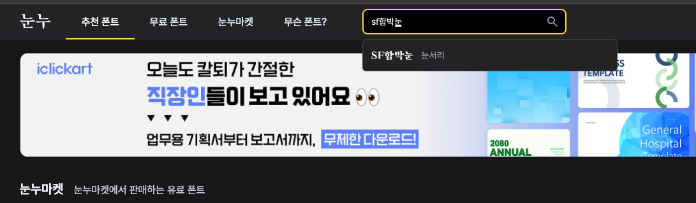

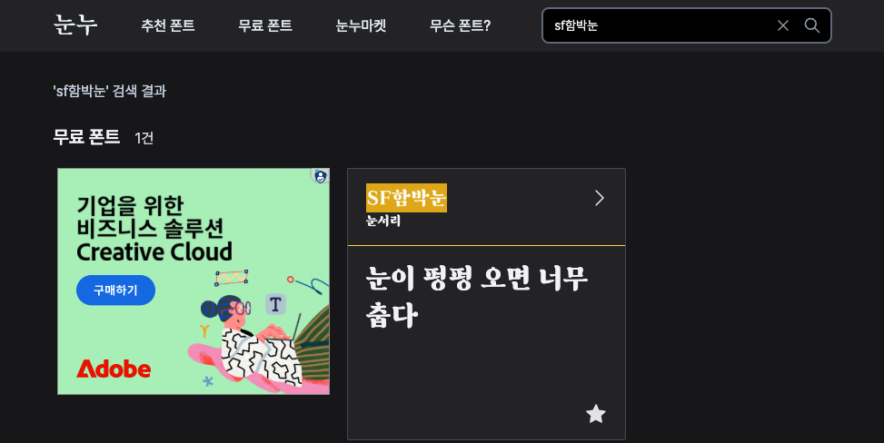

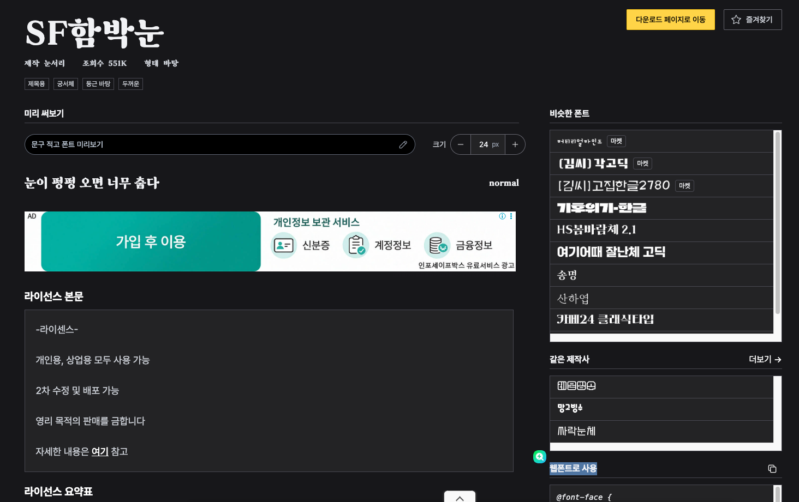

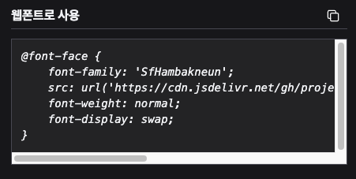

2. 복사한 코드를 index.css 파일에 붙여 넣는다. 이때 @import 코드가 있다면 @import 코드 다음에 붙여 넣는다. @import 코드는 항상 최상위에 있어야 한다.

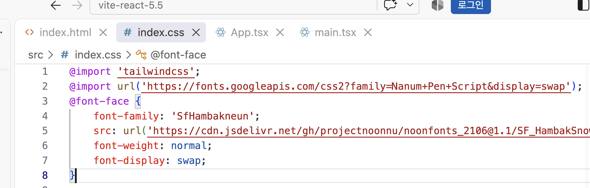

이 코드는 @font-face의 src 속성에 지정된 경로에서 웹 폰트 파일을 로드한다. 여기서 중요한 것은 font-family 속상 값이다. 이 값이 이후 CSS에서 해당 폰트를 사용할 때 지정해야 하는 폰트 이름이기 때문이다. @font-face는 폰트를 정의하는 역할만 하고, 실제 html 요소에 적용하려면 별도로 font-family를 지정해야 한다.

3. 폰트를 적용할 CSS 클래스를 추가한다. @font-face에 지정된 font-family 값이 'SfHambakneun' 이므로 이 이름을 font-family 속성의 값으로 사용해야 웹 폰트가 적용된다.

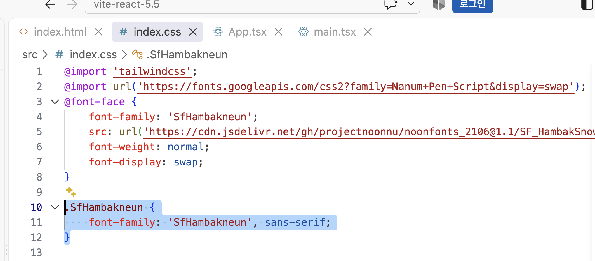

4. 컴포넌트의 jsx 요소에서 className 속성에 SfHambakneun 를 지정하면 웹 폰트가 적용된다.

```javascript
export default function App() {
  return (
    <>
      <h1 className="namum-pen-script-regular">
        나눔 펜 스크립트 이거 예쁜가???
      </h1>
      <hr />
      <h1 className="SfHambakneun">SF함박 눈 이거 예쁜가???</h1>
    </>
  );
}
```

5. 코드를 저장하고 실행하면 확인할수있다.

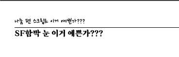
