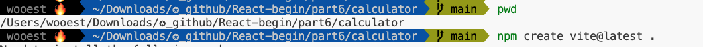
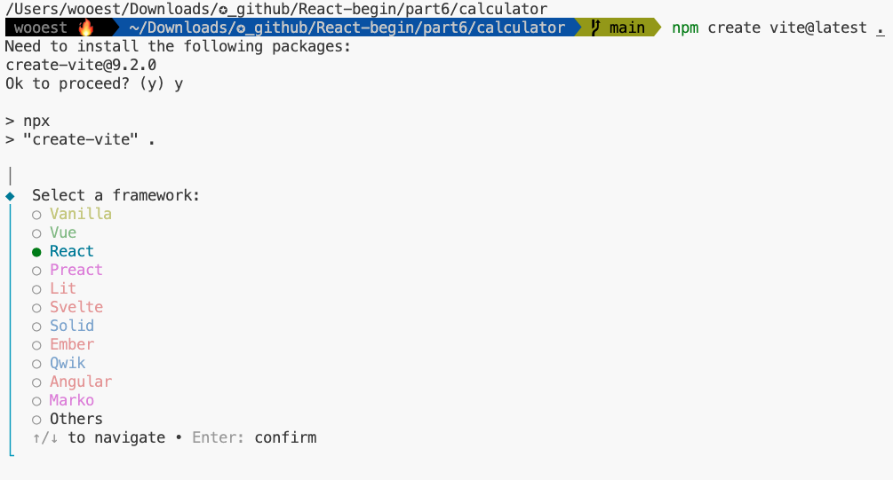
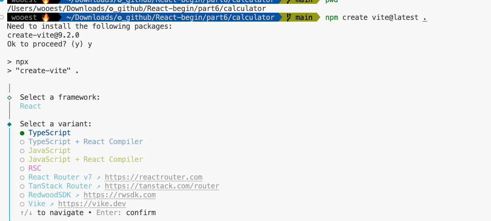
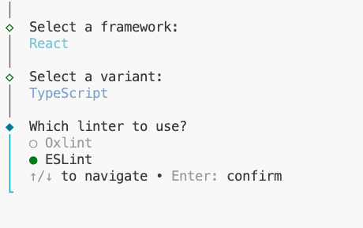
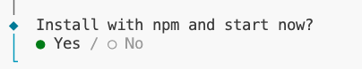
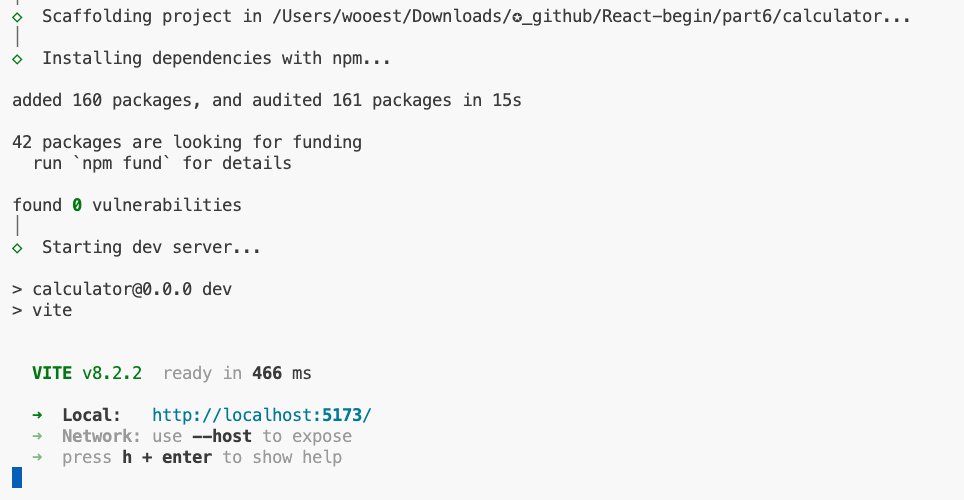
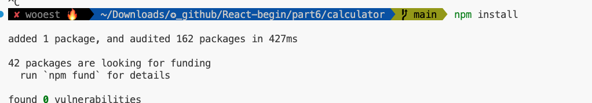
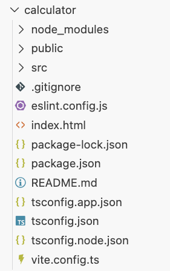

# 리액트 애플리케이션의 기본 구조 설정하기

실습을 위해 리액트 애플리케이션을 생성하자.

---

## 프로젝트 생성하기

Vite를 사용해 리액트 프로젝트를 생성한다.

1. VSCode에서 실습용 폴더를 생성한다. 폴더 이름은 calculator 로 지정하다. 지정한뒤 VSCode 에서 터미널을 열고 아래 명령어를 입력하자.

2. 명령어를 입력하면 몇 가지 설정을 위한 프롬프트가 표시된다. 키보드 방향키를 사용해 React를 선택한 후 이어서 TypeScript를 선택한다.

3. 프롬프트에 값을 모두 입력하면 스케폴딩이 완료된다. 완료되면 이어서 터미널에 다음 명령어를 입력한다.

4. 명령어를 입력하면 리액트 애플리케이션을 실행하는데 필요한 패키지를 설치하자. 설치가 끝나면 다음과 같이 프로젝트에 필요한 초기 폴더와 파일들이 자동으로 생성된다.

---

## 불필요한 폴더와 파일 정리하기
