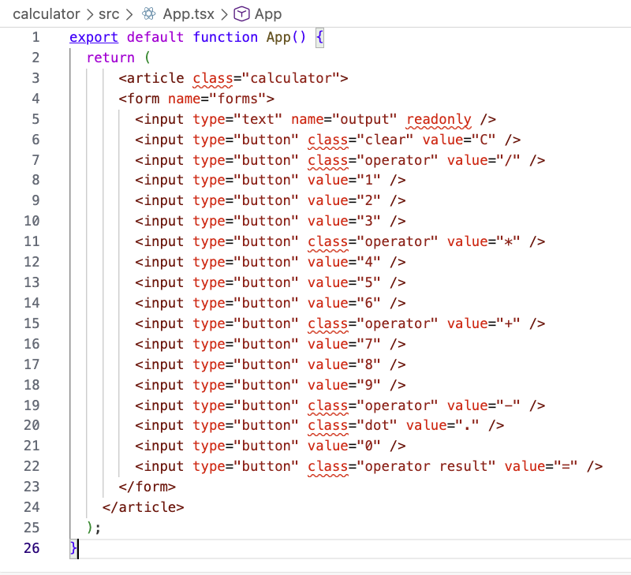
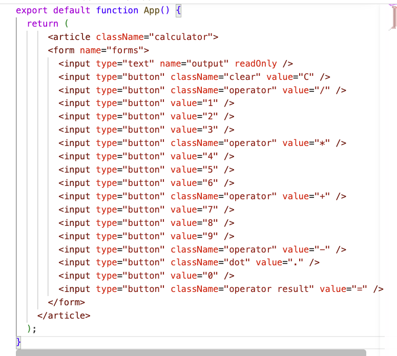
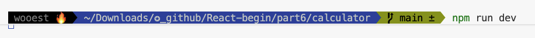
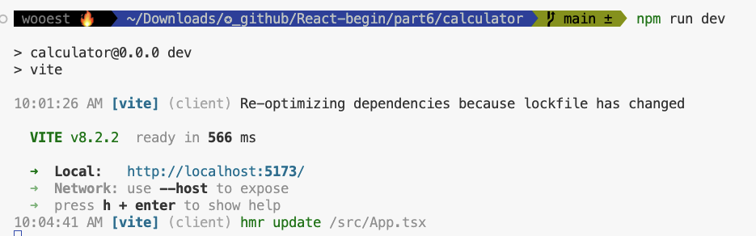
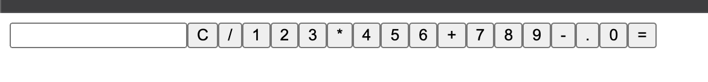
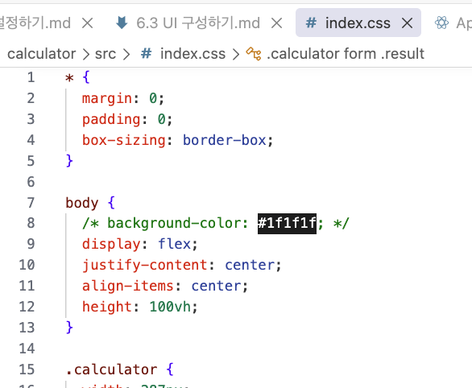
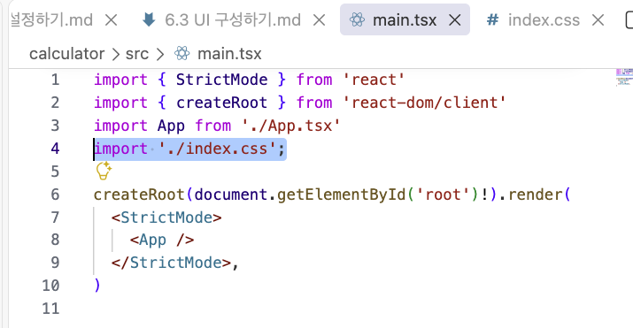
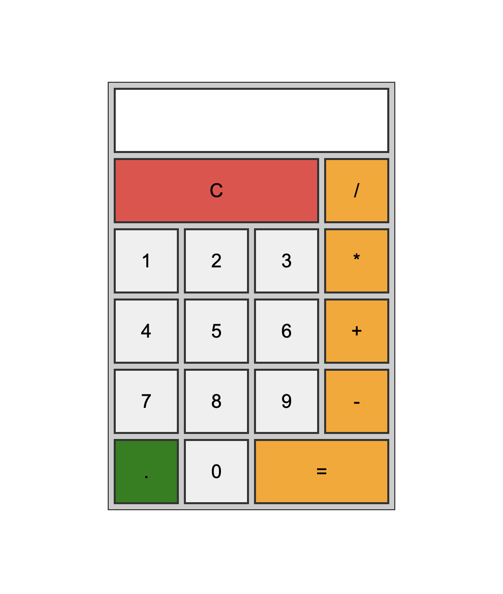

# UI 구성하기

---

## html 작성하기

리액트 애플리케이션을 만들 때 가장 먼저 해야 할 일은 html 구조를 작성하는 것이다. 리액트는 html 과 유사한 문법인 jsx를 사용하므로 기존 html 코드를 기반으로 빠르게 jsx 구조를 만들 수 있다.

특히 리액트를 처음 배우는 단계에서는 처음부터 리액트 방식으로 UI를 개발하기보다 `html과 css로 먼저 UI를 완성한 뒤` 이를 리액트 컴포넌트로 변환하는 방식이 더 효율적이다.

html 구조를 작성해보자.

1. ch06/calculator_html/index.html 파일을 연다. \<body> 태그 내부의 html 코드를 복사한다.

2. 코드를 붙여 넣으면 class 와 readonly 속성에 빨간 밑줄이 생긴다. 이는 jsx에서 사용하는 속성이 html 과 완전히 동일하지 않기 때문이다. \
   카멜 케이스에 맞춰 class는 className 으로 readonly 는 readOnly 로 수정하면 빨간 밑줄이 사라진다.

3. 터미널에 다음 명령어를 입력해 개발 서버를 실행한다.

4. 리액트에 내장된 개발 서버가 구동되며 다음과 같은 로컬 주소가 출력된다.

5. 웹 브라우저에는 다음과 같이 계산기 UI가 표시된다.

---

## CSS 작성하기

앞에서 만든 계산기 UI 는 아직 CSS 를 적용하지 않아 외관이 밋밋하다. 완성도 있는 UI를 보여주기 위해 CSS 코드를 작성해보자.

1. ch06/calculator_html 폴더에 있는 **style.css** 파일을 열고, 전체코드를 복사한다. 리액트 애플리케이션의 src 폴더 하위에 index.css 파일을 새로 만들고, 그안에 복사한 코드를 붙여 넣는다. 계산기 애플리케이션에서는 CSS를 **글로벌 스타일** 로 적용한다. 글로벌 스타일은 기존 CSS 문법과 다르지 않기 때문에 html 프로젝트에서 사용한 CSS 코드를 그대로 사용할 수 있다.

2. 스타일을 적용하려면 main.tsx 파일에서 index.css 파일을 import 문으로 불러와야 한다. main.tsx 파일 상단에 다음과 같이 코드를 추가한다. 이렇게 하면 index.css 에 작성한 스타일이 애플리케이션 전역에 적용된다.

3. 코드를 저장한 후 웹 브라우저를 새로 고침하면 CSS가 적용된 계산기 UI가 화면에 표시된다.

