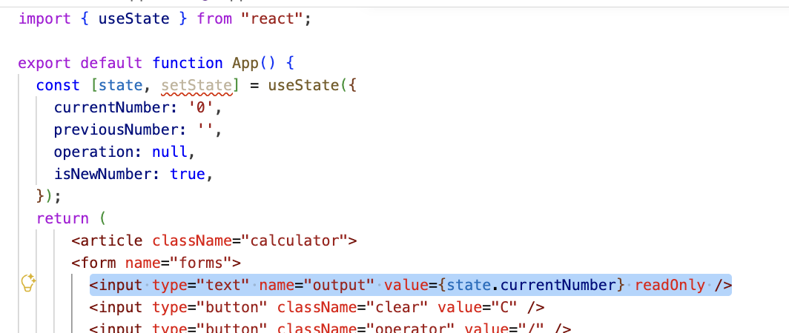
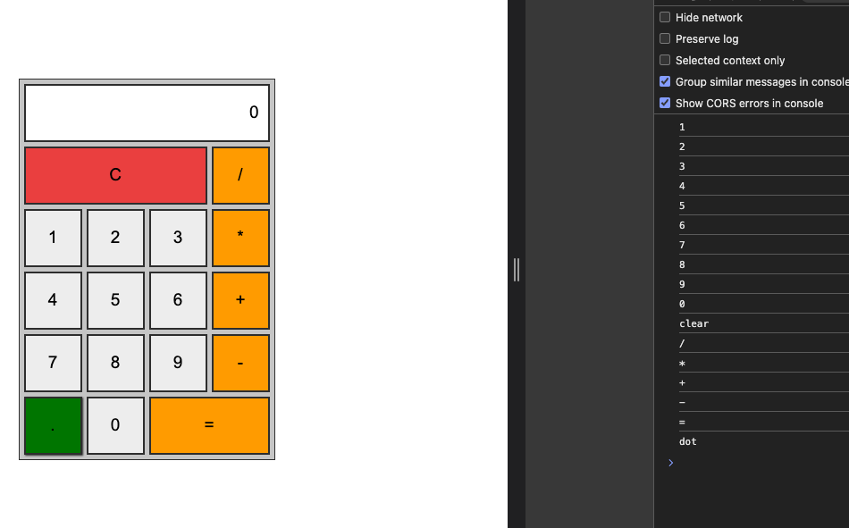

# 데이터 바인딩하고 이벤트 연결하기

html 과 css 코드를 작성해 계산기 UI 를 완성했다. 이제 UI 에 기능을 추가해 실제로 동작하게 만들어 보자.

## 데이터와 이벤트 핸들러 정의하기

계산기에서 숫자 버튼이나 연산 기호 버튼을 클릭하면 입력한 값을 저장하고 연산 결과를 출력해야 한다. 이를 위해 입력 값을 저장할 상태와 버튼 클릭 시 동작을 처리할 이벤트 핸들러를 정의한다.

### 1. App.tsx 파일에서 useState 훅을 사용해 계산기 동작에 필요한 상태를 객체 형태로 정의한다. 각 속성에는 아래와 같이 초깃값을 지정한다.

```javascript
import { useState } from "react";

export default function App() {
  const [state, setState] = useState({
    currentNumber: '0', --- 1
    previousNumber: '', --- 2
    operation: null, --- 3
    isNewNumber: true, --- 4
  });
  return (
      <article className="calculator">
      <form name="forms">
        <input type="text" name="output" readOnly />
        <input type="button" className="clear" value="C" />
        <input type="button" className="operator" value="/" />
        <input type="button" value="1" />
        <input type="button" value="2" />
        <input type="button" value="3" />
        <input type="button" className="operator" value="*" />
        <input type="button" value="4" />
        <input type="button" value="5" />
        <input type="button" value="6" />
        <input type="button" className="operator" value="+" />
        <input type="button" value="7" />
        <input type="button" value="8" />
        <input type="button" value="9" />
        <input type="button" className="operator" value="-" />
        <input type="button" className="dot" value="." />
        <input type="button" value="0" />
        <input type="button" className="operator result" value="=" />
      </form>
    </article>
  );
}
```

1. currentNumber: 현재 계산기 화면에 표시되는 숫자를 저장한다. 새로운 숫자를 입력할 때 이 값이 변경되며, isNewNumber의 값이 false 인 경우 기존 숫자에이어 붙인다.

2. previousNumber: 연산 기호 버튼을 클릭하기 전에 입력한 숫자를 저장한다.

3. operation: 클릭한 연산 기호를 저장한다.

4. isNewNumber: 새로운 숫자를 새로 입력할지 여부를 나타내는 플래그다. true 이면 새로운 숫자로 대체하고, false 이면 기존 숫자 뒤에 이어 붙인다.

### 2. 앞에서 정의한 상태 객체 속성 중에서 jsx 요소와 직접 연결해야 하는 값은 currentNumber 다. 이 값을 화면에 표시하려면 \<input> 요소의 value 속성에 currentNumber 를 바인딩한다. 이렇게 바인딩하면 currentNumber 값이 변경될 때마다 화면도 자동으로 리렌더링되어 상태 값이 표시된다.



---

## 이벤트 핸들러 정의하고 연결하기

계산기 UI에서 결과를 출력하는 화면 부분을 제외한 모든 버튼은 사용자 입력에 따라 동작해야 한다. 이러한 버튼 요소에 클릭이벤트를 연결해 마우스로 버튼을 클릭했을 때 반응하도록 만들어보자.

### 1. 이벤트를 연결하는 방식은 다양하지만, 본 과정에서는 버튼의 종류(C 버튼, 숫자 버튼, 연산 기호 버튼, 소수점 버튼) 에 따라 이벤트 핸들러를 각각 정의하는 방식을 사용한다. 여기서는 구체적인 로직을 작성하지 않고, 각 버튼에 연결할 이벤트 핸들러의 형태만 정의한다. 실제 동작 로직은 다음과정에서 다뤄보자.

```javascript
import { useState } from "react";

export default function App() {
  const [state, setState] = useState({
    currentNumber: '0',
    previousNumber: '',
    operation: null,
    isNewNumber: true,
  });
  // 숫자 버튼 클릭 처리 함수
  const handleNumberClick = ( --- 1
    event : React.MouseEvent<HTMLInputElement, MouseEvent>
  ) => {
      console.log(event.currentTarget.value);
  };
  // 연산 기호 버튼 클릭 처리 함수
  const handleOperatorClick = ( --- 2
    event : React.MouseEvent<HTMLInputElement, MouseEvent>
  ) => {
      console.log(event.currentTarget.value);
  };
  // C 버튼 클릭 처리 함수 : 모든 상태 초기화
  const handleClear = () => { --- 3
      console.log('clear');
  };
  // 소수점 버튼 클릭 처리 함수 : 현재 숫자에 소수점이 없을 경우에만 추가
  const handleDot = () => { --- 4
    console.log('dot');
  };
  return (
      <article className="calculator">
      <form name="forms">
        <input type="text" name="output" value={state.currentNumber} readOnly />
        <input type="button" className="clear" value="C" />
        <input type="button" className="operator" value="/" />
        <input type="button" value="1" />
        <input type="button" value="2" />
        <input type="button" value="3" />
        <input type="button" className="operator" value="*" />
        <input type="button" value="4" />
        <input type="button" value="5" />
        <input type="button" value="6" />
        <input type="button" className="operator" value="+" />
        <input type="button" value="7" />
        <input type="button" value="8" />
        <input type="button" value="9" />
        <input type="button" className="operator" value="-" />
        <input type="button" className="dot" value="." />
        <input type="button" value="0" />
        <input type="button" className="operator result" value="=" />
      </form>
    </article>
  );
}
```

1. handleNumberClick() : 숫자 버튼을 클릭했을 때 호출하는 이벤트 핸들러다. 매개변수로 전달된 이벤트 객체에서 value 속성의 값을 참조하면 어떤 숫자가 눌렸는지 알 수 있다.

2. handleOperatorClick() : 연산 기호 버튼을 클릭했을 때 호출하는 이벤트 핸들러다. 이 또한 이벤트 객체의 value 속성을 통해 어떤 연산기호 버튼이 눌렸는지 확인할 수 있다.

3. handleClear() : C 버튼을 클릭했을 때 호출하는 이벤트 핸들러로 계산기 상태를 초기화한다.

4. handleDot() : 소수점(.) 버튼을 클릭했을 때 호출하는 이벤트 핸들러다. 현재 숫자에 소수점을 추가할 때 사용한다.

### 2. 앞에서 정의한 이벤트 핸들러 함수를 각 버튼 요소의 onClick 속성에 연결한다. 그러면 사용자가 버튼을 클릭할 때마다 적절한 함수가 호출되어 동작을 처리한다.

- 숫자 버튼 : handleNumberClick()
- 연산 기호 버튼 : handleOperator()
- C 버튼 : handleClear()
- 소수점 버튼 : handleDot()

```javascript
import { useState } from "react";

export default function App() {
  const [state, setState] = useState({
    currentNumber: '0',
    previousNumber: '',
    operation: null,
    isNewNumber: true,
  });
  // 숫자 버튼 클릭 처리 함수
  const handleNumberClick = (
    event : React.MouseEvent<HTMLInputElement, MouseEvent>
  ) => {
      console.log(event.currentTarget.value);
  };
  // 연산 기호 버튼 클릭 처리 함수
  const handleOperatorClick = (
    event : React.MouseEvent<HTMLInputElement, MouseEvent>
  ) => {
      console.log(event.currentTarget.value);
  };
  // C 버튼 클릭 처리 함수 : 모든 상태 초기화
  const handleClear = () => {
      console.log('clear');
  };
  // 소수점 버튼 클릭 처리 함수 : 현재 숫자에 소수점이 없을 경우에만 추가
  const handleDot = () => {
    console.log('dot');
  };
  return (
      <article className="calculator">
      <form name="forms">
        <input type="text" name="output" value={state.currentNumber} readOnly />
        <input type="button" className="clear" value="C" onClick={handleClear} />
        <input type="button" className="operator" value="/" onClick={handleOperatorClick} />
        <input type="button" value="1" onClick={handleNumberClick} />
        <input type="button" value="2" onClick={handleNumberClick} />
        <input type="button" value="3" onClick={handleNumberClick} />
        <input type="button" className="operator" value="*" onClick={handleOperatorClick} />
        <input type="button" value="4" onClick={handleNumberClick} />
        <input type="button" value="5" onClick={handleNumberClick} />
        <input type="button" value="6" onClick={handleNumberClick} />
        <input type="button" className="operator" value="+" onClick={handleOperatorClick} />
        <input type="button" value="7" onClick={handleNumberClick} />
        <input type="button" value="8" onClick={handleNumberClick} />
        <input type="button" value="9" onClick={handleNumberClick} />
        <input type="button" className="operator" value="-" onClick={handleOperatorClick} />
        <input type="button" className="dot" value="." onClick={handleDot} />
        <input type="button" value="0" onClick={handleNumberClick} />
        <input type="button" className="operator result" value="=" onClick={handleOperatorClick} />
      </form>
    </article>
  );
}
```

### 3. 코드를 저장한 후 웹 브라우저를 새로 고침한다. 숫자, 연산기호, C, 소수점 버튼을 클릭하면 각각에 연결된 이벤트 핸들러가 실행된다. 개발자 도구의 콘솔 창을 열면 클릭한 값을 확인할 수 있다.


