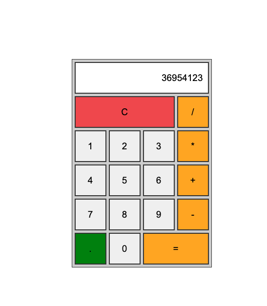
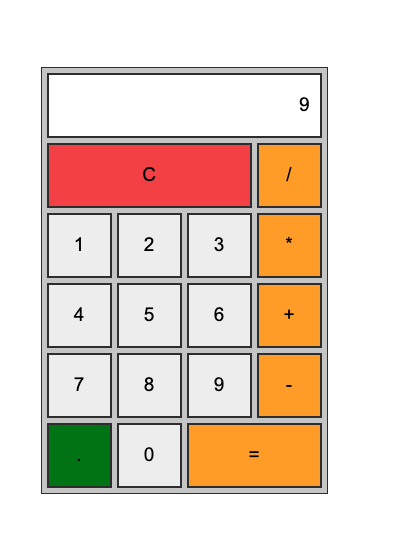

# 로직 구현하기

이제 계산기가 실제로 작동하도록 구현할 차례다. 여기서 **로직** 이란 프로그램이 수행해야 하는 작업의 순서와 조건을 정의한 일련의 과정을 의미한다.

계산을 처리하는 로직은 앞에서 정의한 각 버튼의 클릭 이벤트 핸들러 내부에 작성한다. 복잡한 계산 과정을 이해하기 쉽도록 로직을 기능별로 나눠 단계적으로 구현해보자.

---

## 숫자 입력 로직 구현하기

숫자 입력 로직은 숫자 버튼을 클릭했을 때 해당 숫자를 계산기의 출력칸에 표시하는 기능이다. 앞의 과정에서 숫자 버튼을 클릭하면 handleNumberClick() 함수를 호출하도록 이벤트를 연결했다. 따라서 이 함수 내부에 숫자를 출력카에 표시하는 표시하는 코드를 작성하면 된다.

```javascript
import { useState } from "react";

export default function App() {
  const [state, setState] = useState({
    currentNumber: '0',
    previousNumber: '',
    operation: null,
    isNewNumber: true,
  });
  // 숫자 버튼 클릭 처리 함수
  const handleNumberClick = (
    event : React.MouseEvent<HTMLInputElement, MouseEvent>
  ) => {
      const value = event.currentTarget.value; --- 1
      if(state.isNewNumber) { --- 2
        // 현재 숫자를 새로운 숫자로 대체
        setState({ --- 3
          ...state , // 전개연산자 (=스프레드 연산자)
          currentNumber: value,
          isNewNumber: false,
        });
      } else { --- 4
        // 기존 숫자에 새로운 숫자를 이어 붙임
        setState({ --- 5
          ...state,
          currentNumber: state.currentNumber + value,
        });
      }
  };

  // 연산 기호 버튼 클릭 처리 함수
  const handleOperatorClick = (
    event : React.MouseEvent<HTMLInputElement, MouseEvent>
  ) => {
      console.log(event.currentTarget.value);
  };

  // C 버튼 클릭 처리 함수 : 모든 상태 초기화
  const handleClear = () => {
      console.log('clear');
  };

  // 소수점 버튼 클릭 처리 함수 : 현재 숫자에 소수점이 없을 경우에만 추가
  const handleDot = () => {
    console.log('dot');
  };

  return (
    --- 중략
  );
}
```

1. event.currentTarget.value 로 클릭한 버튼의 숫자를 가져온다. 이 값을 value 변수에 저장해 어떤 숫자가 눌렸는지 확인할 수 있다.

2. 4 조건문을 사용해 상태 객체의 isNewNumber 값이 true 인지 확인한다. 값이 true 라면 새로운 숫자를 처음 입력하는 상황을 의미하고, false 라면 이전에 이미 숫자를 입력한 상태에서 이어서 입력하는 상황을 뜻한다.

3. isNewNumber의 값이 true인 경우 setState() 함수로 상태를 업데이트한다. 현재 숫자(currentNumber)를 새로 입력한 값(value)으로 교체하고, isNewNumber값을 false 로 변경한다. 그러면 다음 입력에서는 else 블록이 실행된다.

4. isNewNumber가 false인 경우 기존 숫자(currentNumber) 에 새로 입력한 숫자(value)를 이어 붙인다. 예를 들어, 현재 숫자가 36일 때 9를 클릭하면 369 가 된다.

코드를 저장한 뒤 실행결과를 확인해보자.



---

## 연산 로직 구현하기

연산 로직이란 연산 기호 버튼을 클릭했을 때 해당 연산을 수행하는 기능을 의미한다. 연산 기호 버튼에는 클릭 이벤트가 연결되어 있으며, 버튼 클릭 시 handleOperatorClick() 함수가 호출된다. 따라서 이 함수 내부에 실제 연산을 처리하는 코드를 작성해야 한다.

이 부분은 계산기의 동작 중 핵심 로직에 해당해서 코드가 비교적 복잡하다.

```javascript
import { useState } from "react";

interface CalculatorState { --- (1)
  currentNumber : string, // 현재 입력 중인 숫자
  previousNumber : string, // 이전에 입력한 숫자
  operation : string | null, // 연산 기호 또는 null
  isNewNumber : boolean, // 새로운 숫자 입력 여부
}

export default function App() {
  const [state, setState] = useState<CalculatorState>({ --- (2)
    currentNumber: '0',
    previousNumber: '',
    operation: null,
    isNewNumber: true,
  });

  // 숫자 버튼 클릭 처리 함수
  const handleNumberClick = (
    event : React.MouseEvent<HTMLInputElement, MouseEvent>
  ) => {
      const value = event.currentTarget.value;
      if(state.isNewNumber) {
        // 현재 숫자를 새로운 숫자로 대체
        setState({
          ...state , // 전개연산자 (=스프레드 연산자)
          currentNumber: value,
          isNewNumber: false,
        });
      } else {
        // 기존 숫자에 새로운 숫자를 이어 붙임
        setState({
          ...state,
          currentNumber: state.currentNumber + value,
        });
      }
  };

  // 연산 기호 버튼 클릭 처리 함수
  const handleOperatorClick = (
    event : React.MouseEvent<HTMLInputElement, MouseEvent>
  ) => {
      // 현재 클릭한 연산 기호 가져오기
      const operator = event.currentTarget.value; --- (3)
      // 현재 출력칸에 표시된 숫자를 숫자형으로 변환
      const current = parseFloat(state.currentNumber || '0'); --- (4)
      // 이전 숫자와 연산 기호가 모두 있는 경우 (연속 연산)
      if(state.previousNumber !== '' && state.operation) { --- (5)
        const prev = parseFloat(state.previousNumber);  --- (6)
        let result = 0; --- (7)
        // 연산 기호에 따라 연산 수행
        switch (state.operation){ --- (8)
          case '+' :
            result = prev + current;
            break;
          case '-' :
            result = prev - current;
            break;
          case '*' :
            result = prev * current;
            break;
          case '/' :
            result = prev / current;
            break;
        }

        if(operator === '=') { --- (9)
          // = 버튼 클릭 시 연산 종료
          setState({
            currentNumber : result.toString(),
            previousNumber : '',
            operation : null,
            isNewNumber : true,
          });
        } else { --- (10)
          setState({
            currentNumber : '',
            previousNumber : result.toString(),
            operation : operator,
            isNewNumber : true,
          });
        }
      } else { --- (11)
        setState({
            currentNumber : '',
            previousNumber : current.toString(),
            operation : operator,
            isNewNumber : true,
          });
      }
  };

  // C 버튼 클릭 처리 함수 : 모든 상태 초기화
  const handleClear = () => {
      console.log('clear');
  };

  // 소수점 버튼 클릭 처리 함수 : 현재 숫자에 소수점이 없을 경우에만 추가
  const handleDot = () => {
    console.log('dot');
  };

  return (
    // 중략...
  );
}
```

1. useState 훅을 사용할 때 상태 객체의 타입을 명시하지 않으면 타입스크립트는 초깃값을 기준으로 타입을 추론한다. 기준 코드에서 operation의 초깃값은 null 입니다. 이 경우 타입스크립트는 operation 의 타입을 null로 추론하고, 이후 문자열 (예 '+', '-') 을 할당하려 하면 타입 오류가 발생한다.

- currentNumber : 여러 자릿수를 입력하기 위해 문자열(string)로 정의한다.

- previousNumber : 마찬가지로 문자열로 정의한다.

- operation : 연산 기호가 아직 입력되지 않은 초기 상태를 고려해 string | null 로 지정한다.

- isNewNumber : boolean 타입을 사용한다.

2. 1에서 정의한 CalculatorState 인터페이스를 useState 훅의 제네릭 타입으로 지정한다. 이렇게 하면 상태 객체는 CalculatorState 구조를 따라야 하므로 잘못된 타입의 값이 속성에 할당되는 오류를 사전에 방지할 수 있다.

3. 연산자 버튼을 클릭하면 event.currentTarget 으로 현재 클릭한 버튼의 value 값을 가져와 operator 변수에 저장한다.

4. currentNumber 속성은 문자열(string) 형태로 저장되므로 연산을 수행하려면 숫자형으로 변환해야 한다. 이를 위해 parseFloat() 함수를 사용해 문자열을 실수(float)로 변환하고, 결과를 current 변수에 저장한다. currentNumber 가 빈 문자열일 수도 있으므로 || '0' 을 사용해 기본값을 지정한 뒤 변환한다.

5. 연산을 수행할 수 있는 조건을 검사하는 부분이다. state.previousNumber !== '' 조건은 이전에 입력한 숫자가 있어야 함을 의미하고, state.operation 조건은 이전에 연산 기호를 클릭했는지를 확인한다. 두 조건이 모두 참일 경우 if 문이 실행되어 연속해서 계산한다.

6. previousNumber 속성에 저장한 문자열 값을 parseFloat() 을 사용해 실수형으로 변환해 prev 변수에 저장한다.

7. result 변수를 선언한다. 이 변수는 이후 switch 문에서 연산 결과를 저장하는 데 사용한다.

8. switch 문으로 state.operation에 저장된 연산 기호에 따라 알맞은 연산을 수행한다. prev(이전 숫자) 와 current(현재 숫자) 를 사용해 덧셈, 뺄셈, 곱셈, 나눗셈 중 해당하는 연산을 실행하고, 결과를 result 변수에 저장한다.

9. 현재 클릭한 버튼이 등호일 경우 연산을 마무리한다. result 값을 문자열로 변환해 currentNumber에 저장하고, 이전 숫자와 연산 기호를 각각 초기화 ('', null) 한다. 또한 isNuewNumber를 true 로 설정해 다음 입력이 새로운 숫자부터 시작되도록 한다. 이 모든 동작은 setState() 함수로 처리한다.

10. 등호가 아닌 다른 연산 기호가 클릭된 경우 연산 결과를 유지하면서 다음 연산을 준비한다. currentNumber를 비우고, result값을 문자열로 변환해 previousNumber 에 저장한다. 연산 기호(operation) 를 새로 클릭한 값으로 갱신하고 isNewNumber를 true로 설정해 다음 숫자 입력을 준비한다.

11. 첫 번째 숫자만 입력된 상태에서 연산 기호 버튼이 클릭된 경우다. 이때는 연산을 수행하지 않고, 현재 숫자를 previousNumber에 저장한다. currentNumber는 빈 문자열로 바꿔 화면을 초기화하고, operation에는 클릭한 연산 기호를 저장한다. 이후 숫자를 입력하도록 isNewNumber를 true로 설정한다.

코드를 저장한 후 3 + 3 + 3 = 순서로 버튼을 클릭해보자.

[실행결과]



---

## 초기화 로직 구현하기
