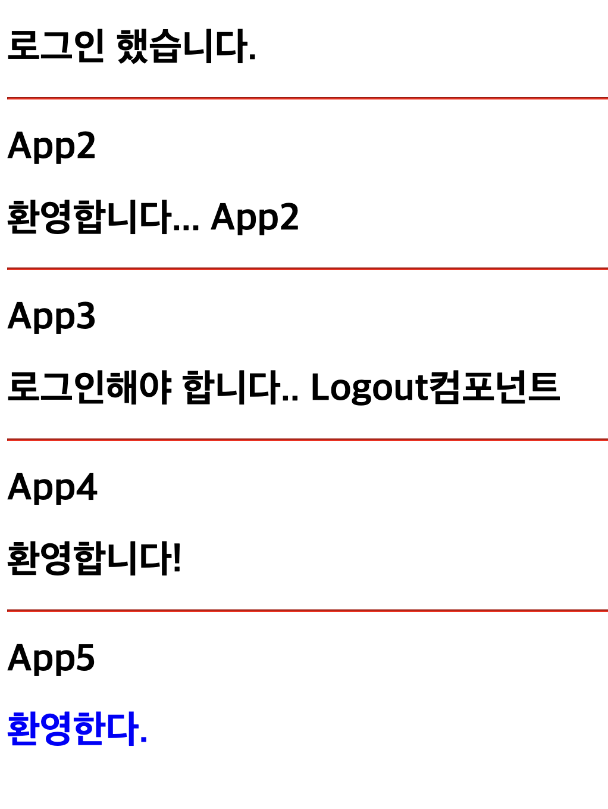

# 조건부 렌더링

**조건부 렌더링** 은 특정 조건에 따라 컴포넌트를 화면에 표시하거나 숨기는 방식이다. 예를 들어 사용자가 로그인한 상태에서는 로그아웃 버튼을, 로그아웃한 상태에서는 로그인 버튼을 보여준다. 이 방식은 사용자의 상황과 요구에 맞춰 필요한 정보만 효과적으로 잔달할 수 있어 사용자 경험을 크게 향상시킬 수 있다.

---

## if 문을 사용한 조건부 렌더링

if 문을 사용한 조건부 렌더링은 가장 기본적이면서도 강력한 렌더링 방식이다. 이 방식의 장점은 코드 가독성과 유지보수성을 높여준다는 것이다. 이 방식을 사용하면 컴포넌트 내부에서 특정 조건에 따라 서로 다른 ui 요소를 렌더링할 수 있으므로 복잡한 조건 분기를 처리할 때 특히 유용하다. 조건문의 명확한 구조 덕분에 코드의 의도가 분명하게 드러나며, 중첩 조건이나 복잡한 로직도 자연스럽게 표현할 수 있다. 그 결과, 디버깅이나 기능을 확장할 때도 효율적으로 코드를 관리할 수 있다. 또한, 일반 프로그래밍에서 사용하는 if 문과 문법이 같아서 개발자가 직관적으로 이해하고 쉽게 구현할 수 있다.

### jsx 요소 렌더링하기

if 문을 사용하면 조건에 따라 서로 다른 jsx요소를 렌더링할 수 있다.

```javascript
export default function App() {
  const isLogin = true;
  if (isLogin) {
    return <h1>로그인 했습니다.</h1>;
  }
  return <h1>로그인해야 합니다.</h1>;
}
```

위의 코드는 isLogin 변수의 값을 확인해 조건에 따라 다른 ui를 보여주는 예제다. isLogin 변수의 값이 true 이면 "로그인했습니다" 라는 메시지를 담은 \<h1> 요소가 렌더링되고, false 이면 "로그인해야 합니다" 라는 메시지를 담은 \<h1> 요소가 렌더링된다.


---

### 컴포넌트 렌더링하기

조건부 렌더링은 jsx 요소뿐만 아니라 전체 컴포넌트를 조건에 따라 렌더링할 때도 사용할 수 있다.

아래 코드는 isLogin 변수의 값에 따라 \<Login /> 컴포넌트와 \<Logout /> 컴포넌트 중 선택해 렌더링한다. 즉, 로그인 여부와 같은 조건에 따라 전혀 다른 컴포넌트를 렌더링할 수 있다.

```javascript
import Login from "./components/Login";
import Logout from "./components/Logout";

export default function App() {
  const isLogin = false;
  if (isLogin) return <Login />;
  return <Logout />;
}
```

조건에 따라 여러 컴포넌트를 함께 렌더링해야 하는 경우도 있다. 하지만 리액트의 jsx 문법에서는 하나의 컴포넌트가 반드시 단일 루트 요소만 반환해야 한다는 제약이 있다. 따라서 여러 컴포넌트를 동시에 반환하려면 이들을 하나의 부모 요소로 묶어야 한다. 이때 유용하게 사용할 수 있는 것이 바로 프레그먼트 다. 프레그먼트로 작성하면 불필요한 dom 요소를 추가하지 않고도 여러 컴포넌트를 그룹화할 수 있다.

아래 코드는 로그인 상태에 따라 2개의 컴포넌트를 묶어 함께 렌더링한다. 프레그먼트를 사용해 불필요한 \<div> 같은 요소를 추가하지 않고도 jsx 규칙을 만족한다.

```javascript
import Login from "./components/Login";
import Logout from "./components/Logout";
import LoginMessage from "./components/LoginMessage";
import LogoutMessage from "./components/LogoutMessage";

export default function App() {
  const isLogin = false;

  if (isLogin) {
    return (
      <>
        <Login />
        <LoginMessage />
      </>
    );
  }
  return (
    <>
      <Logout />
      <LogoutMessage />
    </>
  );
}
```

---

### 변수에 담아 사용하기

if 문은 jsx 표현식 내부에서는 직접 사용할 수 없다. 이러한 제약 때문에 일반적으로는 컴포넌트 전체의 조건에 따라 다르게 렌더링하는 방식으로 if문을 사용한다.

하지만 다른 접근 방법도 있다. 조건에 따라 변수에 서로 다른 jsx 요소를 할당한 뒤, jsx 표현식 내부에서 그 변수를 사용하는 방식이다. 이 방법을 사용하면 jsx 내부에서 직접 if 문을 사용하지 않으면서도 동적으로 화면을 구성할 수 있다.

아래 코드는 조건에 따라 다른 텍스트 메시지를 message 변수에 담고 jsx에서 그 변수를 사용해 렌더링한다.

```javascript
export default function App() {
  const isLogin = false;
  let message;
  if (isLogin) {
    message = "환영합니다.";
  } else {
    message = "로그인해야 합니다.";
  }
  return <h1>{message}</h1>;
}
```

이 방식은 텍스트뿐만 아니라 jsx 요소나 컴포넌트도 변수에 할당할 수 있다는 장점이 있다. 그래서 컴포넌트 전체 구조는 그대로 유지하면서 내부의 특정 부분만 조건에 따라 다르게 렌더링할 수 있다.

아래 예제는 단순한 텍스트가 아닌 jsx요소와 컴포넌트를 변수에 담아 조건에 따라 렌더링한다.

```javascript
import Logout from "./components/Logout";

export default function App() {
  const isLogin = false;
  let message;
  if (isLogin) {
    message = <h1>환영합니다</h1>;
  } else {
    message = <Logout />;
  }
  return <>{message}</>;
}
```

이 방식을 사용할 때 주의할 점이 있다. 변수를 렌더링할 때는 jsx표현식 안에서 사용해야 한다. 예를 들어 return {message} 처럼 작성하면 오류가 발생한다. 이는 jsx 요소가 내부적으로 객체로 처리되기 때문이다. 객체 자체를 반환하면 리액트가 이를 렌더링할 수 없다. 반드시 jsx 표현식 내부에서 중괄호 {} 를 사용해 변수를 참조해야 한다.

---

## 삼항 연산자를 사용한 조건부 렌더링

삼항 연산자는 리액트에서 조건에 따라 두 가지 다른 결과를 렌더링해야 할 때 매우 효과적인 방식이다. if~else 문법보다 더 간결하게 표현할 수 있으며, jsx 내부에서도 인라인 스타일을 사용할 수 있다는 장점이 있다. 특히 간단한 조건에 따라 ui를 전환해야 하는 경우, 삼항 연산자는 매우 유용하다.

### jsx 요소 렌더링하기

삼항 연산자는 `조건 ? 참일_때_결과 : 거짓일_때_결과` 형태로 사용한다. 이 구문은 자바스크립트의 기본 연산자 중 하나로, 조건이 참이면 물음표(?) 다음에 오는 표현식을 평가하고 조건이 거짓이면 콜론(:) 다음에 오는 표현식을 평가한다.

아래 코드는 isLogin 변수의 값에 따라 '환영합니다!' 또는 '로그인해야 합니다' 라는 서로 다른 문자열을 조건부로 렌더링하는 예제다. 이처럼 삼항 연산자는 jsx내부에서 중괄호를 사용해 조건을 직접 포함시킬 수 있다.

```javascript
export function App4() {
  const isLogin = true;
  return (
    <div>
      <hr style={{ borderColor: "red" }} />
      <h1>App4</h1>
      <h1>{isLogin ? "환영합니다!" : "로그인해야 합니다."}</h1>
    </div>
  );
}
```

단순히 문자열만 조건부 렌더링하는 것이 아니라 jsx 요소 자체를 조건부 렌더링하고 싶다면 다음과 같이 삼항 연산자를 사용할 수 있다. 이 경우에는 컴포넌트의 반환값 전체가 삼항 연산자의 결과가 된다. 조건에 따라 서로 다른 jsx 요소를 반환하므로 더 복잡한 ui 구조도 조건부로 렌더링할 수 있다.

```javascript
export function App5() {
  const isLogin = true;
  return (
    <div>
      <hr style={{ borderColor: "red" }} />
      <h1>App5</h1>
      {isLogin ? (
        <h1 style={{ color: "blue" }}>환영한다.</h1>
      ) : (
        <h1 style={{ color: "red" }}>로그인해야 한다.</h1>
      )}
    </div>
  );
}
```

반환해야 할 jsx 요소가 여러 개라면 프래그먼트를 사용해 이들을 하나의 루트 요소로 묶어 작성할 수 있다. 이렇게 하면 DOM에 불필요한 노드를 추가하지 않으면서도 여러 jsx 요소를 하나의 그룹으로 반환할 수 있다.

```javascript
export default function App() {
  const isLogin = true;
  return isLogin ? (
    <>
      <h1>환영합니다.</h1>
      <p>로그인했습니다.</p>
    </>
  ) : (
    <>
      <h1>로그인해야 합니다.</h1>
      <p>서비스를 이용하려면 로그인해 주세요.</p>
    </>
  );
}
```

앞의 예제는 삼항 연산자 안에서 여러 jsx 요소를 프레그먼트 감싸 조건에 따라 서로 다른 ui를 렌더링한다.

[렌더링 결과]


---

### 컴포넌트 렌더링하기

삼항 연산자는 텍스트나 간단한 jsx 요소뿐만 아니라 컴포넌트를 조건부 렌더링할 때도 매우 효과적이다. 이 방식은 상태에 따라 ui 전체를 다르게 구성해야 할 때 특히 유용하다.

아래 예제는 isLogin 변수의 값에 따라 \<Login /> 또는 \<Logout /> 컴포넌트를 조건부 렌더링한다.

```javascript
export function App6() {
  const isLogin = true;
  return (
    <div>
      <hr style={{ borderColor: "red" }} />
      <h1>App6</h1>
      {isLogin ? <Login /> : <Logout />}
    </div>
  );
}
```

여러 컴포넌트를 함께 렌더링하는 것도 가능하다. 이때는 if 문을 사용할 때와 마찬가지로 프레그먼트를 사용해 하나의 루트 요소로만 묶어주면 된다.

아래 예제는 로그인 상태에 따라 2개의 컴포넌트를 함께 조건부 렌더링한다. 로그인한 경우에는 \<Login /> 과 \<LoginMessage /> 컴포넌트를, 로그아웃한 경우에는 \<Logout /> 과 \<LogoutMessage /> 컴포넌트를 표시한다.

```javascript
import Login from "./components/Login";
import Logout from "./components/Logout";
import LoginMessage from "./components/LoginMessage";
import LogoutMessage from "./components/LogoutMessage";

export default function App() {
  const isLogin = true;
  return isLogin ? (
    <>
      <Login />
      <LoginMessage />
    </>
  ) : (
    <>
      <Logout />
      <LogoutMessage />
    </>
  );
}
```

---

### 그 밖의 사용법

#### 1. 변수에 담아 사용하기

삼항 연산자는 jsx내부에서 간단한 조건을 처리할 때 자주 사용한다. 하지만 활용 범위는 이보다 더 넓다. 삼항 연산자의 결과를 먼저 변수에 저장한뒤 jsx 표현식에서 해당 변수를 사용하는 방법도 매우 효과적이다. 이 방법을 사용하면 복잡한 조건부 렌더링 로직을 컴포넌트의 반환부와 분리할 수 있어 코드의 가독성을 높이고 유지보수도 더 쉬워진다.

기본 형태는 조건에 따라 서로 다른 문자열을 변수에 할당하는 것이다. 다음 예제를 보면 isLogin 값에 따라 서로 다른 메시지를 message 변수에 저장한 뒤 jsx에서 사용한다.

```javascript
export default function App() {
  const isLogin = true;
  const message = isLogin ? "환영한다" : "환영하지 못한다";
  return <h1>{message}</h1>;
}
```

변수에는 문자열뿐만 아니라 jsx 요소 자체도 할당할 수 있다. 이 방법은 조건에 따라 완전히 다른 ui 를 구성할 수 있어 더 복잡한 조건부 렌더링에도 효과적이다.

다음 예제는 로그인 상태에 따라 서로 다른 텍스트를 표시한다. 여러 jsx 요소를 함께 렌더링해야 하므로 프레그먼트를 사용해 하나의 그룹으로 묶는다.

```javascript
export function App7() {
  const isLogin = true;
  const message = isLogin ? (
    <>
      <h1>환영한다.</h1>
      <h2>오늘 기분은 어떠니?</h2>
    </>
  ) : (
    <>
      <h1>환영 못 한다.</h1>
      <h2>오늘 기분이 안 좋다.</h2>
    </>
  );
  return (
    <div>
      <hr style={{ borderColor: "red" }} />
      <h1>App7</h1>
      <div>{message}</div>
    </div>
  );
}
```

변수에 전체 컴포넌트를 담을 수도 있다. 이 방법은 조건에 따라 완전히 다른 기능을 가진 컴포넌트를 렌더링해야 할 때 유용하다.

아래 예제는 isLogin 값에 따라 \<Login /> 또는 \<Logout /> 컴포넌트를 선택적으로 변수에 할당하고, 이를 렌더링한다.

---

#### 2. 동적으로 스타일 적용하기

삼항 연산자는 jsx에서 상태의 값에 따라 스타일을 적용할 때도 유용하다.

다음 예제는 isActive 변수의 값에 따라 텍스트에 적용하는 스타일이 달라진다. 삼항 연산자를 사용해 fontSize와 fontWeight 속성을 조건부로 설정하고 있다.

```javascript
export function App9() {
  const isActive = true;
  return (
    <div>
      <hr style={{ borderColor: "red" }} />
      <h1>App9</h1>
      <div
        style={{
          fontSize: isActive ? "1rem" : "2rem",
          fontWeight: isActive ? "bold" : "normal",
          color: "blue",
        }}
      >
        동적으로 스타일 적용하기
      </div>
    </div>
  );
}
```

---

#### 3. 동적으로 속성의 값 적용하기

삼항 연산자는 상태 값에 따라 서로 다른 속성 값을 적용할 때도 사용할 수 있다. 특히 className 속성처럼 css 클래스 이름을 조건에 따라 다르게 지정해야 할 때 매우 유용하다.

다음 예제는 isActive 값이 true 이면 \<div> 요소에 active 클래스를, false 이면 inactive 클래스를 적용한다.

```javascript
export default function App(){
  const isActive = true;
  return <div className={{isActive ? 'active' : 'inactive'}}>TEXT</div>;
}
```

className 에 기본 클래스를 적용하면서 조건에 따라 클래스를 추가해야 할 경우, **백틱(`)과 문자열 보간(${})** 기능을 사용해 className 값을 동적으로 설정할 수 있다.
