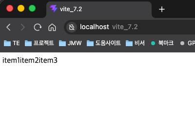
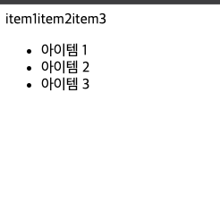
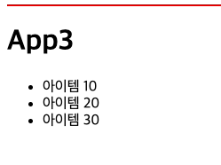

# 반복 렌더링

**반복 렌더링**은 배열이나 리스트 형태의 데이터를 기반으로 여러 컴포넌트를 생성해 일관된 방식으로 화면에 출력하는 기법이다. 상태 변화에 따라 ui를 효율적으로 업데이트함으로써 사용자 경험을 향상시키고, 불필요한 리렌더링을 줄여 리소스를 효율적으로 사용할 수 있게 한다. 특히 대규모 애플리케이션에서는 반복 렌더링을 사용해 사용자의 상호작용을 실시간으로 ui에 반영하는 것이 필수적이다. 이러한 방식은 동적이로 반응성이 뛰어난 웹 애플리케이션을 구축하는 데 중요한 역할을 한다.

자바스크립트는 반복 처리를 위한 다양한 구문을 제공한다. 그러나 리액트에서는 반복 렌더링 시 주로 표준 내장 객체인 Array 의 map() 메서드를 사요한다. map() 은 각 배열 요소에 특정 함수를 적용한 결과로 새로운 배열을 반환하며, jsx 와 결합해 컴포넌트를 반복 렌더링하는 데 적합하다.

---

## 반복 렌더링의 기본 개념 이해하기

반복 렌더링은 배열 데이터를 기반으로 여러 개의 jsx 요소를 화면에 출력하는 작업이다. 따라서 반복 렌더링을 정확히 이해하려면 배열을 jsx로 렌더링할 때 리액트가 어떻게 동작하는지를 알아야 한다.

리액트는 jsx 문법을 사용해 자바스크립트 코드를 html 처럼 작성할 수 있도록 한다. 그런데 jsx 내부에서 배열을 그대로 출력하면 조금 독특한방식으로 동작한다.

예를 들어, jsx에 배열을 삽입할 경우 리액트는 아래와 같은 절차를 따른다.

1. 배열의 각 요소를 문자열로 변환한다.
2. 변환한 문자열들을 구분자 없이 하나로 이어 붙인다.
3. 이렇게 생성된 하나의 문자열을 내용으로 사용해 화면에 표시한다.

이러한 기본 동작을 이해하면 map() 메서드를 사용한 반복 렌더링의 효과를 더 명확히 알 수 있다.

아래 예제는 items 라는 배열을 jsx 내부에서 {items} 형태로 출력하고 있다.

```javascript
export default function App() {
  const items = ["item1", "item2", "item3"];
  return <div>{items}</div>;
}
```

코드를 실행하면 아래와 같이 출력된다.



배열의 각 요소 (item1, item2, item3) 는 문자열로 변환된 뒤, 구분자 없이 하나의 긴 문자열로 합쳐지고, 결국 위와 같은 결과가 나온다.

이처럼 리액트에서 배열을 {배열} 형태로 jsx에 직접 넣으면 배열의 모든 요소가 문자열로 변환되어 공백 없이 하나의 문자열로 합쳐진다. 이 문제를 해결하려면 배열의 각 요소를 jsx 요소로 변환해야 한다. 그러면 리액트는 이를 각각의 독립적인 요소로 인식하고 개별적으로 렌더링한다. 자바스크립트는 배열 안에 html 태그를 직접 포함할 수 없지만, 리액트는 배열 안에 jsx요소를 포함할 수 있기 때문에 이러한 방식이 가능하다.

다른 예제를 살펴보자. items 배열이 \<li> 요소들로 구성되어 있고, 이 배열을 jsx 내부에서 {items} 형태로 출력한다. 그러면 배열의 모든 \<li> 요소가 자동으로 렌더링된다.

```javascript
export function App2() {
  const items = [
    <li key="0">아이템 1</li>,
    <li key="1">아이템 2</li>,
    <li key="2">아이템 3</li>,
  ];
  return <ul>{items}</ul>;
}
```

코드에서 각 \<li> 요소에 key 속성이 포함되어 있다. 배열에 요소가 추가되거나 제거될때 리액트는 어떤 요소가 변경되었는지 추적해야 한다. 이때 key 속성을 활용한다. 만약 key가 없거나 중복 값을 사용하면 렌더링 성능이 저하되거나 예상치 못한 ui 오류가 발생할 수 있다. 따라서 각 요소에는 고유한 값을 가진 key 속성을 지정해야 한다.

[실행결과]



배열안에는 jsx 요소뿐만 아니라 컴포넌트도 포함할 수 있다. 다음 예제는 배열이 컴포넌트로 구성된 경우이다. 즉, 배열의 각 요소가 jsx 형태의 컴포넌트이다.

```javascript
// src/components/ListItem.tsx
export default function ListItem({text} : {text: string}){
    return <li>{text}</li>
}

// src/App.tsx
import ListItem from "./components/ListItem";
export function App3(){
  const items = [
    <ListItem key='0' text='아이템 10' />
    ,<ListItem key='1' text='아이템 20' />
    ,<ListItem key='2' text='아이템 30' />
  ];
  return (
    <div>
      <hr style={{borderColor: 'red'}} />
      <h1>App3</h1>
      <ul>{items}</ul>
    </div>
  );
}
```

컴포넌트를 배열로 렌더링할 때도 각 요소에는 key 속성을 지정해야 한다. 이 코드에서 배열을 구성하는 각 컴포넌트는 key 속성으로 고유하게 식별되고, 각각 0, 1, 2 의 값을 가진다. 다만, 이 경우에는 key는 ListItem 컴포넌트의 props가 아닌 jsx 요소 자체의 속성이다.

[출력결과]



이 처럼 리액트에서는 jsx 표현식으로 배열을 렌더링할 수 있는 기능을 제공한다. 배열을 jsx안에서 출력하면 리액트는 배열의 모든 요소를 순서대로 하나의 화면에 렌더링한다.

> **key 와 ref 속성**
>
> 리액트에서는 컴포넌트에 데이터를 전달할 때 보통 속성을 사용한다. 예를들어 다음과 같이 작성하면 ListItem 컴포넌트는 '아이템 1' 이라는 값을 props.text로 사용할 수 있다.
>
> `<ListItem text='아이템 1' />`
>
> 하지만 일부 특별한 속성들은 컴포넌트 내부로 전달되지 않는다. 그 대표적인 예가 key와 ref 다.
>
> **key** 속성은 배열을 렌더링할 때 각 컴포넌트를 고유하게 식별하기 위해 사용한다. 리액트 18까지는 key의 값을 컴포넌트의 props 객체에 포함하지 않고 내부에서만 사용한다. 따라서 컴포넌트 내부에서 props.key와 같이 접근하려 하면 값을 참조할 수 없다. 그러나 리액트 19부터 일반 props로 전달할 수 있게 바뀌었다.
>
> **ref** 또한 리액트에서 dom 요소나 컴포넌트 인스턴스에 직접 접근하기 위해 사용한다. ref 역시 컴포넌트의 props로 전달되지 않으며, 컴포넌트 내부에서 props.ref 로 접근할 수 없다.
>
> 이처럼 key와 ref는 일반 속성과 달리 리액트가 내부에서 처리하는 특별한 속성이다. 따라서 두 속성은 컴포넌트 내부에서 사용할 수 없다는 점을 기억하자.

---

## map() 메서드 사용하기
