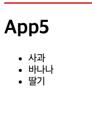

# 반복 렌더링

**반복 렌더링**은 배열이나 리스트 형태의 데이터를 기반으로 여러 컴포넌트를 생성해 일관된 방식으로 화면에 출력하는 기법이다. 상태 변화에 따라 ui를 효율적으로 업데이트함으로써 사용자 경험을 향상시키고, 불필요한 리렌더링을 줄여 리소스를 효율적으로 사용할 수 있게 한다. 특히 대규모 애플리케이션에서는 반복 렌더링을 사용해 사용자의 상호작용을 실시간으로 ui에 반영하는 것이 필수적이다. 이러한 방식은 동적이로 반응성이 뛰어난 웹 애플리케이션을 구축하는 데 중요한 역할을 한다.

자바스크립트는 반복 처리를 위한 다양한 구문을 제공한다. 그러나 리액트에서는 반복 렌더링 시 주로 표준 내장 객체인 Array 의 map() 메서드를 사요한다. map() 은 각 배열 요소에 특정 함수를 적용한 결과로 새로운 배열을 반환하며, jsx 와 결합해 컴포넌트를 반복 렌더링하는 데 적합하다.

---

## 반복 렌더링의 기본 개념 이해하기

반복 렌더링은 배열 데이터를 기반으로 여러 개의 jsx 요소를 화면에 출력하는 작업이다. 따라서 반복 렌더링을 정확히 이해하려면 배열을 jsx로 렌더링할 때 리액트가 어떻게 동작하는지를 알아야 한다.

리액트는 jsx 문법을 사용해 자바스크립트 코드를 html 처럼 작성할 수 있도록 한다. 그런데 jsx 내부에서 배열을 그대로 출력하면 조금 독특한방식으로 동작한다.

예를 들어, jsx에 배열을 삽입할 경우 리액트는 아래와 같은 절차를 따른다.

1. 배열의 각 요소를 문자열로 변환한다.
2. 변환한 문자열들을 구분자 없이 하나로 이어 붙인다.
3. 이렇게 생성된 하나의 문자열을 내용으로 사용해 화면에 표시한다.

이러한 기본 동작을 이해하면 map() 메서드를 사용한 반복 렌더링의 효과를 더 명확히 알 수 있다.

아래 예제는 items 라는 배열을 jsx 내부에서 {items} 형태로 출력하고 있다.

```javascript
export default function App() {
  const items = ["item1", "item2", "item3"];
  return <div>{items}</div>;
}
```

코드를 실행하면 아래와 같이 출력된다.


배열의 각 요소 (item1, item2, item3) 는 문자열로 변환된 뒤, 구분자 없이 하나의 긴 문자열로 합쳐지고, 결국 위와 같은 결과가 나온다.

이처럼 리액트에서 배열을 {배열} 형태로 jsx에 직접 넣으면 배열의 모든 요소가 문자열로 변환되어 공백 없이 하나의 문자열로 합쳐진다. 이 문제를 해결하려면 배열의 각 요소를 jsx 요소로 변환해야 한다. 그러면 리액트는 이를 각각의 독립적인 요소로 인식하고 개별적으로 렌더링한다. 자바스크립트는 배열 안에 html 태그를 직접 포함할 수 없지만, 리액트는 배열 안에 jsx요소를 포함할 수 있기 때문에 이러한 방식이 가능하다.

다른 예제를 살펴보자. items 배열이 \<li> 요소들로 구성되어 있고, 이 배열을 jsx 내부에서 {items} 형태로 출력한다. 그러면 배열의 모든 \<li> 요소가 자동으로 렌더링된다.

```javascript
export function App2() {
  const items = [
    <li key="0">아이템 1</li>,
    <li key="1">아이템 2</li>,
    <li key="2">아이템 3</li>,
  ];
  return <ul>{items}</ul>;
}
```

코드에서 각 \<li> 요소에 key 속성이 포함되어 있다. 배열에 요소가 추가되거나 제거될때 리액트는 어떤 요소가 변경되었는지 추적해야 한다. 이때 key 속성을 활용한다. 만약 key가 없거나 중복 값을 사용하면 렌더링 성능이 저하되거나 예상치 못한 ui 오류가 발생할 수 있다. 따라서 각 요소에는 고유한 값을 가진 key 속성을 지정해야 한다.

[실행결과]


배열안에는 jsx 요소뿐만 아니라 컴포넌트도 포함할 수 있다. 다음 예제는 배열이 컴포넌트로 구성된 경우이다. 즉, 배열의 각 요소가 jsx 형태의 컴포넌트이다.

```javascript
// src/components/ListItem.tsx
export default function ListItem({text} : {text: string}){
    return <li>{text}</li>
}

// src/App.tsx
import ListItem from "./components/ListItem";
export function App3(){
  const items = [
    <ListItem key='0' text='아이템 10' />
    ,<ListItem key='1' text='아이템 20' />
    ,<ListItem key='2' text='아이템 30' />
  ];
  return (
    <div>
      <hr style={{borderColor: 'red'}} />
      <h1>App3</h1>
      <ul>{items}</ul>
    </div>
  );
}
```

컴포넌트를 배열로 렌더링할 때도 각 요소에는 key 속성을 지정해야 한다. 이 코드에서 배열을 구성하는 각 컴포넌트는 key 속성으로 고유하게 식별되고, 각각 0, 1, 2 의 값을 가진다. 다만, 이 경우에는 key는 ListItem 컴포넌트의 props가 아닌 jsx 요소 자체의 속성이다.

[출력결과]


이 처럼 리액트에서는 jsx 표현식으로 배열을 렌더링할 수 있는 기능을 제공한다. 배열을 jsx안에서 출력하면 리액트는 배열의 모든 요소를 순서대로 하나의 화면에 렌더링한다.

> **key 와 ref 속성**
>
> 리액트에서는 컴포넌트에 데이터를 전달할 때 보통 속성을 사용한다. 예를들어 다음과 같이 작성하면 ListItem 컴포넌트는 '아이템 1' 이라는 값을 props.text로 사용할 수 있다.
>
> `<ListItem text='아이템 1' />`
>
> 하지만 일부 특별한 속성들은 컴포넌트 내부로 전달되지 않는다. 그 대표적인 예가 key와 ref 다.
>
> **key** 속성은 배열을 렌더링할 때 각 컴포넌트를 고유하게 식별하기 위해 사용한다. 리액트 18까지는 key의 값을 컴포넌트의 props 객체에 포함하지 않고 내부에서만 사용한다. 따라서 컴포넌트 내부에서 props.key와 같이 접근하려 하면 값을 참조할 수 없다. 그러나 리액트 19부터 일반 props로 전달할 수 있게 바뀌었다.
>
> **ref** 또한 리액트에서 dom 요소나 컴포넌트 인스턴스에 직접 접근하기 위해 사용한다. ref 역시 컴포넌트의 props로 전달되지 않으며, 컴포넌트 내부에서 props.ref 로 접근할 수 없다.
>
> 이처럼 key와 ref는 일반 속성과 달리 리액트가 내부에서 처리하는 특별한 속성이다. 따라서 두 속성은 컴포넌트 내부에서 사용할 수 없다는 점을 기억하자.

---

## map() 메서드 사용하기

리액트에서 배열에 포함된 요소를 jsx 표현식으로 출력하면 배열의 모든 요소를 하나로 이어 붙여 렌더링된다는 것을 이전에 확인했다. 이러한 jsx 문법의 특징은 리액트에서 특징 요소를 반복적으로 렌더링하는 데 활용된다.

자바스크립트의 표준 내장 객체인 Array의 map() 메서드는 배열의 각 요소를 순회하면서 가공한 결과를 새로운 배열로 반환한다. 리액트에서는 이 메서드를 활용해 배열 데이터를 jsx 요소나 컴포넌트로 변환해 반복 렌더링한다.

예를 들어, 사과, 바나나, 딸기와 같은 문자열이 담긴 배열이 있다고 가정해보자. 이 배열의 각 항목을 \<li> 요소로 렌더링하려면 코드를 아래와 같이 작성한다.

```javascript
export function App4() {
  const items = [
    <li key="사과">사과</li>,
    <li key="바나나">바나나</li>,
    <li key="딸기">딸기</li>,
  ];
  return (
    <div>
      <hr style={{ borderColor: "red" }} />
      <h1>App4</h1>
      <ul>{items}</ul>
    </div>
  );
}
```

이 코드는 배열에 jsx 요소를 직접 담은 형태이다. 각 \<li> 요소에는 key 속성을 지정해 리액트가 각 항목을 고유하게 식별할 수 있다. 그러나 이와 같은 방식은 코드의 가독성이 떨어지고 확장성도 좋지 않다. 실제로는 대부분의 배열이 api 요청 등을 통해 전달되며, jsx요소가 아닌 문자열이나 객체로 구성된 데이터 형태이기 때문이다. 이처럼 값으로만 구성된 배열을 렌더링하려면 먼저 각 값을 jsx 요소로 변환하는 과정이 필요하다. 이때 유용한 메서드가 바로 map() 이다.

앞선 예제를 다음과 같이 수정하면 문자열 배열을 \<li> 요소로 변환해 출력할 수 있다.

```javascript
export function App5() {
  const items = ["사과", "바나나", "딸기"];
  return (
    <div>
      <hr style={{ borderColor: "red" }} />
      <h1>App5</h1>
      <ul>
        {items.map((item, index) => (
          <li key={index}>{item}</li>
        ))}
      </ul>
    </div>
  );
}
```

items.map() 은 items 배열의 각 항목을 \<li> 요소로 감싼 jsx로 변환하고, map() 메서드의 두 번째 매개변수인 인덱스를 key로 사용한다. map() 이 반환한 배열은 jsx 표현식 안에서 렌더링한다.

[출력결과]



컴포넌트를 반복 렌더링하는 방법도 매우 간단하다. 앞서 \<li> 와 같은 jsx 요소를 반복 렌더링한 것처럼 컴포넌트도 배열의 요소로 사용하면 된다.

앞선 예제에서 items 배열의 각 항목을 ListItem 컴포넌트를 사용해 다음과 같이 렌더링할 수 있다. 이때 각 항목은 text라는 props 로 ListItem 컴포넌트에 전달된다. key 속성은 각 항목을 고유하게 식별할 수 있도록 index값을 사용한다.

```javascript
export function App6() {
  const items = ["사과0", "바나나1", "딸기2"];
  return (
    <div>
      <hr style={{ borderColor: "red" }} />
      <h1>App6</h1>
      <ul>
        {items.map((item, index) => (
          <ListItem key={index} text={item} />
        ))}
      </ul>
    </div>
  );
}
```

이처럼 map() 메서드를 사용하면 배열 데이터를 컴포넌트로 손쉽게 변환할 수 있다. 리액트에서 가자 일반적으로 사용하는 반복 렌더링 패턴이니 잘 기억하자.

> Tip\
> 예제 코드에서 반복 렌더링할 때 key 속성의 값으로 map() 메서드의 두 번째 매개변수인 인덱스를 사용했다. 이 방식은 배열의 요소를 추가 또는 삭제하거나 순서가 바뀌는 경우에는 예기치 않은 문제를 일으킬 수 있다. 리액트는 key 값을 기준으로 각 컴포넌트를 식별하고 렌더링을 최적화하는데 인덱스를 key 로 사용하면 요소의 위치가 바뀔 때 기존 요소와 새 요소를 잘못 매칭하는 문제가 발생할 수 있다. 따라서 실제 프로덕션 환경에서는 인덱스를 key로 사용하는 것을 권장하지 않는다. 이 예제에서는 임시로 사용했을뿐이다. 실무에서는 반드시 고유값을 key 로 사용해야 한다.

---

## 그 밖의 사용법

리액트에서 반복 렌더링을 구현할 때 가장 효율적인 방법은 map() 메서드를 사용하는 것이다. 실제 현업에서도 거의 모든 반복 렌더링에 map() 메서드를 사용한다고 해도 과언이 아니다. 그러나 map()만이 유일한 방법은 아니다. 리액트는 자바스크립트를 기반으로 하기 때문에 반복문을 포함한 다양한 방법으로 반복 렌더링을 구현할 수 있다. 다만, 이런 방식들은 코드의 가독성과 리액트의 작동 원리 면에서 map() 메서드보다 비효율적일 수 있다.

---

### for 문 사용하기

for 문은 while 문과 함께 자바스크립트의 대표적인 반복문이다. 그러나 jsx 내부에서 for 문을 직접 사용할 수 없기 때문에 반복 렌더링을 구현하려면 조금 다른 방식으로 작성해야 한다.

다음 예제는 for 문을 사용해 jsx 외부에서 배열을 먼저 구성한 후 화면에 렌더링한다.

```javascript
export function App7() {
  const renderItems = [];
  const items = ["사과", "바나나", "딸기"];
  for (let i = 0; i < items.length; i++) {
    renderItems.push(<li key={i}>{items[i]}</li>);
  }
  return (
    <div>
      <hr style={{ borderColor: "red" }} />
      <h1>App7</h1>
      <ul>{renderItems}</ul>
    </div>
  );
}
```

renderItems 라는 빈 배열을 먼저 정의하고, for 문을 사용해 items 배열의 각 요소를 순회한다. 순회 과정에서 각 요소를 \<li> 형태의 jsx 로 변환한 뒤, renderItems 배열에 push() 메서드로 추가한다. renderItems 배열을 jsx 표현식으로 출력해 반복 렌더링되도록 한다.

이 방식은 자바스크립트에 익숙한 개발자에게는 직관적일 수 있지만, jsx 의 선언적 특성과 리액트 스타일에 잘 어울리지 않기 때문에 실제 프로젝트에서는 거의 사용하지 않는다.

---

### forEach() 사용하기

forEach() 메서드는 Array 객체의 메서드 중 하나로, 배열의 각 요소를 순회하면서 특정 작업을 수행할 때 사용한다. 리액트에서도 forEach() 메서드를 사용해 반복 렌더링을 구현할 수 있다.

다음 예제는 forEach()를 사용해 문자열 배열을 \<li> 요소로 변환하고 화면에 렌더링한다.

```javascript
export function App8(){
  const items = ['사과', '바나나', '딸기'];
  const elements: React.ReactNode[] = [];
  items.forEach((item, index) => {
    elements.push(<li key={index}>{item}</li>);
  });
  return (
    <div>
      <hr style={{borderColor: 'red'}} />
      <h1>App8</h1>
      <ul>
        {elements}
      </ul>
    </div>
  );
}
```

jsx 요소를 저장할 빈 배열(elements)을 선언한다. forEach() 메서드를 사용해 items 배열의 각 요소와 인덱스를 순회한다. 순회하면서 jsx요소 \<li> 를 생성하고, elements 배열에 push() 메서드를 사용해 추가한다. 순회 과정에서 각 요소를 \<li> 형태의 jsx로 반환한 뒤, elements 배열에 push() 메서드로 추가한다. elements 배열을 jsx 표현식으로 출력해 \<ui> 안에 렌더링한다.

forEach() 메서드는 map() 메서드와 달리 반환값이 없다. 따라서 jsx 요소들을 담기 위한 별도의 배열을 만들어 push() 메서드로 추가해야 한다. 이 방식도 구현은 가능하지만 가독성이 떨어질 수 있다.

---

### reduce() 사용하기

reduce() 메서드도 Array 객체의 메서드 중 하나로, 배열의 모든 요소를 순회하며 누적 값을 계산해 최종 결과를 반환한다. 이 메서드는 일반적으로 숫자 합계처럼 하나의 값을 도출하는 데 많이 사용하지만, 배열을 반환하는 형태로도 응용할 수 있어 리액트에서 반복 렌더링에 활용할 수 있다.

다음 예제는 reduce() 메서드를 사용해 \<li> 요소로 구성된 배열을 \<ul> 태그 안에 렌더링한다.

```javascript
export function App9(){
  const items = [
    <li key='1'>사과</li>,
    <li key='2'>바나나</li>,
    <li key='3'>딸기</li>,
  ];
  return (
    <div>
      <hr style={{borderColor: 'red'}} />
      <h1>App9</h1>
      <ul>
        {items.reduce<React.ReactNode[]>((acc, item) => {
          acc.push(item);
          return acc;
        }, [])}
      </ul>
    </div>
  );
}
```

문자열을 포함한 jsx 요소들을 배열로 정의한다. 각 요소에는 반드시 고유한 key 속성을 지정해야 한다.\
reduce() 메서드로 items 배열을 순회한다.\
첫 번째 매개변수 `acc는 누적된 값을 의미하며, 초깃값은 빈 배열[] 이다` 현재 순회 중인 요소를 acc 배열에 push() 메서드로 추가한다. 누적된 결과 배열 acc 를 반환하고, 이를 \<ul> 태그 내부에서 렌더링한다.

reduce() 메서드는 반복 도중 누적 값을 직접 제어할 수 있기 때문에 배열을 구성하면서 동시에 가공(필터링 등)이 필요한 경우에 유용하다. 또한, for문이나 forEach() 방식처럼 별도의 외부 배열을 미리 정의할 필요가 없어 코드가 더 간결하다.

> Tip\
> 예제 코드에서 사용한 <React.ReactNode[]> 는 반환할 배열의 타입을 지정하는 부분이다. 이는 타입스크립트에서 제네릭 타입을 지정하는 방식이다. Reach.ReactNode 타입은 리액트에서 렌더링할 수 있는 모든 요소를 포괄하는 타입이다. 즉, <Reach.ReactNode[]> 는 리액트에서 렌더링할 수 있는 모든 요소를 담은 배열이라는 의미다.
>
> 이외에도 JSX Element 타입을 사용할 수도 있다. JSX Element는 JSX 문법으로 생성된 요소만을 가리키는 타입이다. 두 타입 모두 사용할 수 있지만, React.ReactNode 타입이 더 많은 요소를 포괄한다.

리액트에서 반복 렌더링의 핵심은, 렌더링할 요소를 배열 형태의 데이터로 변환하는 것이다. JSX 표현식은 배열을 출력할 때 배열의 각 요소를 하나의 JSX 요소로 연결해 렌더링한다. 따라서 반복 가능한 형태의 배열을 생성하는 과정이 매우 중요하다.

일반적으로 가장 많이 사용하는 방법은 map() 메서드이다. 여기서는 map() 메서드 외에도 다양한 방식으로 반복 렌더링을 구현해 보았다. 물론 이 방법들은 모두 자바스크립트 문법에 기반해 배열을 순회하고 가공하는 방식일 뿐이다. 하지만 반복 렌더링을 구현할 수 있는 다양한 접근방식과 사고 방식을 보여주기 위에 여러 방법을 사용해보았다. 자바스크립ㅌ의 특성상 배열 데이터를 다룰 수만 있다면 while, do...while 같은 반복문이나 filter(), some(), every() 와 같은 배열 메서드도 충분히 반복 렌더링에 활용할 수 있다.

가장 중요한 점은 리액트에서 반복 렌더링을 구현하려면 데이터를 반드시 리액트가 이해하고 렌더링할 수 있는 형식 (JSX 요소 배열) 으로 변환해야 한다는 점이다. 즉, 렌더링 대상은 JSX 요소 또는 리액트에서 인식 가능한 노드 형태여야 하며, 어떤 반복문이ㅏ 메서드를 사용하든 최종적으로 JSX 요소 배열을 반환하는 구조를 만들어야 한다.
