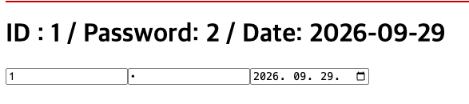
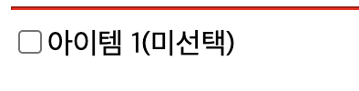
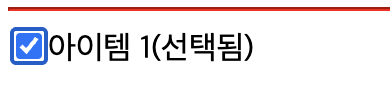
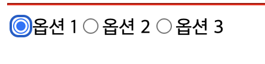
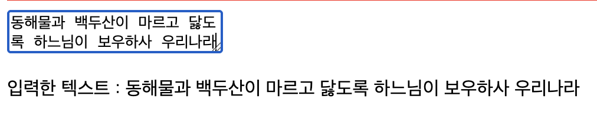

# 폼 제어하기

리액트에서는 폼 요소에 입력된 값을 어떻게 제어하느냐에 따라 제어 컴포넌트와 비제어 컴포넌트로 나눌 수 있다. 어떤 방식을 선택하느냐에 따라 폼의 동작과 구조가 달라진다.

---

## 제어 컴포넌트

**제어 컴포넌트** 는 입력 값을 리액트 컴포넌트의 상태로 완전히 관리하는 방식이다. 즉, 사용자가 입력한 값을 바로 DOM에 저장하지 않고 먼저 상태에 저장한 뒤 그 값을 화면에 표시하는 구조이다. 이 방식은 입력 값이 변경될 때마다 상태를 업데이트하고, 상태 값을 다시 입력 요소에 연결한다. 그래서 ui와 상태가 항상 일치(동기화)되며, 실시간으로 값을 추적하거나 검증하는 작업이 쉬워진다.

제어 컴포넌트는 다음과 같은 순서로 작동한다.

1. 상태 정의 : useState 훅을 사용해 입력 값을 저장할 상태를 정의한다.

2. 상태 업데이트 : 사용자가 값을 입력하면 \<input> 요소의 onChange 속성에 연결된 이벤트 핸들러가 실행되어 입력 값을 상태에 저장한다.

3. 상태와 입력 요소 연결 : \<input> 요소의 value 속성을 상태 값으로 설정한다. 이렇게 하면 \<input> 요소는 리액트의 상태에 의해 제어되고, 항상 최신 상태 값이 화면에 표시된다.

폼 요소를 만들어보며 작동 방식을 이해해 보겠습니다.

### 제어 컴포넌트로 한 줄 입력 요소 다루기

리액트에서는 html의 \<input> 태그를 사용해 한 줄 입력 요소를 만들 수 있습니다. 이를 제어 컴포넌트 방식으로 구현하면 다음과 같다.

```javascript
import { useState } from "react";

export default function Input() {
    const [value, setValue] = useState(''); --- (1)
    const handleChange = (e : React.ChangeEvent<HTMLInputElement>) => { --- (2)
        setValue(e.target.value);
    };
    return (
        <>
            <form>
                <h1>Input: {value}</h1> --- (3)
                <input type="text" value={value} onChange={handleChange} /> --- (4)
            </form>
        </>
    );
}
```

(1) useState 훅으로 value라는 상태를 정의한다.

- value : \<input>의 값을 저장하는 상태 변수이다.
- setValue : value를 변경할 때 사용하는 상태 업데이트 함수이다.
- 초깃값은 빈 문자열('')로 설정한다.

(2) handleChange() 함수는 입력 값을 가져와 value 값을 업데이트 한다.

- e.target.value로 사용자가 \<input> 요소에 입력한 값을 가져온다. 이 값을 setValue() 함수로 value 에 저장한다.
- 상태가 바뀌면 리액트 자동으로 컴포넌트를 리렌더링해 \<input>값을 최신 상태로 유지한다.

(3) \<h1> 태그는 value 상태의 값을 실시간으로 화면에 표시한다. 리액트는 항상 상태의 최신 값을 기준으로 화면을 다시 그리기 때문에 \<h1> 요소의 내용도 자동으로 업데이트된다.

(4) \<input> 의 value 속성을 value 상태 변수와 연결한다.

- value 속성과 value 상태를 연결하면 \<input> 요소는 value 상태에 의해 제어된다.
- 사용자가 값을 입력해도 value 상태가 바뀌지 않으면 \<input> 값은 바뀌지 않는다. 따라서 \<input> 요소는 상태(value)가 완전히 제어하는 제어 컴포넌트이다.
- 사용자가 값을 입력할 때마다 onChange 이벤트가 발생하고, 이벤트 핸들러인 handleChange() 함수가 호출된다.

입력 값을 제어하려면 입력 요소마다 하나의 상태가 필요하다. 따라서 입력 요소가 여러 개인 경우, 각 입력 값을 관리하기 위해 여러 개의 상태 변수와 이벤트 핸들러를 정의해야한다.

예를 들어, ID 입력(value), 비밀번호 입력(password), 날짜 입력(date)을 각각 제어하려면 다음과 같이 작성한다.

```javascript
import { useState } from "react";

export default function Input2(){
    // input[type='text']
    const [value, setValue] = useState('');
    const handleChange = (e : React.ChangeEvent<HTMLInputElement>) => {
        setValue(e.target.value);
    };
    // input[type='password']
    const [password, setPassword] = useState('');
    const handleChangePassword = (e : React.ChangeEvent<HTMLInputElement>) => {
        setPassword(e.target.value);
    };
    // input[type='date']
    const [date, setDate] = useState('');
    const handleChangeDate = (e : React.ChangeEvent<HTMLInputElement>) => {
        setDate(e.target.value);
    };
    return(
        <>
            <form>
                <h1>ID : {value} / Password : {password} / Date : {date}</h1>
                <input type='text' value={value} onChange={handleChange} />
                <input type='password' value={password} onChange={handleChangePassword} />
                <input type='date' value={date} onChange={handleChangeDate} />
            </form>
        </>
    );
}
```

하지만 여러 입력 요소를 각각 상태로 관리하면 코드가 복잡해지고 유지보수가 어려울 수 있다. 이럴 때는 객체 형태의 상태를 사용해 여러 입력 값을 통합 관리할 수 있다.

```javascript
import { useState } from "react";

export default function Input3() {
    const [formState, setFormState] = useState({ id: '', password: '', date: '',}); --- (1)

    const handleChange = (e : React.ChangeEvent<HTMLInputElement>) => {
        setFormState((formState) => ({ --- (2)
            ...formState,
            [e.target.name] : e.target.value,
        }));
    };

    return (
        <>
            <form>
                <h1>ID : {formState.id} / Password: {formState.password} / Date: {formState.date}</h1> --- (3)
                <input type='text' name='id' value={formState.id} onChange={handleChange} /> --- (4)
                <input type='password' name='password' value={formState.password} onChange={handleChange} />
                <input type='date' name='date' value={formState.date} onChange={handleChange} />
            </form>
        </>
    );
}
```

(1) 여러 입력 값을 저장하는 객체 형태의 상태(formState)를 정의한다. 각 키(id, password, date) 는 \<input> 요소의 name 속성과 동일하게 설정한다.
이렇게 객체 형태로 관리하면 새로운 입력 요소도 쉽게 추가할 수 있다.

(2) setFormState() 함수로 상태를 업데이트한다. 리액트는 상태 업데이트를 비동기적으로 처리한다. 그래서 이전 상태 값을 사용해 상태를 안전하게 업데이트하도록 콜백 함수를 사용한 함수형 업데이트 방식으로 호출한다.

- 스프레트 연산자(...) 를 사용해 기존 상태(formState)를 복사 (...formState) 한다.

- [e.target.name] : 입력 값(e.target.value)을 객체의 특정 속성 값으로 할당하는 방식이다. 이는 객체의 속성 이름을 동적으로 설정하는 자바스크립트 문법으로 `계산된 속성 이름` 이라고 한다. 예를 들어, 입력 요소의 name 속성 값이 id이고 사용자가 입력한 값이 newUser라면 formState["id"] = 'newUser' 라는 의미다.

(3) 입력 값을 실시간으로 화면에 표시한다. 예를 들어, formState.id 는 \<input>의 name='id'의 값을 표시한다.

(4) \<input> 요소 3개가 동일한 구조로 상태를 업데이트 한다.

- type : 입력 요소의 종류를 지정한다 (text, password, date)
- name : 상태 객체(formState)의 키와 동일하게 지정한다. 리액트는 이 값을 사용해 객체의 특정 키 값을 업데이트한다.
- value : 화면에 표시할 상태 값을 지정한다.
- onChange : 입력 값이 바뀔 때마다 상태를 업데이트할 함수를 지정한다.

`여기서 중요한 부분은 상태 객체의 키 이름이 입력 요소의 name 속성 값과 일치해야 한다는 것이다. 이는 이벤트 객체의 target 속성에서 name 값을 참조해 어떤 입력 요소가 변경되었는지 식별하고 그에 맞는 상태 값을 정확히 업데이트하기 위해서이다.`

App 컴포넌트를 아래와 같이 작성하고 실행한다.

[실행결과]



---

### 제어 컴포넌트로 체크박스 다루기

\<input> 은 한 줄 입력 요소뿐 아니라 체크박스도 만들 수 있다. 체크박스를 제어 컴포넌트 방식으로 구현하려면 checked 속성과 onChange 속성을 사용해 다음과 같이 작성한다.

```javascript
import { useState } from "react";

export default function Checkbox() {
    const [isChecked, setIsChecked] = useState(false);
    const handleCheckboxChange = (event : React.ChangeEvent<HTMLInputElement>) => {
        setIsChecked(event.target.checked); --- (1)
    };
    return (
        <form>
            <input type='checkbox'
                checked={isChecked} --- (2)
                onChange={handleCheckboxChange}
            /> --- (3)
            <label>아이템 1({isChecked ? '선택됨' : '미선택'})</label>
        </form>
    );
}
```

(1) \<input> 요소의 type 속성을 'checkbox' 로 설정하면 체크박스를 만들 수 있다. checked 속성은 체크박스의 선택 상태를 나타낸다. true면 체크된 상태, false면 체크되지 않은 상태이다. 이 속성에 상태 변수 isChecked를 연결하면 상태에 따라 체크박스가 자동으로 업데이트된다.

(2) 사용자가 체크박스를 클릭할 때마다 onChange 이벤트가 발생하고, 연결된 이벤트 핸들러가 실행된다.

(3) 이벤트 객체의 checked 속성은 체크박스의 선택 여부 (isChecked)를 나타낸다. 이 값을 읽어 setIsChecked() 함수로 상태를 업데이트하면 화면도 변경된다.

[출력결과]



체크박스를 여러 개 관리해야 할 때도 객체 형태의 상태를 사용하면 모든 체크박스를 하나의 상태로 통합해 관리할 수 있다.

```javascript
import { useState } from "react";

export default function Checkbox2() {
    const [formState, setFormState] = useState({ --- (1)
        agree1 : false ,
        agree2 : false ,
        agree3 : false ,
    });

    const handleCheckboxChange = (event : React.ChangeEvent<HTMLInputElement>) => { --- (2)
        setFormState((formState) => ({
            ...formState ,
            [event.target.name] : event.target.checked ,
        }));
    };

    return (
        <form>
            <input type='checkbox' id='ag1' name='agree1' checked={formState.agree1} --- (3)
            onChange={handleCheckboxChange} />
            <label htmlFor='ag1'>동의 1({formState.agree1 ? '선택됨' : '미선택'})</label>

            <input type='checkbox' id='ag2' name='agree2' checked={formState.agree2}
            onChange={handleCheckboxChange} />
            <label htmlFor='ag2'>동의 2({formState.agree2 ? '선택됨' : '미선택'})</label>

            <input type='checkbox' id='ag3' name='agree3' checked={formState.agree3}
            onChange={handleCheckboxChange} />
            <label htmlFor='ag3'>동의 3({formState.agree3 ? '선택됨' : '미선택'})</label>
        </form>
    );
}
```

(1) 체크박스 상태를 담는 formState 상태 객체를 정의한다. 각 키 (agree1, agree2, agree3)는 각 체크박스의 선택 상태를 나타낸다.

(2) 기존 상태를 복사(...formState)한 뒤 event.target.name 을 키로 사용해 해당 체크박스의 상태만 업데이트한다.

(3) \<input> 요소의 Checked 속성에 해당 상태 값을 연결하면 상태가 true일 때만 체크박스가 선택 상태로 표시된다. 이때 name속성은 상태 객체의 키 이름과 정확히 일치해야 한다.

---

### 제어 컴포넌트로 라디오 버튼 다루기

\<input> 태그로 라디오 버튼도 만들 수 있다. 라디오 버튼은 여러 항목 중 오직 하나만 선택할 때 사용한다. 기본 구조는 한줄 입력 요소나 체크박스와 비슷하지만, 작동 방식에는 차이가 있다. 라디오 버튼도 value, checked, onChange 속성으로 상태를 제어한다. 하지만 그룹 안에서 하나만 선택할 수 있기 때문에 선택한 값을 상태로 비교하는 방식으로 제어해야 한다.

```javascript
import React, { useState } from "react";

export default function Radio() {
    const [selectedValue, setSelectedValue] = useState('option1'); --- (1)

    const handleRadioChange = (e : React.ChangeEvent<HTMLInputElement>) => {
        setSelectedValue(e.target.value); --- (2)
    };

    return (
        <form>
            <label>
                <input type='radio' value='option1' --- (3)
                    checked={selectedValue === 'option1'}
                    onChange={handleRadioChange}
                />옵션 1
            </label>
            <label>
                <input type='radio' value='option2'
                    checked={selectedValue === 'option2'}
                    onChange={handleRadioChange}
                />옵션 2
            </label>
            <label>
                <input type='radio' value='option3'
                    checked={selectedValue === 'option3'}
                    onChange={handleRadioChange}
                />옵션 3
            </label>
        </form>
    );
}
```

(1) 상태 변수 selectValue는 현재 선택된 라디오 버튼의 value 속성 값을 저장한다. 초깃값을 'option1' 로 설정했기 때문에 처음 렌더링될 때 '옵션1' 이 선택된 상태로 표시된다.

(2) 사용자가 라디오 버튼을 클릭하면 onChange 이벤트가 발생하고, setSelectedValue() 함수가 해당 버튼의 value 값을 상태로 저장한다.

(3) \<input> 요소 type 을 'radio' 로 설정해 라디오 버튼을 3개 만든다.

- value 는 각 버튼이 나타내는 값이다.
- checked 속성은 해당 라디오 버튼의 선택 여부를 나타낸다. 현재 상태와 해당 버튼의 value가 일치({selectedValue === 'option(N)'}) 하면 true가 되어 선택 상태로 표시된다.
- onChange 속성으로 모두 같은 handleRadioChange() 이벤트 핸드러를 공유하고, 라디오 버튼을 클릭하면 상태를 변경한다.

[출력결과]



라디오 버튼은 여러 항목 중 하나를 선택하면 같은 그룹에 속한 나머지는 자동으로 선택 해제된다. 이러한 특징 덕분에 라디오 그룹은 상태 하나로도 제어가 가능하다. 라디오 그룹이 여러 개인 경우에는 객체 형태의 상태를 사용해 각 그룹 값을 하나의 객체로 함께 관리할 수 있다.

다음 예제는 gender(성별)와 color(색상)라는 두 라디오 그룹을 제어 컴포넌트 방식을 사용해 하나의 상태 객체로 관리한다.

```javascript
import { useState } from "react";

export default function Radio2() {
    const [formState, setFormState] = useState({ --- (1)
        gender: 'male',
        color: 'red',
    });

    const handleRadioChange = (event : React.ChangeEvent<HTMLInputElement>) => { --- (2)
        setFormState((formState) => ({
            ...formState,
            [event.target.name] : event.target.value,
        }));
    };

    return (
        <>
            <form>
                <div> {/* 성별 그룹 */}
                    <label>
                        <input type='radio' name='gender' value='male' --- (3)
                            checked={formState.gender === 'male'}
                            onChange={handleRadioChange}
                        />
                        Male
                    </label>
                    <label>
                        <input type='radio' name='gender' value='female'
                            checked={formState.gender === 'female'}
                            onChange={handleRadioChange}
                        />
                        FeMale
                    </label>
                </div>
                <div> {/** 색상 그룹 */}
                    <label>
                        <input type='radio' name='color' value='red' --- (4)
                            checked={formState.color === 'red'}
                            onChange={handleRadioChange}
                        />
                        Red
                    </label>
                    <label>
                        <input type='radio' name='color' value='blue'
                            checked={formState.color === 'blue'}
                            onChange={handleRadioChange}
                        />
                        Blue
                    </label>
                </div>
            </form>
        </>
    );

}
```

(1) 라디오 그룹별로 선택된 값을 저장하는 formState라는 상태 객체를 정의한다. gender, color 그룹의 초깃값을 각각 'male' 과 'red' 로 설정한다.

(2) hanleRedChange()는 모든 라디오 버튼에 공통으로 사용하는 이벤트 핸드러다.

- event.target.name 은 'gender' 또는 'color' 값을 가진다.
- event.target.value 는 사용자가 클릭한 라디오 버튼의 값을 나타낸다.
- name 키의 값을 value 값으로 업데이트해 어떤 그룹인지에 따라 상태가 자동으로 업데이트된다.

(3) name='gender' 로 성별 그룹을 지정한다. 상태의 formState.gender 값과 비교해 어떤 버튼이 선택 상태인지 결정한다.

(4) name='color' 로 색상 그룹을 지정한다. 작동 방식을 성별 그룹과 동일하다.

이 코드의 핵심은 입력 요소의 name 속성 값을 활용해 동적으로 상태 객체의 속성을 업데이트한다는 점이다. 이처럼 상태를 객체 형태로 관리하면 라디오 그룹이 여러 개일 때도 하나의 이벤트 핸들러만으로 모든 그룹을 효율적으로 제어할 수 있다.

---

### 제어 컴포넌트로 여러 줄 입력 요소 다루기

\<textarea> 태그는 여러 줄 입력이 가능한 폼 요소를 만들 때 사용한다. html에서는 다음과 같이 시작 태그와 종료 태그 사이에 내용을 넣는 방식으로 작성한다.

`<textare>Hello</textarea>`

리액트에서도 \<textarea> 요소는 제어 컴포넌트로 다룰 수 있고 "입력 값은 value와 onChange 속성을 사용해 상태로 직접 제어 한다.

\<textarea> 는 기본적으로 내용이 필요한 요소이므로 보통 열고 닫는 형태를 사용한다. 그러나 내용이 비어 있을 경우 다음과 같이 셀프 클로징 태그로도 작성할 수 있다.

`<textarea />`

**셀프 클로징 태그**란 html 이나 jsx 에서 자식 요소나 내용을 포함하지 않는 태그를 \<태그 /> 형태로 간단히 닫는 방식입니다. html 에서는 \<input> 또는 \<input /> 모두 허용하지만, jsx에서는 반드시 \<input /> 처럼 닫아야 하며, \<input> 처럼 닫지 않은 형태는 오류가 발생한다.

다음은 \<textarea> 요소를 제어 컴포넌트 방식으로 구현한 예제다.

```javascript
import { useState } from "react";

export default function Textarea(){
    const [text, setText] = useState(''); --- (1)
    const handleChange = (event : React.ChangeEvent<HTMLTextAreaElement>) => { --- (2)
        setText(event.target.value);
    };
    return (
        <form>
            <textarea value={text} onChange={handleChange} /> --- (3)
            <p>입력한 텍스트 : {text}</p> --- (4)
        </form>
    );
}
```

(1) text는 사용자가 입력한 값을 저장하는 상태 변수이고, setText는 해당 상태를 업데이트하는 함수이다. 초깃값은 빈 문자열 ('')로 설정해 처음 렌더링 될때 \<textarea> 는 비어 있는 상태로 표시된다.

(2) handleChange() 는 사용자가 \<textarea>에 값을 입력할 때마다 발생하는 onChange이벤트에 의해 호출된다. 이 함수는 이벤트 객체의 target.value 로 입력 값을 읽어와 상태에 저장한다.

(3) \<textarea> 요소의 value 속성을 상태 변수 text 에 연결해 이 요소를 제어 컴포넌트로 만든다. 입력 값은 상태를 통해 완전히 제어되며, 상태가 바뀔때마다 리액트는 자동으로 ui를 렌더링한다.

(4) \<p> 요소에서는 현재 상태 값(text)을 화면에 표시한다. 사용자가 입력한 사용은 실시간으로 상태에 반영되고, 그 값은 곧바로 화면에도 표시된다.

[출력결과]



\<textarea> 요소도 여러 개의 값을 하나의 객체 상태로 통합 관리할 수 있다. 입력 요소마다 name 속성을 저장하고, 해당 값을 활용해 상태 객체의 특정 키 값ㅇㄹ 동적으로 업데이트하면 된다.

아래는 2개의 \<textarea> 요소를 하나의 상태 {formState} 로 관리하는 예제다.

```javascript
import React, { useState } from "react";

export default function Textarea2(){
    const [formState, setFormState] = useState({ --- (1)
        desc: '',
        introduce : '',
    });

    const handleChange = (event : React.ChangeEvent<HTMLTextAreaElement>) => {
        setFormState((formState) => ({  --- (2)
            ...formState,
            [event.target.name] : event.target.value,
        }));
    };

    return (
        <form>  --- (3)
            <textarea name='desc' value={formState.desc} onChange={handleChange} />
            <p>입력한 텍스트11 : {formState.desc}</p>

            <textarea name='introduce' value={formState.introduce} onChange={handleChange} />
            <p>입력한 텍스트22 : {formState.introduce}</p>
        </form>
    );
}
```

(1) formState는 desc 와 introduce라는 2개의 입력 요소를 객체 형태로 통합해 관리한다. 초깃값은 모두 빈 문자열('') 이다.

(2) 모든 \<textarea> 요소는 handleChange() 함수를 공유한다. event.target.name은 현재 입력중인 요소의 이름을 나타낸다. ('desc' 또는 'introduce') 계산된 속성 이름 문법을 사용해 해당 항목만 업데이트하고, 나머지 상태는 유지한다.

(3) \<form> 은 두 입력 요소를 하나의 폼 구조로 묶기 위해 사용한다. \<textarea>는 각각 name='desc' 와 name='introduce' 로 구분한다. 사용자가 입력한 내용은 상태로 저장되고, \<p> 요소를 통해 실시간으로 화면에 반영된다.

---

## 비제어 컴포넌트

**비제어 컴포넌트** 는 폼 오소의 입력 값을 리액트 상태가 아닌 dom 자체에서 직접 관리하는 방식이다. 즉, 사용자가 입력한 값은 컴포넌트의 상태로 저장하지 않고, dom에 그대로 저장한다.

이 방식에서는 useState 훅 대신 useRef 훅을 사용해 dom 요소에 직접 접근해 값을 읽거나 조작한다.

useRef 훅은 아래와 같이 사용한다.

### 1. useRef 훅으로 참조 생성 : useRef 훅으로 참조 객체(ref)를 생성한다. 이 객체는 나중에 특정 dom 요소에 연결되어 해당 요소를 직접 제어 할 수 있다.

> 형식 \
> import { useRef } from 'react';
> const ref = useRef<Type>(initialValue);

- \<Type> : 참조할 대상의 타입이다. 제네릭 타입은 보통 생략 가능하지만, dom 요소를 명확하게 참조하고 싶을 땐 이를 지정해주는 것이 좋다.

- initialValue : 초깃값으로 보통 null 로 설정한다.

### 2. 입력 요소에 ref 객체 연결 : 생성한 ref 객체를 입력 요소의 ref 속성과 연결하면 해당 dom 노드를 ref.current.value 를 사용해 직접 접근할 수 있다.

비제어 컴포넌트는 제어 컴포넌트처럼 입력 값을 실시간으로 추적하지 않는다. 그래ㅔ서 사용자가 입력하는 동안 리액트는 값이 무엇인지 알지 못하고 이벤트가 발생했을 때(버튼 클릭, 폼 제출 등)만 값을 참조한다. 즉, 제어 컴포넌트가 입력 값을 항상 상태로 감시하는 방식이라면 `비제어 컴포넌트는 필요할 때만 값을 가져오는 방식이다.`

폼 요소에 useRef 훅을 연결해 비제어 컴포넌트의 작동 방식을 이해해보자.

● 비제어 컴포넌트로 한 줄 입력 요소 다루기

비제어 컴포넌트는 폼을 제출하는 시점에 직접 dom에서 값을 읽어옵니다. 한 줄 입력 요소는 비제어 방식으로 다음과 같이 구현할 수 있다.

```javascript
import { useRef } from "react";

export default function Input4(){
    const inputRef = useRef<HTMLInputElement>(null); --- (1)
    const handleSubmit = (e : React.FormEvent) => { --- (2)
        e.preventDefault();
        const inputValue = inputRef.current?.value;
        console.log('Submitted value : ', inputValue);
    };

    return (
        <form onSubmit={handleSubmit}>
            <input type='text' ref={inputRef} /> --- (3)
            <button type='submit'>Submit</button>
        </form>
    );
}
```

(1) useRef 훅을 사용해 dom 요소를 참조할 객체(inputRef)를 생성한다. 초깃값은 null이며, 제네릭 타입으로 HTMLInputElement 를 지정해 타입 안정성을 확보한다.

(2) 버튼을 클릭해 폼을 제출하면 호출되는 handleSubmit() 함수를 정의한다. ref.current 로 \<input> 요소를 직접 참조하고, 입력된 값을 읽는다.

(3) 생성한 객체를 \<input> 요소의 ref 속성과 연결한다. 그러면 해당 dom 요소에 직접 접근할 수 있다.

> Tip \
> inputRef.current?.value 는 ref.current가 null 인지 아닌지 확신할 수 없을 때 사용하는 문법으로 **_옵셔널 체이닝_** 이라고 한다. \
> 이는 jsx dㅔ서 값을 안전하게 읽는 방식으로, 특히 초기 렌더링 직후나 컴포넌트가 조건부 렌더링하는 경우에는 ?. 를 사용하는 것이 좋다. \
> ref.current 가 null 이면 undefined 를 반환하고 오류를 일으키지 않는다.

`이처럼 입력 중에는 리액트가 값을 알지 못하다가 제출 시점에만 값을 가져오는 방식이 비제어 컴포넌트의 특징이다.`

`비제어 컴포넌트는 입력 값을 실시간으로 추적하지 않기 때문에 필요한 순간에만 값을 가져오는 이벤트 핸들러가 있어야 한다`. 이벤트가 반드시 onSubmit 일 필요는 없고, onClick 같은 클릭 이벤트도 사용할 수 있다. 중요한 건 적절한 시점에 ref.current.value 로 값을 읽어오는 코드가 있어야 한다는 점이다.

예를 들어, 다음과 같은 클릭 이벤트 핸들러에서도 비제어 컴포넌트 방식으로 입력 값을 가져올 수 있다.
